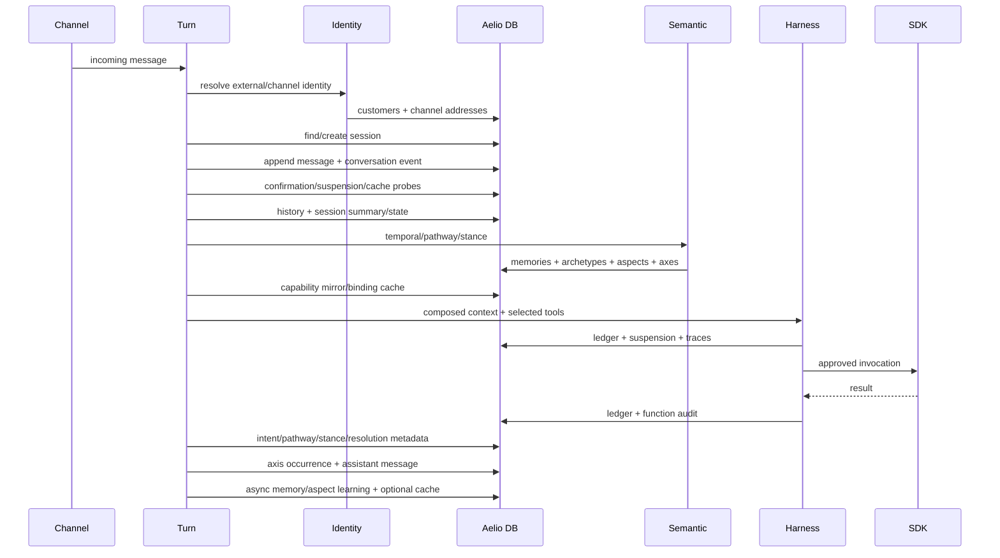

# Harness + Aelio DB Data Model

## Current implementation, target architecture, keys, modalities, retention, and lifecycle

This document closes the data-model gap beneath the AelioConvox harness.

It answers:

- What data exists?
- Which logical space owns it?
- What is authoritative versus derived?
- How is each record keyed and partitioned?
- Which data is columnar, textual, vector, or graph-shaped?
- Which records are mutable, append-only, cached, or ephemeral?
- What expires, decays, compacts, or never disappears?
- How does a reactive or proactive turn read and write the model?
- Where does the current implementation lack tenant isolation, uniqueness, transactions,
  retention, provenance, or schema evolution?
- What target model should be implemented before more harness behavior is added?

The first half documents the current implementation. The second half defines a target model.
They are intentionally separated: treating current behavior as the final design would preserve
several correctness and operability holes.

---

# Part I — Data-model foundations

## 1. Aelio DB is a multimodal row engine

aelio-os is not three independent databases. It is one typed row engine whose columns
can participate in different retrieval modalities.

Supported column kinds are:

```text
bool
i64
f64
utf8
timestamp
text
edge
vector(dim)
```

The client sends tagged values:

```ts
type ApiValue =
  | { type: "null" }
  | { type: "bool"; value: boolean }
  | { type: "i64"; value: number }
  | { type: "f64"; value: number }
  | { type: "utf8"; value: string }
  | { type: "vector"; value: number[] }
  | { type: "edges"; value: number[] }
  | { type: "embed"; value: string };
```

A row can therefore be:

- **columnar** — exact filters and numeric/time comparisons;
- **textual** — lexical/BM25 retrieval;
- **vector** — semantic nearest-neighbor retrieval;
- **graph** — traversal through row-ID edge columns;
- **hybrid** — multiple modalities fused into one ranked result.

The application normally generates embeddings in Node and sends raw vectors. It does not
normally rely on Aelio DB's `embed` value or server-side semantic clause.

---

## 2. Physical row identity versus logical identity

Every inserted Aelio DB row receives a physical numeric:

```text
row_id
```

Application tables also store logical IDs such as:

```text
message_id
customer_id
session_id
memory_id
job_id
turn_id
```

These are not the same thing.

### Physical row ID

- allocated by Aelio DB engine;
- used by `getRow`, `updateRow`, and `deleteRow`;
- used as the target of `edge` columns;
- local to the database;
- not a business key;
- should not be exposed as stable external identity.

### Logical ID

- generated or derived by AelioConvox;
- survives hydration and API boundaries;
- used in scalar-filter scans;
- represents domain identity;
- currently lacks database-enforced uniqueness.

### Current implication

Most current “upserts” are:

```text
scan by logical key
  → if found, update physical row_id
  → otherwise insert
```

Because the HTTP API has no unique constraint, transaction, compare-and-swap, or
`INSERT ... ON CONFLICT`, two writers can create duplicate logical rows.

---

## 3. Physical persistence path

The production boundary is:

```text
TypeScript store
  → @aelio/db-client
  → HTTP/JSON
  → ll-server
  → ll_query::Database
  → ll-engine
```

Aelio DB engine uses one database-wide catalog and one global physical storage stream:

- table IDs and column IDs are catalog metadata;
- all logical tables share the WAL, memtable, manifest, and `.vss` segment list;
- every row carries a hidden system table ID;
- query planning injects `system_table_id = requested_table_id`;
- table isolation is therefore an implicit scalar predicate, not separate files or WALs;
- row IDs are database-global `u64` values, not table-local IDs.

Inside a segment, dense local offsets map back to global row IDs through a translation table.
Edge indexes store global row IDs, allowing graph paths to cross segment boundaries.

Two boundary risks follow:

1. The TypeScript client represents `u64` row IDs as JavaScript `number`, which is not exact
   above `2^53 - 1`.
2. Tenant isolation is not a storage-engine property. It depends entirely on Aelio table
   choice and tenant-filter correctness.

The write path is:

```text
typed row request
  → table/column names resolved by catalog
  → WAL append
  → MVCC memtable version
  → optional flush
  → immutable .vss segment
  → optional compaction
```

Before flush:

- rows are WAL-durable;
- rows are queryable from the memtable;
- vector/text queries use exact memtable scans rather than segment indexes.

After flush, `.vss` segments can contain:

- scalar indexes;
- vector/HNSW indexes;
- BM25 text indexes;
- edge indexes.

Compaction:

- merges segment and memtable versions;
- preserves newest visible row versions;
- drops superseded versions and tombstones;
- improves physical layout and query performance.

Physical compaction is not logical retention. A record does not expire merely because
compaction runs; application code must first delete or tombstone it.

### Current physical index behavior

- I64 segment columns receive in-memory sorted scalar indexes for equality/ranges.
- Bool, F64, UTF-8, and timestamp-like columns do not have the same query-time scalar index.
- Vector columns use HNSW candidate generation with full-precision reranking.
- UTF-8 runtime values receive BM25 sections, even when the catalog kind was `utf8` rather
  than `text`.
- Edge columns receive forward and reverse indexes plus a target Bloom filter.
- Memtable scalar/vector/text/graph operations scan current rows rather than maintaining all
  incremental indexes.
- Zone maps are written but are not currently used by the query executor.

### Current schema-enforcement boundary

The engine validates column names but does not fully validate inserted runtime value types
against catalog kinds. Direct vector inserts are not dimension-checked by the HTTP ingestion
path. `timestamp` normally travels as an I64 runtime value. A malformed client can therefore
cross boundaries that the TypeScript stores currently avoid by convention.

---

## 4. Query model

The client query shape is:

```ts
{
  k: number;
  vector?: { col: string; query: number[] };
  semantic?: { col: string; text: string };
  text?: { col: string; query: string };
  filters?: Array<{
    col: string;
    op: "eq" | "ne" | "gt" | "ge" | "lt" | "le";
    value: ApiValue;
  }>;
  graph?: {
    col: string;
    seeds: number[];
    depth: number;
  };
}
```

Aelio DB can execute vector, text, graph, and scalar operators over memtable and segment
sources. Ranked modalities are fused with reciprocal-rank fusion.

The returned score is a ranking/fusion score, not necessarily cosine similarity.

Query execution resolves duplicate row versions by newest visible transaction version.
Newer tombstones suppress older live copies. The public HTTP interface always reads the
latest snapshot; MVCC time-travel is not exposed.

Graph traversal has an additional caveat: traversal unions outgoing edges from all sources
before final newest-version filtering. An old segment can contribute a stale edge from a row
updated or deleted in a newer source. Global edge targets can also cross table IDs as
intermediate hops; the injected table filter constrains final results but not every
intermediate node. Aelio's axis design keeps related nodes in one table, but stale paths are
still an engine-level concern.

The HTTP DTO currently has no explicit application bounds for:

- `k`;
- graph depth or seed count;
- vector/edge length;
- filter count;
- string length;
- row/request size.

These limits should be enforced at the server boundary before treating Aelio DB as a
multi-tenant service.

For memories, tools, archetypes, aspects, and response cache, AelioConvox commonly:

1. requests candidate row IDs from Aelio DB;
2. hydrates full rows;
3. reads the stored vector;
4. recomputes cosine in TypeScript;
5. applies application-calibrated thresholds;
6. returns the bounded final set.

---

## 4A. Direct answers to the four highest-priority design questions

### Question 1: What is Aelio DB's actual isolation unit?

**Answer: one database-wide physical storage/index stream, with logical table and tenant
filters. It is not one physical vector index per tenant.**

Aelio DB engine currently has:

```text
one catalog
one WAL
one MVCC memtable
one manifest
one global row-ID sequence
one shared set of .vss segments
```

Logical tables are identified by catalog table IDs. Every row receives a hidden table-ID
value, and the query planner injects:

```text
hidden_table_id = requested_table_id
```

Table isolation is therefore a filter inside shared physical sources. A table does not get
its own WAL, directory, manifest, segment set, or tenant-specific HNSW index.

Tenant isolation is one level higher and is entirely application-defined:

```text
option A: separate Aelio DB deployment/database per tenant
option B: separate logical table names per tenant
option C: shared logical tables with tenant_id filter
```

The current AelioConvox code mixes B and C:

- table names are configurable and can be deployment-specific;
- only selected tables contain a `tenant` column;
- most customer/runtime tables contain no tenant column;
- aspect, archetype, and axis stores currently use the literal tenant `"default"`;
- several queries that write tenant do not filter by tenant.

#### Cost consequences

**Separate deployment per tenant**

- strongest isolation;
- smallest vector candidate population;
- easiest deletion/export boundary;
- highest operational cost;
- one process/storage lifecycle per tenant;
- difficult for a large number of small tenants.

**Separate logical table per tenant**

- better logical separation;
- large catalog/schema count;
- tables still share the same physical WAL/segments;
- table filter is an indexed hidden I64 predicate;
- not truly a separate physical vector index;
- migration/bootstrap cost scales with tenant count.

**Shared table with tenant filter**

- cheapest catalog and operational model;
- best for many small tenants;
- correctness depends on every query applying tenant scope;
- a missing filter becomes a data-isolation incident;
- tenant values are currently UTF-8, which do not receive the same efficient segment scalar
  index as I64 columns;
- filtered vector cost depends on selectivity and chosen pre/post strategy;
- one large tenant can affect shared index size and latency.

#### Recommended decision

For the current single-tenant-per-server product, keep one configured dataset namespace per
deployment, but add `tenant_id` to every row and query now.

For future shared-database multi-tenancy:

```text
shared tables
+ mandatory tenant_id_i64 filter
+ tenant-aware authorization in ll-server
+ per-tenant quotas
+ selectivity benchmarks
+ optional dedicated deployment for very large/regulatory tenants
```

Use a stable numeric tenant key for hot scalar filtering and retain the human tenant slug as
metadata. Do not create 26 tables per small tenant unless benchmarks show shared filtered
indexes cannot meet latency targets.

#### Required validation

Before choosing shared-table multi-tenancy, benchmark:

```text
tenant cardinality:       10 / 100 / 1,000 / 10,000
rows per tenant:          skewed and uniform
tenant selectivity:       50% / 10% / 1% / 0.1% / 0.01%
segment count:            realistic post-flush count
vector dimensions:       configured production dimensions
k:                        5 / 20 / 100
latency:                  p50 / p95 / p99
recall:                   exact filtered baseline versus ANN
```

---

### Question 2: Does Aelio DB support filtered vector search natively?

**Answer: yes. Filters are part of the native query plan, but execution is adaptive: Aelio DB
can use ANN followed by filtering or exact pre-filtered search. It is not always one or the
other.**

A query can contain:

```ts
{
  k: 20,
  vector: {
    col: "embedding",
    query: queryVector
  },
  filters: [
    { col: "tenant_id_i64", op: "eq", value: tenantKey },
    { col: "customer_id", op: "eq", value: customerId },
    { col: "status", op: "eq", value: "active" },
    { col: "expires_at", op: "gt", value: now }
  ]
}
```

The planner estimates filter selectivity and chooses between:

#### ANN post-filter

```text
HNSW candidate generation
  → apply scalar predicates
  → return filtered top K
```

Best when:

- filter keeps a large fraction of the index;
- ANN can overfetch enough candidates;
- filter evaluation is cheap;
- target recall remains acceptable.

Risk:

- a highly selective tenant/customer filter may leave too few candidates;
- increasing ANN effort raises latency;
- shared index population can dominate work.

#### Exact pre-filter

```text
evaluate scalar predicates
  → build matching row set
  → compute exact vector distance only for that set
  → top K
```

Best when:

- filter is highly selective;
- matching set is reasonably small;
- exact scan is cheaper than ANN overfetch.

The implementation uses:

- selectivity estimation;
- stored ANN recall curves;
- a safety discount;
- exact pre-filter parallelism above a threshold.

#### Important limitations

1. Segment scalar indexes are strongest for I64 range/equality predicates.
2. UTF-8 tenant/customer/status filters may require more scanning than an indexed numeric
   tenant key.
3. Memtable vector queries are exact scans.
4. Selectivity estimation is based on bounded samples, not full statistics.
5. RRF result scores are ranking scores, so Aelio rehydrates and recomputes cosine.
6. Expired rows filtered only in TypeScript can consume candidate slots. Expiry should be in
   the native query filter where possible.
7. Direct vectors are not dimension-validated at HTTP ingestion.

#### Recall-shape decision

Use one query shape per data class:

```text
memory:
  tenant + customer + active + valid-time native filters
  vector top-N candidates
  hydrate + cosine/evidence rerank

tool registry:
  tenant + registry_hash native filters
  vector candidate retrieval
  optional 1-hop graph expansion
  live-registry hydration

archetypes:
  tenant + active-aspect filters
  vector + BM25 hybrid
  cosine rerank by valence bucket

response cache:
  tenant + customer + expires_at>now
  vector candidates
  very high cosine threshold
```

Do not use a single unfiltered global vector query followed by application-only tenant
filtering.

#### Verdict

Filtered vector search is a real native capability, but “good selectivity” is workload
dependent. The architecture may rely on it only after filtered-recall and p95/p99 benchmarks
using the production tenant distribution.

---

### Question 3: Is three-hop graph traversal cheap enough for a hot path?

**Answer: not proven, and the current Aelio hot path should not assume that it is.**

Aelio DB engine has native breadth-first graph traversal:

```text
seed global row IDs
  → read forward edge index
  → breadth-first expansion per depth
  → union reachability across memtable and segments
  → apply final table/filter resolution
```

Edge sections use:

- forward CSR;
- reverse target index;
- target Bloom filter;
- global row IDs.

This is structurally capable of multi-segment traversal. However, cost depends on:

```text
seed count
× average fan-out per hop
× depth
× number of resident segments/sources
× filter selectivity
```

A three-hop traversal can approach:

```text
O(seeds × fanout^3)
```

before deduplication. A fan-out of 3 is small; a fan-out of 100 is not.

#### Current engine caveats

1. Graph expansion unions edges across all sources.
2. Adjacency is not newest-version-resolved before expansion.
3. An older segment can contribute stale edges from an updated/deleted row.
4. Traversal can pass through a deleted intermediate node.
5. Global row IDs allow physical traversal through rows from another logical table; the
   injected table filter constrains final results, not every intermediate hop.
6. There is no cost budget, maximum visited-node count, or explicit query timeout in the graph
   DTO itself.
7. There are no repository benchmarks demonstrating production p95 for three hops.

#### Current Aelio behavior

- Lighthouse uses a native one-hop `requires` expansion.
- Customer axes do **not** use native graph query.
- Axis traversal performs repeated `getRow()` HTTP calls following `head → previous`.
- Default axis depth is 12.

Therefore the current customer-axis path pays network round trips and should not be described
as cheap native graph traversal.

#### Hot-path recommendation

Use:

```text
0–1 native hop:
  normal hot path

2 hops:
  only with bounded fan-out and benchmarked node budget

3 hops:
  precomputed/materialized subgraph, async path, or strict visit budget
```

For linked-list axes:

- add a native bounded-chain endpoint or use graph traversal after stale-edge semantics are
  fixed;
- store skip links/materialized recent windows if deeper history is common;
- keep prompt recall to the newest bounded occurrences;
- move large historical analysis to asynchronous jobs.

For general graphs, require:

```text
max_depth
max_seeds
max_visited_nodes
max_fanout_per_node
deadline_ms
tenant filter
node_type filter
```

#### Required benchmark

Measure:

```text
fan-out:       1 / 3 / 10 / 30 / 100
depth:         1 / 2 / 3
seeds:         1 / 5 / 20
segments:      realistic counts
updates:       stale-edge-heavy and append-only
latency:       p50 / p95 / p99
visited nodes
result recall/correctness
```

Until that benchmark exists, three hops must not sit on the synchronous customer-message hot
path.

---

### Question 4: Can all writes for a turn be atomic?

**Answer: no. The current public database and application APIs support atomic single-row
mutations only. A complete turn requires a saga/outbox/idempotency design, or new engine-level
multi-row transaction support.**

Aelio DB engine internally uses WAL transactions for each individual mutation:

```text
insert/update/delete
  → WAL operation record
  → WAL commit record
  → fsync
  → apply to memtable
```

But the HTTP API exposes no:

- begin transaction;
- transaction ID;
- multi-row atomic batch;
- compare-and-swap;
- conditional update;
- uniqueness constraint;
- serializable snapshot;
- commit/rollback across requests.

A turn currently writes independently:

```text
user message
conversation archive event
session activity
session metadata
customer lifecycle state
axis occurrence
axis root head
memory candidates
plan suspension
ledger entry
function-call audit
assistant message
conversation archive event
cache entry
trace/telemetry
```

Any prefix can survive if a later write fails.

External tool execution makes a normal database transaction insufficient anyway:

```text
database cannot roll back a refund, email, payment, or third-party API call
```

#### Required saga model

Use a durable turn state machine:

```text
RECEIVED
  → CONTEXT_READY
  → PLANNED
  → EXECUTING
  → WAITING_USER | COMPLETED | FAILED
```

Every transition is idempotent and versioned.

#### Required external-write protocol

Before invoking a side-effecting tool:

```text
1. atomically acquire idempotency key/lease
2. persist step attempt = invoking
3. invoke tenant SDK with same idempotency key
4. tenant handler deduplicates that key
5. persist result and complete lease
6. emit outbox event for downstream projections
```

If the process crashes:

- a lease can be reclaimed after expiry;
- the tenant handler returns the existing result for the same key;
- projections can replay from the durable event.

#### Required local-write grouping

If Aelio DB engine gains a batch transaction API, group only local invariants:

```text
conversation event + session activity
plan step result + ledger/idempotency completion + outbox event
axis occurrence + root-head compare-and-swap
job claim + lease
suspension replace
```

Do not hold a database transaction open while waiting for an LLM or external SDK.

#### Compensation rules

Compensation is appropriate only when the business action has a real inverse:

```text
reserve inventory  ↔ release inventory
create draft       ↔ delete draft
temporary hold     ↔ release hold
```

It is not safe to assume compensation for:

```text
send message
issue refund
charge payment
expose data
delete external resource
```

Those require idempotency and forward recovery, not pretend rollback.

#### Verdict

Today:

```text
single-row atomicity: yes
multi-row turn atomicity: no
external side-effect atomicity: no
safe multi-process saga primitives: incomplete
```

The target architecture should use a saga with durable events, versioned state transitions,
idempotency leases, an outbox, and handler-level idempotency. Engine-level multi-row
transactions would improve local consistency but would not eliminate the saga requirement.

---

## 5. The required logical spaces

The data model should be understood as eleven spaces.

```text
1. Identity authority
2. Conversation event log
3. Current conversation state
4. Temporal context
5. Semantic memory
6. Learned semantics and customer graph
7. Capability registry
8. Harness execution control
9. Delivery and scheduling
10. Audit and observability
11. Authentication and deduplication
```

These spaces have different consistency and retention requirements.

### Authority classes

Every dataset should be explicitly classified as:

| Class | Meaning | Recovery expectation |
|---|---|---|
| `SOURCE_OF_TRUTH` | Current business/runtime state | Must survive restart and reject conflicting writes |
| `EVENT_LOG` | Immutable historical fact | Append-only; replayable |
| `DERIVED` | Rebuildable projection/index | May be deleted and reconstructed |
| `EPHEMERAL` | Short-lived control/cache state | TTL and bounded size required |
| `AUDIT` | Compliance/debug history | Append-only with explicit retention |

The current schemas do not store this class; it exists only implicitly in code.

---

# Part II — Current logical model

## 6. Identity authority space

### 6.1 `convox_customers`

**Role:** canonical Aelio customer projection.

**Current columns**

```text
customer_id      utf8
external_id      utf8
display_name     utf8
metadata         utf8(JSON)
created_at       i64
updated_at       i64
```

**Logical keys**

```text
primary logical key: customer_id
lookup key: external_id
```

**Modality**

```text
columnar only
```

**Writers**

- identity/customer resolution;
- lifecycle updates;
- flow progress updates;
- customer profile metadata;
- proactive opt-in.

**Readers**

- every turn;
- lifecycle and profile gates;
- proactive sending;
- daemon/reflection flow;
- admin views.

**Authority**

```text
SOURCE_OF_TRUTH projection for harness-visible customer state
```

The tenant's business backend may remain the ultimate authority for account state.

**Retention**

No automatic deletion or expiry.

**Current gaps**

- no `tenant_id`;
- `external_id` has no unique constraint;
- opaque JSON metadata contains lifecycle, flow, profile, and opt-in fields;
- frequently queried metadata cannot be filtered/indexed columnarly;
- scan-then-insert customer creation can race;
- no deletion/anonymization workflow.

---

### 6.2 `convox_channel_addresses`

**Role:** map channel addresses to customers.

**Current columns**

```text
address_id       utf8
customer_id      utf8
channel          utf8
address          utf8
verified_at      i64
created_at       i64
```

**Logical keys**

```text
row key: address_id
identity key: channel + address
reverse lookup: customer_id + channel
```

**Modality**

```text
columnar only
```

**Authority**

```text
SOURCE_OF_TRUTH for Aelio channel routing
```

**Retention**

No automatic deletion.

**Current gaps**

- no tenant partition;
- no uniqueness on `(channel, address)`;
- no uniqueness on `(customer_id, channel, address)`;
- address may contain PII in plaintext;
- `verified_at` is set on creation without a general verification-state model;
- multiple rows can be returned but callers often select the first.

---

## 7. Conversation event-log space

### 7.1 `convox_messages`

**Role:** canonical chronological message content used for transcript/history/rate limits.

**Current columns**

```text
message_id       utf8
session_id       utf8
customer_id      utf8
role             utf8
content          text
channel          utf8
tier             i64
created_at       i64
embedding        vector(embed_dim)
parent_ids       edge
```

**Logical key**

```text
message_id = random UUID
```

**Common partitions**

```text
session_id
customer_id
role
tier
created_at
```

**Modality**

```text
columnar + text + vector + edge-capable
```

`parent_ids` exists in schema but is not actively populated by normal turn writes.

**Writers**

- `persistMessage()` for user and assistant turns.

**Readers**

- history window;
- complete transcript;
- rate limiting;
- message counts;
- last inbound time;
- immediate-context construction;
- reflection.

**Authority**

```text
EVENT_LOG and current transcript source
```

**Retention**

No logical retention or deletion. `tier=0` rows remain indefinitely.

**Current gaps**

- no tenant column;
- no uniqueness on `message_id`;
- no content encryption or PII classification;
- embeddings do not record model/version/dimension;
- embedding failure creates a row without a vector;
- user/assistant messages are duplicated into `convox_conversations`;
- `tier` is fixed to zero in active writes;
- parent/causal graph is unused.

---

### 7.2 `convox_conversations`

**Role:** denormalized event archive with state projection at message time.

**Current columns**

```text
event_id                utf8
message_id              utf8
session_id              utf8
customer_id             utf8
customer_external_id    utf8
channel                 utf8
channel_address         utf8
role                    utf8
content                 text
embedding               vector(embed_dim)
created_at              i64
lifecycle_state         utf8
lifecycle_state_reason  utf8
intent_label            utf8
intent_summary          utf8
intent_stack            text(JSON)
flow_id                 utf8
flow_step_id            utf8
flow_step_index         i64
flow_step_goal          utf8
active_policies         text(JSON)
tools_executed          text(JSON)
pending_confirmation    bool
```

**Logical keys**

```text
event_id = random UUID
message_id = reference to convox_messages
```

**Modality**

```text
columnar + text + vector
```

**Authority**

```text
EVENT_LOG / audit projection
```

It is not the current-state authority; it records what state looked like when the event was
written.

**Retention**

No expiry.

**Current gaps**

- duplicates message content and embedding cost;
- stores external ID and channel address alongside content, increasing PII footprint;
- no tenant column;
- JSON arrays are not columnar;
- no schema version;
- event and message inserts are separate, non-transactional writes;
- an archive failure can occur after the message row is already inserted.

---

## 8. Current conversation-state space

### 8.1 `convox_sessions`

**Role:** current session lifecycle, summary, and session-scoped metadata.

**Current columns**

```text
session_id         utf8
customer_id        utf8
channel            utf8
status             utf8
started_at         i64
last_activity_at   i64
closed_at          i64
summary            text
metadata           utf8(JSON)
```

**Logical key**

```text
session_id = random UUID
```

**Lookup**

```text
active session by customer_id + status
```

The active lookup does not filter the requested channel. The runtime effectively reuses the
latest active customer session across channels, even though the session row stores one
channel.

**Metadata currently carries**

- intent stack;
- summary message count;
- legacy pending confirmation;
- semantic pathway decision;
- conversational stance;
- resolution/proactive state.

**Modality**

```text
columnar + text + opaque JSON
```

**Authority**

```text
SOURCE_OF_TRUTH for session-scoped harness state
```

**Lifecycle**

- active session is touched for every persisted message;
- sessions older than idle timeout are changed to `closed`;
- default idle timeout is 60 minutes;
- closed rows are retained indefinitely.

**Current gaps**

- no tenant column;
- no unique active session invariant;
- read-modify-write metadata patches can race;
- metadata updates are not versioned/CAS protected;
- no channel-neutral/cross-channel session model despite cross-channel reuse;
- intent/pathway/stance/resolution are buried in one JSON blob;
- summaries have no model/version/source coverage metadata.

---

### 8.2 `runtime_state`

**Schema**

```text
scope          utf8
kind           utf8
payload        text
expires_at     i64
updated_at     i64
```

**Intended logical key**

```text
scope + kind
```

**Current status**

The table is ensured at startup but has no active production writer in the current core
runtime.

**Authority**

```text
UNUSED / schema-only
```

It should not be treated as an implemented state store.

---

## 9. Temporal-context space

### 9.1 In-process hot context

The immediate-context engine maintains a process-local map:

```text
customer_id → recent messages
```

**Window**

```text
less than 5 minutes
```

**Properties**

- verbatim content;
- not durable by itself;
- lazily seeded from `convox_messages`;
- invalidated when a new message is persisted;
- pruned by age;
- snapshot cached for 30 seconds.

This is memory, not a Aelio DB table.

---

### 9.2 `convox_compactions`

**Role:** durable immediate-context time buckets.

**Current columns**

```text
compaction_id   utf8
customer_id     utf8
session_id      utf8
tier            i64
label           utf8
content         text
embedding       vector(embed_dim)
created_at      i64
covers_from     i64
covers_to       i64
child_ids       edge
```

**Current active tiers**

```text
tier 1: 5–15 minutes
tier 2: 15–30 minutes
tier 3: 30–60 minutes
tier 4: 1–24 hours
```

**Logical key generated by active engine**

```text
ice-{customer_id}-{tier}-{covers_to}
```

The engine actually updates rows by physical row ID after scanning by customer.

**Modality**

```text
columnar + text
```

The schema has vector and edge columns, but active immediate-context writes do not populate
`embedding` or `child_ids`.

**Lifecycle**

1. messages leave the hot five-minute window;
2. they are grouped into age tiers;
3. existing buckets slide to older tiers;
4. buckets colliding in one tier merge;
5. long merged content is LLM-condensed or truncated;
6. buckets older than 24 hours are deleted when the context engine runs.

**Authority**

```text
DERIVED and rebuildable from messages within the retained horizon
```

**Current gaps**

- no tenant;
- cleanup is read-triggered, not guaranteed background retention;
- bucket merge/update/delete is non-transactional;
- embedding/child graph columns are unused;
- `session_id` is written as empty for cross-session customer buckets;
- summary provenance and model version are absent;
- source message IDs are not retained, so exact reconstruction is difficult.

---

## 10. Semantic-memory space

### 10.1 `convox_memories`

**Role:** durable facts, preferences, and reflection insights.

**Current columns**

```text
memory_id          utf8
customer_id        utf8
content            text
embedding          vector(embed_dim)
category           utf8
source_session_id  utf8
confidence         f64
created_at         i64
expires_at         i64
```

**Logical key**

```text
memory_id = random UUID
```

**Deduplication**

```text
exact customer_id + content scan before insert
```

This is not atomic and does not perform semantic deduplication.

**Modality**

```text
columnar + text + vector
```

**Writers**

- post-turn memory extraction;
- daemon reflection insight.

**Readers**

- semantic pathway memory recall;
- prompt and evidence construction.

**Query**

```text
vector nearest candidates
AND customer_id equality
→ hydrate
→ reject expires_at <= now
→ recompute cosine
→ minimum score
→ top K
```

**Authority**

```text
LEARNED DERIVED KNOWLEDGE
```

It should not be considered an authoritative customer/account fact unless provenance and
verification say so.

**Lifecycle**

- `expires_at=0` means no expiry;
- expired rows are filtered on read;
- expired rows are not physically deleted by this store;
- default extracted/reflection memories commonly have no expiry.

**Current gaps**

- no tenant;
- no source message/span/tool result;
- no subject/predicate structure;
- no verified/inferred distinction;
- no contradiction/supersession model;
- no embedding model/version;
- no semantic dedup;
- no confidence decay;
- no actual deletion of expired rows;
- no correction/retraction workflow.

---

## 11. Learned-semantics and graph space

### 11.1 `convox_aspects`

**Role:** registry of conversational dimensions the system can assess.

**Current columns**

```text
aspect_id      utf8
tenant         utf8
name           utf8
description    text
embedding      vector(embed_dim)
status         utf8(candidate | active | retired)
source         utf8(builtin | discovered)
hits           i64
created_at     i64
last_seen_at   i64
```

**Logical key**

```text
aspect_id = random UUID
```

**Partition**

```text
tenant
```

**Lifecycle**

- builtin aspects begin active;
- discovered aspects begin candidate;
- matching observations increment `hits`;
- candidate becomes active at three hits;
- retired status excludes it from matching;
- no automatic retirement or age decay.

**Modality**

```text
columnar + text + vector
```

**Authority**

```text
DERIVED learned taxonomy
```

**Current tenant issue**

The store constructor defaults tenant to `"default"`. Server startup currently creates the
store without passing `config.name`, so aspects are stored under `"default"` rather than the
configured tenant name.

**Current gaps**

- no unique tenant/name;
- hit increment is read-modify-write;
- no source evidence;
- no quality metrics or admin approval fields;
- no automatic retirement;
- candidate promotion is count-only, not evidence-quality-aware;
- embedding version absent.

---

### 11.2 `convox_archetypes`

**Role:** positive, neutral, and negative exemplar buckets belonging to aspects.

**Current columns**

```text
archetype_id   utf8
tenant         utf8
aspect_id      utf8
category       utf8
valence        utf8
keyword        utf8
description    text
usage          text
inference      text
guidance       text
embedding      vector(embed_dim)
created_at     i64
```

**Logical key**

```text
archetype_id = random UUID
```

**Intended natural key**

```text
tenant + aspect_id + valence
```

No uniqueness is enforced.

**Modality**

```text
columnar + text + vector
```

**Query**

```text
tenant filter
+ vector similarity
+ optional BM25 over description
→ RRF candidates
→ hydrate
→ recompute cosine
```

**Lifecycle**

- seeded when empty;
- can be replaced for a tenant;
- no automatic expiry;
- rows belonging to retired aspects remain but are filtered indirectly by active aspect IDs.

**Authority**

```text
DERIVED taxonomy configuration
```

**Current tenant issue**

Like aspects, the active server creates this store with the default tenant string.

---

### 11.3 `convox_axis_nodes`

**Role:** per-customer, per-aspect chronological occurrence graph.

**Current columns**

```text
node_id         utf8
tenant          utf8
node_type       utf8(root | occurrence)
customer_id     utf8
aspect_id       utf8
aspect_name     utf8
occurrence_id   utf8
turn_id         utf8
message_id      utf8
session_id      utf8
span            text
valence         utf8
positive        f64
negative        f64
neutral         f64
strength        f64
intent_label    utf8
flow_id         utf8
embedding       vector(embed_dim)
created_at      i64
previous        edge
head            edge
```

**Graph shape**

```text
root(tenant, customer, aspect)
  └── head → newest occurrence row_id
                   └── previous → older occurrence row_id
                                         └── previous → ...
```

Edges reference physical row IDs in the same table.

**Logical keys**

```text
root node_id:
  root:{customer_id}:{aspect_id}

occurrence_id:
  SHA256(tenant | turn_id | span_index | aspect_id)[0:32]
```

The root string omits tenant, though root lookup includes tenant.

**Modality**

```text
columnar + text + vector + graph
```

**Write path**

1. detect an active/fed stance aspect;
2. calculate deterministic occurrence ID;
3. scan for duplicate occurrence;
4. find or create axis root;
5. read current root head;
6. insert occurrence with `previous=current head`;
7. update root `head=new occurrence`.

**Read path**

1. find root by tenant/customer/aspect;
2. read head physical row ID;
3. repeatedly call `getRow`;
4. follow `previous`;
5. stop at depth 12 or outside temporal scope;
6. compute cosine locally;
7. return newest-first.

The active axis traversal does not use Aelio DB's graph query clause.

**Authority**

```text
DERIVED evidence graph
```

**Lifecycle**

- append indefinitely;
- bounded traversal, not bounded storage;
- no decay or deletion;
- temporal windows suppress old records at read time only.

**Current gaps**

- store uses tenant `"default"` in active server wiring;
- root/occurrence/head update is non-transactional;
- concurrent writes can fork or lose head advancement;
- `message_id` is usually absent because turn write-back does not carry the persisted message ID;
- no source offsets or prompt/evidence version;
- no confidence/model version;
- no retention;
- graph traversal incurs repeated HTTP round trips.

---

## 12. Capability-registry space

### 12.1 `harness_tools`

**Role:** derived semantic mirror of live SDK function definitions.

**Current columns**

```text
tenant          utf8
registry_hash   utf8
name            utf8
description     text
intent          utf8
safety          utf8
params_json     text
embedding       vector(embed_dim)
requires        edge
```

**Natural key**

```text
tenant + registry_hash + name
```

**Modality**

```text
columnar + text + vector + graph
```

**Lifecycle**

- on registry hash change, all tenant rows are deleted;
- current tools are reinserted;
- second pass wires heuristic prerequisite edges;
- no history is intentionally retained.

**Authority**

```text
DERIVED mirror; live SDK registry is authoritative
```

**Current gaps**

- delete/reinsert is non-transactional;
- a reader can observe partial refresh;
- stale and current hashes can coexist if refresh fails;
- no unique key;
- graph `requires` is heuristic retrieval expansion, not executable dependency truth.

---

### 12.2 `harness_capabilities`

**Role:** intent-category and product-brief semantic index for feasibility probes.

**Current columns**

```text
tenant          utf8
registry_hash   utf8
category        utf8
content         text
embedding       vector(embed_dim)
```

**Natural key**

```text
tenant + registry_hash + category
```

**Authority**

```text
DERIVED
```

**Lifecycle**

Rebuilt with the tool mirror on registry changes.

---

### 12.3 `harness_bindings`

**Role:** cache capability text to verified tool name.

**Current columns**

```text
binding_key     utf8
tenant          utf8
registry_hash   utf8
instruction     text
embedding       vector(embed_dim)
tool_name       utf8
created_at      i64
expires_at      i64
```

**Logical key**

```text
binding_key =
  SHA256(tenant | registry_hash | normalized instruction)[0:32]
```

**Lookup**

```text
binding_key + tenant
```

The stored embedding is not used for lookup.

**Authority**

```text
EPHEMERAL DERIVED CACHE
```

**Lifecycle**

- default TTL is 1,440 minutes;
- expired rows are ignored;
- expired rows are not deleted;
- registry hash naturally invalidates old bindings.

**Current gaps**

- duplicate binding keys possible;
- no physical cleanup;
- embedding is stored but unused;
- lookup does not filter registry hash separately because it is encoded in key.

---

### 12.4 `convox_sdk_connections`

**Role:** persisted connection heartbeat and function catalog.

**Current columns**

```text
connection_id       utf8
sdk_version         utf8
language            utf8
connected_at        i64
last_heartbeat_at   i64
functions_json      text
```

**Logical key**

```text
connection_id
```

**Lifecycle**

- upserted on registration/heartbeat/function update;
- removed on disconnect;
- rows older than two minutes are pruned at server startup.

**Authority**

```text
CURRENT CONNECTION PROJECTION
```

The live in-memory registry is authoritative for actual invocation.

**Current gaps**

- no tenant;
- states, policies, flows, persona, brief, and `canSend` are not persisted;
- heartbeat upsert is scan-then-update;
- startup cleanup is best effort.

---

## 13. Harness execution-control space

### 13.1 `harness_suspensions`

**Role:** one parked plan awaiting user information or confirmation.

**Current columns**

```text
session_id      utf8
tenant          utf8
reason          utf8
payload         text(JSON)
created_at      i64
expires_at      i64
```

**Logical key**

```text
session_id
```

One row per session is intended.

**Payload includes**

- schema version;
- goal;
- original user message;
- registry hash;
- resolved instructions;
- tool names;
- argument sources;
- dependencies;
- effects;
- produced fields;
- completed ledger;
- pending instruction;
- missing field/question;
- exact pending write call;
- recoil count.

**Authority**

```text
EPHEMERAL SOURCE_OF_TRUTH for a paused harness plan
```

**Lifecycle**

- default TTL is 24 hours;
- replace clears all session rows then inserts;
- read chooses newest duplicate;
- expired or invalid payload is cleared;
- confirmation/denial/success clears it.

**Current gaps**

- reads/clears filter only `session_id`, not tenant;
- delete-then-insert creates a no-suspension window;
- no unique session key;
- payload is opaque JSON and cannot be partially queried;
- no encryption despite potentially containing user text and tool arguments.

---

### 13.2 `harness_ledger`

**Role:** per-instruction replay/idempotency record.

**Current columns**

```text
session_id       utf8
turn_id          utf8
instruction_id   utf8
args_hash        utf8
status           utf8
result_json      text
created_at       i64
```

**Logical idempotency key**

```text
session_id + turn_id + instruction_id + args_hash
```

**Authority**

```text
EXECUTION CONTROL / AUDIT HYBRID
```

**Lifecycle**

- no expiry or cleanup;
- result inserted asynchronously after invocation;
- duplicate rows tolerated;
- loaded by session + turn;
- executor deduplicates successful instruction/hash pairs.

**Current gaps**

- no tenant/customer;
- no unique constraint;
- not atomic with external side effect;
- write is fire-and-forget;
- row omits tool name and duration even though in-memory ledger includes them;
- result may contain sensitive data indefinitely;
- ordinary new inbound turns receive new turn IDs, limiting crash-recovery scope.

---

## 14. Delivery and scheduling space

### 14.1 `convox_job_queue`

**Role:** inbound/outbound durable work queue.

**Current columns**

```text
job_id          utf8
queue           utf8
payload         text(JSON)
status          utf8
attempts        i64
max_attempts    i64
next_run_at     i64
locked_by       utf8
locked_at       i64
error_message   text
created_at      i64
completed_at    i64
```

**Logical key**

```text
job_id = random UUID
```

**States**

```text
pending → processing → done
                     ↘ pending retry
                     ↘ failed
```

**Defaults**

- max attempts: 5;
- retry delay: 5 seconds;
- stale-processing reclaim: 5 minutes;
- workers poll every 250 ms.

**Authority**

```text
SOURCE_OF_TRUTH for queued delivery/work
```

**Lifecycle**

No cleanup of done/failed jobs.

**Current gaps**

- no tenant/customer columns outside opaque payload;
- claim lock protects only one Node process;
- no atomic claim/CAS;
- multiple server processes can double-claim;
- no priority, dedup key, lease token, heartbeat, or dead-letter table;
- payload schema/version absent;
- completed rows grow indefinitely.

---

### 14.2 `convox_proactive_messages`

**Role:** proactive send/blocked decision record and frequency/dedup source.

**Current columns**

```text
proactive_id   utf8
customer_id    utf8
channel        utf8
to_address     utf8
content        text
dedup_key      utf8
status         utf8(sent | blocked)
reason         text
created_at     i64
```

**Logical key**

```text
proactive_id = random UUID
```

**Dedup lookup**

```text
dedup_key + status=sent
```

**Frequency lookup**

```text
customer_id + status=sent + created_at >= 24h ago
```

**Authority**

```text
AUDIT plus proactive-delivery guard state
```

**Retention**

None.

**Current gaps**

- no tenant;
- dedup key is global rather than tenant/customer/channel scoped;
- no unique constraint;
- full destination and content retained indefinitely;
- `sent` means enqueued, not necessarily delivered;
- no delivery status linkage to outbound job.

---

## 15. Audit and observability space

### 15.1 `convox_function_calls`

**Columns**

```text
call_id                 utf8
session_id              utf8
customer_id             utf8
function_name           utf8
args_json               text
result_json             text
status                  utf8
safety_level            utf8
required_confirmation   bool
confirmed               bool
duration_ms             i64
error_message           text
created_at              i64
```

**Logical key**

```text
call_id = random UUID
```

**Authority**

```text
AUDIT EVENT LOG
```

**Retention**

None.

**Current gaps**

- no tenant/turn/instruction/invocation ID;
- pending confirmation and eventual success are separate unlinked rows;
- arguments/results can contain secrets or PII;
- no redaction policy;
- no retention;
- audit write is awaited after side effect and can fail the turn after external success.

---

### 15.2 `convox_turn_api_calls`

**Columns**

```text
call_id          utf8
turn_id          utf8
session_id       utf8
customer_id      utf8
sequence         i64
call_type        utf8(llm | embed)
purpose          utf8
model            utf8
iteration        i64
prompt_summary   text
input_preview    text
message_count    i64
tool_count       i64
tool_names       text(JSON)
stop_reason      utf8
duration_ms      i64
tokens_in        i64
tokens_out       i64
created_at       i64
```

**Logical ordering key**

```text
turn_id + sequence
```

**Authority**

```text
AUDIT / TELEMETRY
```

**Retention**

None.

**Current gaps**

- no tenant;
- prompt summary can include system/user previews;
- no cost field/provider request ID;
- no redaction classification per field;
- no retention;
- sequence is process-context generated, not database enforced.

---

### 15.3 `harness_traces`

**Columns**

```text
turn_id       utf8
session_id    utf8
tenant        utf8
kind          utf8
payload       text(JSON)
embedding     vector(embed_dim)
tier          i64
created_at    i64
```

**Identity**

No logical trace ID; physical row ID only.

**Modality**

```text
columnar + text + vector
```

Only plan traces receive meaningful embeddings; other trace vectors are all zeros.

**Authority**

```text
LOSSY AUDIT/DEBUG STREAM
```

**Lifecycle**

- fire-and-forget writes;
- no implemented trace compaction or tiering despite comments;
- no retention.

**Current gaps**

- trace payload may contain customer text and plan arguments;
- full/redacted prompt setting protects prompt traces only;
- zero vectors consume storage;
- no trace ID/schema version;
- no actual L0–L3 lifecycle.

---

### 15.4 `convox_reflections`

**Columns**

```text
reflection_id   utf8
session_id      utf8
customer_id     utf8
outcome         utf8
score           f64
summary         text
issues_json     text
insight         text
followup        text
created_at      i64
```

**Logical key**

```text
reflection_id
```

One reflection per session is intended through `hasForSession`, not uniqueness.

**Authority**

```text
DERIVED ANALYTICS / AUDIT
```

**Retention**

None.

**Current gaps**

- no tenant/model/prompt version;
- no source transcript hash;
- duplicate session reflections possible;
- LLM JSON is manually parsed rather than schema-forced;
- generated follow-up and insight retained indefinitely.

---

## 16. Authentication and deduplication space

### 16.1 `convox_inbound_dedup`

**Columns**

```text
message_id    utf8
created_at    i64
```

**Logical key**

```text
provider message_id
```

**Lifecycle**

- claim is scan-then-insert;
- on approximately 1% of claims, rows older than seven days are deleted;
- prune scans at most 2,000 rows.

**Authority**

```text
EPHEMERAL DEDUP CONTROL
```

**Current gaps**

- no tenant/channel/provider;
- concurrent duplicate claims can both win;
- probabilistic cleanup can leave old rows indefinitely;
- provider IDs can collide across channels.

---

### 16.2 `convox_magic_links`

**Columns**

```text
link_id        utf8
token_hash     utf8
email          utf8
customer_id    utf8
external_id    utf8
expires_at     i64
consumed_at    i64
created_at     i64
```

**Keys**

```text
link_id
token_hash lookup
```

**Lifecycle**

- default link TTL: 15 minutes;
- validation rejects expired or consumed links;
- consume is read-then-update;
- rows are not deleted after expiry/consumption.

**Authority**

```text
EPHEMERAL AUTHORIZATION TOKEN STATE
```

**Current gaps**

- no tenant;
- email retained indefinitely;
- no atomic consume;
- no physical cleanup;
- no issuance/request metadata or revocation reason.

---

## 17. Response-cache space

### `convox_response_cache`

**Columns**

```text
cache_id       utf8
customer_id    utf8
query          text
embedding      vector(embed_dim)
reply          text
hits           i64
created_at     i64
expires_at     i64
```

**Logical key**

```text
cache_id = random UUID
```

**Lookup**

```text
customer filter
+ vector nearest candidates
→ hydrate
→ expiry check
→ recompute cosine
→ threshold
```

**Defaults**

- feature disabled;
- similarity threshold 0.92;
- TTL 60 minutes.

**Authority**

```text
EPHEMERAL DERIVED CACHE
```

**Lifecycle**

- expired rows are ignored;
- expired rows are not deleted;
- hit count is incremented through read-modify-write;
- only no-tool, non-pending replies are stored.

**Current gaps**

- no tenant/model/prompt/policy version;
- no normalization hash;
- query/reply PII retained after logical expiry;
- stale rows physically accumulate;
- concurrent hit increments can be lost.

---

# Part III — Current decay and retention matrix

## 18. What decays today

### Hard expiry with active deletion

```text
harness suspension:
  24 hours by default
  deleted when read after expiry

immediate-context compaction:
  older than 24 hours
  deleted when context engine runs

SDK connection rows:
  older than 2-minute heartbeat cutoff
  pruned at server startup

inbound dedup:
  older than 7 days
  probabilistic 1% prune trigger
```

### Logical expiry without deletion

```text
response cache:
  default 60 minutes
  ignored after expiry

harness binding cache:
  default 1,440 minutes
  ignored after expiry

memory:
  optional expires_at
  ignored after expiry

magic link:
  default 15 minutes
  rejected after expiry

intent frames:
  default 20 minutes
  non-spine frames filtered in memory
```

### Special non-decaying intent behavior

The first three intent frames are an always-alive spine:

```text
index 0, 1, 2 survive TTL filtering
```

They disappear only when popped, replaced by max-depth behavior, or explicitly rewritten.

### Time-weighted relevance without deletion

```text
axis evidence:
  excluded outside temporal scope

unresolved proactive state:
  activation score decays with 3-day half-life

evidence:
  temporal relevance decays by configured scoring function
```

The underlying records remain stored.

### No current retention

```text
customers
channel addresses
messages
conversation archive
closed sessions
most memories
aspects
archetypes
axis occurrences
jobs
function-call audit
turn API telemetry
traces
reflections
proactive messages
ledger
expired cache rows
expired binding rows
expired magic links
```

This is the main storage-growth and privacy gap.

---

## 19. Logical decay versus physical compaction

These concepts must not be conflated.

### Logical decay

Application meaning changes:

- cache becomes invalid;
- memory becomes stale;
- context leaves a window;
- intent expires;
- suspension can no longer resume;
- customer asks for deletion.

### Logical deletion

Application issues `deleteRow` or writes a tombstone/update.

### Physical compaction

Aelio DB engine removes old row versions and tombstones from storage segments.

Correct lifecycle:

```text
retention policy decides expiration
  → sweeper identifies rows
  → rows are deleted/tombstoned
  → flush/compaction reclaims physical space
```

Running compaction without a retention sweeper does not remove logically expired data.

### What is automatic in the shipped deployment

- WAL fsync and memtable visibility happen for each successful mutation.
- Aelio health-checks Aelio DB and creates missing tables.
- There is no memtable-size/time-triggered automatic flush in `ll-server`.
- There is no internal automatic compaction scheduler.
- There is no engine-level TTL.
- The optional `aelio-db-daemon` sweeps only `runtime_state` and can compact periodically, but
  the standard all-in-one image and Compose deployment do not start it.
- Aelio's Node backup worker is currently a no-op.

With S3 segment storage, flushed `.vss` files can be remote, but WAL, manifest, and catalog
remain local. S3 segment upload alone is therefore not a complete disaster-recovery backup.

---

# Part IV — How one turn uses the model

## 20. Reactive turn read/write sequence



### Pre-reasoning writes

```text
customers/channel_addresses  ensure identity
sessions                     active session and activity
messages                     raw user message
conversations                enriched user event
```

### Reasoning reads

```text
sessions metadata            intent/lifecycle-related snapshot
customers metadata           lifecycle/profile/flow state
messages                     history and temporal context
compactions                  recent cross-session context
memories                     long-term semantic facts
aspects/archetypes           current stance taxonomy
axis_nodes                   historical customer stance occurrences
harness_tools/capabilities   capability retrieval
harness_bindings             instruction binding cache
```

### Execution writes

```text
harness_suspensions          paused plan
harness_ledger               instruction result
function_calls               safety/tool audit
harness_traces               execution decision stream
turn_api_calls               LLM/embedding telemetry
```

### Post-turn writes

```text
sessions metadata            intent, pathway, stance, resolution
customers metadata           lifecycle transition
axis_nodes                   current aspect occurrences
messages/conversations       assistant reply
memories                     extracted fact/insight
aspects/archetypes           learned candidate taxonomy
response_cache               safe no-tool answer
```

---

## 21. Proactive and daemon data path

The reflection daemon reads:

```text
closed sessions
message transcript
function-call audit
existing reflection marker
session pathway/stance/resolution metadata
customer identity/address/opt-in
```

It writes:

```text
reflection
optional durable memory insight
updated resolution metadata
proactive trace
proactive sent/blocked record
outbound job
```

Delivery updates the job row to done or failed. The proactive record currently says `sent`
when the job is enqueued, so delivery truth and proactive truth are not fully normalized.

---

# Part V — Target implementable model

## 22. Target principles

The target model should enforce ten invariants.

1. Every business/runtime row is tenant-scoped.
2. Every logical entity has a declared natural key.
3. Every mutable source-of-truth row supports atomic versioned update.
4. Every event is append-only and has causal/provenance references.
5. Every vector records embedding identity and source hash.
6. Every learned fact records evidence, confidence, and verification status.
7. Every graph edge has declared semantics, direction, and lifecycle.
8. Every dataset has a retention class.
9. Sensitive fields have a PII class and redaction/encryption policy.
10. Derived stores are rebuildable from authoritative records.

---

## 23. Common target envelope

Every target table should include or derive:

```ts
type RecordEnvelope = {
  tenant_id: string;
  entity_id: string;
  schema_version: number;
  created_at: number;
  updated_at: number;
  expires_at?: number;
  deleted_at?: number;
  source_type?: string;
  source_id?: string;
  data_class: "source" | "event" | "derived" | "ephemeral" | "audit";
  pii_class: "none" | "low" | "personal" | "sensitive";
};
```

Not every field must be physically repeated when the table's schema fixes it, but the
semantics must be explicit.

### Tenant key

Use:

```text
tenant_id
```

consistently. Do not mix `tenant`, config name, default literal, or table-name isolation.

### Entity key

Use deterministic canonical keys where idempotency matters:

```text
tenant_id + entity kind + natural key
  → SHA-256 canonical ID
```

Random UUIDs remain appropriate for append-only events with no natural dedup identity.

---

## 24. Target spaces and canonical tables

### Identity authority

```text
customers
customer_addresses
customer_profile_fields
customer_consents
```

### Conversation events and state

```text
conversation_events
sessions
intent_frames
lifecycle_state
flow_progress
resolution_state
```

### Temporal and semantic context

```text
context_buckets
memory_facts
memory_evidence
```

### Learned graph

```text
semantic_nodes
semantic_edges
aspect_definitions
aspect_exemplars
aspect_occurrences
```

### Capabilities

```text
registry_snapshots
tool_definitions
capability_nodes
tool_dependency_edges
binding_cache
```

### Harness control

```text
turns
plans
plan_steps
step_attempts
suspensions
confirmations
idempotency_keys
```

### Delivery

```text
jobs
delivery_attempts
proactive_decisions
```

### Audit

```text
decision_events
model_calls
tool_calls
```

### Security

```text
inbound_dedup
magic_links
sdk_leases
```

---

## 25. Target conversation-event model

Replace the current dual message/archive write with one canonical append event.

```ts
type ConversationEvent = {
  tenant_id: string;
  event_id: string;
  event_type:
    | "user_message"
    | "assistant_message"
    | "tool_result"
    | "system_event"
    | "proactive_message";
  customer_id: string;
  session_id: string;
  turn_id: string;
  channel_id: string;
  parent_event_id?: string;
  content_ref?: string;
  content_redacted: string;
  content_hash: string;
  created_at: number;
  embedding?: number[];
  embedding_model?: string;
  embedding_version?: string;
  embedding_dim?: number;
  state_snapshot_id?: string;
  schema_version: number;
};
```

### Why this is better

- one durable append rather than duplicate message/archive rows;
- explicit event type and causality;
- turn ID available everywhere;
- state projection can be rebuilt;
- PII content can be separated from redacted searchable content;
- embedding lineage is explicit;
- proactive and reactive messages use the same event model.

If a denormalized conversation view is needed, build it as a derived projection.

---

## 26. Target current-state model

Opaque customer/session metadata should be split.

### `sessions`

```text
key:
  tenant_id + session_id

natural active-session uniqueness:
  tenant_id + customer_id + scope_id + status=active

columns:
  customer_id
  scope_id
  started_at
  last_activity_at
  closed_at
  status
  summary_id
  version
```

`scope_id` must explicitly say whether continuity is:

- per channel;
- cross-channel customer-wide;
- per business conversation/thread.

### `intent_frames`

```text
key:
  tenant_id + session_id + frame_id

columns:
  position
  label
  summary
  kind
  source
  confidence
  started_at
  last_active_at
  expires_at
  concluded_at
```

### `lifecycle_state`

```text
key:
  tenant_id + customer_id

columns:
  state_id
  reason
  source
  source_event_id
  version
  updated_at
```

### `flow_progress`

```text
key:
  tenant_id + customer_id + flow_id

columns:
  current_step_id
  current_step_index
  completed_steps
  status
  version
  updated_at
```

### `resolution_state`

```text
key:
  tenant_id + session_id

columns:
  state
  intent_label
  flow_id
  reason_code
  reason_text
  attempt_count
  score_version
  updated_at
```

These rows need compare-and-swap using `version`.

---

## 27. Target temporal-context model

```ts
type ContextBucket = {
  tenant_id: string;
  customer_id: string;
  bucket_id: string;
  tier: 1 | 2 | 3 | 4;
  covers_from: number;
  covers_to: number;
  source_event_ids: string[];
  summary: string;
  summary_model?: string;
  summary_prompt_version?: string;
  content_hash: string;
  created_at: number;
  expires_at: number;
  version: number;
};
```

### Required invariants

- one active bucket per tenant/customer/tier;
- no overlapping source-event coverage;
- source event IDs retained for provenance;
- expiry enforced by scheduled sweeper;
- bucket update atomic;
- old bucket deleted only after replacement commit.

### Default target retention

```text
hot context cache        5 minutes
tier 1                  15 minutes
tier 2                  30 minutes
tier 3                  60 minutes
tier 4                  24 hours
bucket metadata audit    7 days, without raw content
```

---

## 28. Target memory-fact model

Free-text memory rows are insufficient for correction and provenance.

```ts
type MemoryFact = {
  tenant_id: string;
  memory_id: string;
  customer_id: string;
  subject: string;
  predicate: string;
  object_json: string;
  canonical_text: string;
  category: string;
  verification: "explicit_user" | "tool_verified" | "inferred" | "admin";
  confidence: number;
  status: "active" | "superseded" | "retracted" | "expired";
  valid_from: number;
  valid_to?: number;
  expires_at?: number;
  supersedes_memory_id?: string;
  embedding: number[];
  embedding_model: string;
  embedding_version: string;
  source_hash: string;
  created_at: number;
  updated_at: number;
};
```

Evidence belongs in a separate relation:

```ts
type MemoryEvidence = {
  tenant_id: string;
  memory_id: string;
  evidence_id: string;
  source_type: "message" | "tool_result" | "reflection" | "admin";
  source_id: string;
  span_start?: number;
  span_end?: number;
  quoted_text_redacted?: string;
  observed_at: number;
};
```

### Target recall filter

```text
tenant_id
AND customer_id
AND status=active
AND valid time
AND not expired
AND allowed privacy purpose
```

Then perform semantic retrieval and evidence scoring.

---

## 29. Target graph model

Aelio DB engine edge columns point to physical row IDs in the same table. Cross-domain graph
relationships therefore require either:

1. one unified node table with typed nodes and edge columns; or
2. separate typed graph tables whose edges remain intra-table; or
3. logical-ID edges stored as scalar columns and resolved in two stages.

For AelioConvox, use typed graph spaces rather than one unrestricted universal graph.

### Customer aspect graph

```text
aspect_axis_roots:
  tenant_id + customer_id + aspect_id
  head_occurrence_row_id
  version

aspect_occurrences:
  deterministic occurrence_id
  customer_id
  aspect_id
  source_event_id
  source span offsets
  valence scores
  intent_id
  flow_id
  embedding lineage
  previous edge
  observed_at
  expires_at/retention_class
```

### Tool dependency graph

Keep this separate because it is registry-derived:

```text
tool_dependency_edges:
  tenant_id
  registry_hash
  from_tool_id
  to_tool_id
  relation = likely_prerequisite
  confidence
  derivation_version
```

### Do not mix

Tool prerequisite edges, customer stance history, memory provenance, and conversation parent
events have different meaning and lifecycle. They should not share an untyped edge relation.

---

## 30. Target embedding model

Every vector-bearing record needs:

```text
embedding
embedding_model
embedding_provider
embedding_version
embedding_dim
embedding_source_hash
embedded_at
```

### Why

The current system can:

- change provider;
- change output dimensions;
- fall back from remote model to local hash embedding;
- truncate or zero-pad mismatched vectors.

Without lineage, incompatible vector spaces can silently coexist.

### Required invariant

Never compare vectors unless:

```text
model + version + dimension + normalization strategy
```

match.

### Migration strategy

When embedding configuration changes:

1. create a new vector column/table version;
2. dual-write new embeddings;
3. backfill active rows;
4. query only one version at a time;
5. validate recall metrics;
6. retire the old version.

`ensureTable()` currently checks only table existence, not column or vector-dimension drift,
so schema migration must be explicit.

---

## 31. Target harness execution model

The current opaque suspension and thin ledger should become typed control tables.

### `turns`

```text
tenant_id + turn_id
session_id
customer_id
input_event_id
status
registry_hash
prompt_version
started_at
finished_at
```

### `plans`

```text
tenant_id + plan_id
turn_id
goal
planner_model
planner_output_hash
status
created_at
```

### `plan_steps`

```text
tenant_id + plan_id + step_id
tool_name
capability
effect
arg_sources_json
dependencies_json
status
```

### `step_attempts`

```text
tenant_id + plan_id + step_id + attempt
invocation_id
args_hash
args_redacted
status
result_ref
duration_ms
started_at
finished_at
```

### `idempotency_keys`

```text
key:
  tenant_id + idempotency_key

columns:
  operation
  args_hash
  status
  result_ref
  lease_owner
  lease_expires_at
  completed_at
```

The idempotency record must be acquired atomically before an external write.

### `suspensions`

```text
tenant_id + session_id
turn_id
plan_id
step_id
reason
question
payload_version
expires_at
version
```

Typed plan/step rows eliminate one huge opaque payload and permit reliable admin
reconstruction.

---

## 32. Target job and delivery model

### Atomic lease requirement

Job claim must be:

```text
UPDATE pending job
SET status=processing, lease_owner=?, lease_expires_at=?
IF status=pending AND next_run_at<=now
RETURNING row
```

The current HTTP API cannot express this atomically. Engine/API support is required for safe
multi-process workers.

### Separate job from delivery attempt

```text
jobs:
  desired work and retry policy

delivery_attempts:
  each provider call and result

proactive_decisions:
  why contact was allowed/blocked

conversation_event:
  message actually emitted
```

Do not label a proactive message `sent` at enqueue time. Use:

```text
approved → queued → delivering → delivered | failed
```

---

## 33. Target retention policy

Retention should be configuration, not scattered constants.

```ts
type RetentionPolicy = {
  dataset: string;
  raw_ttl_days?: number;
  redacted_ttl_days?: number;
  tombstone_ttl_days?: number;
  legal_hold_supported: boolean;
  delete_strategy: "hard" | "anonymize" | "compact";
};
```

### Recommended initial policy

| Space | Raw retention | Derived retention | Notes |
|---|---:|---:|---|
| Customer identity | Until deletion/account policy | N/A | Encrypt sensitive fields |
| Channel addresses | Until revoked/deleted | N/A | Hash searchable address where possible |
| Conversation content | Tenant-configured, e.g. 30–90 days | Redacted summaries longer | Support customer deletion |
| Immediate context | 24 hours | 7-day metadata | Current design intent |
| Memory facts | Until invalid/superseded or configured TTL | Evidence follows source policy | Never immortal by default |
| Aspect occurrences | 90 days or compressed | Aggregate trend longer | Decay old evidence |
| Capability mirror | Current registry only | Old hash 1 day | Rebuildable |
| Binding cache | 1 day | None | Delete on expiry |
| Suspension | 24 hours | Minimal audit 30 days | Remove raw arguments after expiry |
| Response cache | 1 hour | None | Delete on expiry |
| Jobs | Done 7 days; failed 30 days | Metrics longer | Payload redaction |
| Function audit | 30–90 days | Aggregates longer | Redact args/results |
| Model telemetry | 14–30 days | Cost aggregates longer | Avoid raw prompts |
| Harness traces | 7–30 days | Sampled/aggregated longer | Plan payload redaction |
| Magic links | Expiry + 1 day | Security event longer | Delete email/token row |
| Inbound dedup | 7 days | None | Deterministic sweeper |

Actual numbers must be tenant/legal-policy driven, but every dataset needs a non-ambiguous
default.

---

## 34. Retention sweeper

A scheduled retention worker should:

1. load policy version;
2. enumerate expired rows by dataset and tenant;
3. honor legal hold;
4. delete or anonymize in bounded batches;
5. record a retention audit event without preserving deleted content;
6. trigger/coordinate physical flush and compaction;
7. publish metrics for scanned, deleted, failed, and reclaimed data.

Read-time expiry checks remain defense in depth, not the primary cleanup mechanism.

---

## 35. Tenant isolation

The current server is operationally close to one tenant per deployment, but tables and code
mix two isolation approaches:

- configured table names;
- a `tenant` column on selected tables.

This is unsafe if multiple tenants share one Aelio DB database.

### Required rule

Every logical query must include:

```text
tenant_id = current tenant
```

before customer/session/entity filters.

### Current unscoped high-risk datasets

```text
customers
channel addresses
sessions
messages
conversation archive
memories
jobs
cache
function calls
model telemetry
reflections
proactive messages
inbound dedup
magic links
SDK connections
ledger
```

### Selected current tenant bugs

- aspect/archetype/axis stores use the literal `"default"` in active server wiring;
- suspension reads and clears by session ID without tenant;
- proactive dedup searches a global dedup key;
- inbound dedup searches a global provider message ID.

Before shared-database multi-tenancy, these must be fixed.

---

## 36. PII and security model

### Sensitive current fields

```text
message content
conversation content
channel address
external ID
email
memory text
tool arguments and results
trace payloads
prompt previews
reflection text
proactive content/destination
suspension payload
job payload
```

### Required controls

1. field-level PII classification;
2. encryption at rest for raw sensitive text/addresses;
3. tenant-scoped encryption keys where required;
4. redacted searchable projection separate from raw content;
5. purpose-limited prompt projection;
6. trace/audit redaction before persistence;
7. access-control policy for admin endpoints;
8. customer deletion cascade;
9. retention enforcement;
10. hashes for exact lookup where plaintext is unnecessary.

Embeddings are not anonymous. They may leak semantic information and must follow the source
content's access and retention policy.

---

## 37. Consistency boundaries

The target system needs explicit atomic boundaries.

### Identity creation

Atomically enforce:

```text
unique tenant + external_id
unique tenant + channel + address
```

### Turn input

Atomically append:

```text
conversation event
+ session activity/version update
```

### Suspension

Atomically replace:

```text
one tenant/session suspension
```

### Tool side effect

Atomically acquire:

```text
idempotency lease before external invocation
```

Then atomically finalize:

```text
step attempt + result + idempotency completion
```

External calls cannot be part of a database transaction, so use an idempotency lease/outbox
protocol.

### Axis append

Atomically:

```text
insert occurrence
+ compare-and-swap root head
```

### Job claim

Atomically transition one eligible job from pending to leased processing.

Without engine support for uniqueness/CAS/transactions, a single-writer partitioning strategy
must be enforced operationally.

---

## 38. Schema versioning

Current `ensureTable()` only checks whether the table exists. It does not compare:

- missing columns;
- changed kinds;
- changed vector dimensions;
- renamed fields;
- index requirements.

Target startup must:

1. read catalog schema;
2. compare against expected schema version;
3. refuse incompatible startup or run a migration;
4. record migration state;
5. support dual-read/write during backfill;
6. validate row counts and embeddings;
7. retire old schema only after verification.

Every opaque JSON payload also needs its own `payload_version`.

---

## 39. Recommended key conventions

```text
tenant_id:
  stable tenant UUID or slug

customer_id:
  UUID; unique within tenant

session_id:
  UUID; unique within tenant

turn_id:
  UUID; one reactive/proactive reasoning cycle

event_id:
  UUID/ULID; append-only event identity

plan_id:
  deterministic from tenant + turn + planner attempt

step_id:
  planner-local ID scoped by plan

invocation_id:
  UUID sent over SDK wire

idempotency_key:
  hash(tenant + operation + stable business target + canonical args)

dedup_key:
  tenant + channel/provider + external event ID

graph node ID:
  hash(tenant + node kind + natural identity)
```

Do not rely on physical `row_id` outside internal edge storage.

---

## 40. Required query patterns

The target model should optimize these first.

### Active session

```text
tenant_id = ?
AND customer_id = ?
AND scope_id = ?
AND status = active
```

### Session history

```text
tenant_id = ?
AND session_id = ?
ORDER BY created_at DESC
LIMIT ?
```

### Memory recall

```text
tenant_id = ?
AND customer_id = ?
AND status = active
AND valid_at(now)
+ vector query
```

### Customer axis

```text
tenant_id + customer_id + aspect_id
→ root head
→ previous traversal bounded by time/depth
```

### Suspension

```text
tenant_id + session_id
AND expires_at > now
```

### Ledger/idempotency

```text
tenant_id + idempotency_key
```

### Due job

```text
tenant_id/queue shard
AND status = pending
AND next_run_at <= now
ORDER BY priority, next_run_at
LIMIT 1
```

### Turn reconstruction

```text
tenant_id + turn_id
→ event + plan + steps + calls + traces + reply
```

---

# Part VI — Migration plan

## 41. Phase 0: freeze semantics

Before migration:

1. assign owner and authority class to every current table;
2. define tenant ID;
3. define retention defaults;
4. define embedding model/version;
5. define current JSON payload schemas;
6. measure current row counts and growth;
7. stop adding new opaque metadata fields.

---

## 42. Phase 1: tenant and schema envelope

Add/version:

- `tenant_id`;
- `schema_version`;
- `updated_at`;
- `expires_at` where relevant;
- `pii_class` or table-level classification;
- embedding lineage columns.

Fix active store constructors so archetypes, aspects, and axes receive the configured tenant.

Make every query tenant-scoped.

---

## 43. Phase 2: canonical events and typed state

1. introduce `conversation_events`;
2. dual-write current messages/archive and canonical events;
3. backfill event links;
4. introduce typed intent/lifecycle/flow/resolution rows;
5. dual-read with parity checks;
6. stop adding state to opaque metadata;
7. retire duplicated archive writes after admin/telemetry migration.

---

## 44. Phase 3: execution correctness

1. add `turns`, `plans`, `plan_steps`, and `step_attempts`;
2. add atomic idempotency lease;
3. add atomic job lease;
4. add CAS versioning for state and axis roots;
5. link confirmation pending/success audit;
6. link proactive decision to job and delivery attempt;
7. move suspension payload into typed references.

This phase is required before claiming exactly-once or safe multi-process execution.

---

## 45. Phase 4: memory and graph provenance

1. introduce structured memory facts;
2. attach source evidence;
3. add verification/supersession/retraction;
4. backfill existing memories as `inferred` with lower confidence;
5. add occurrence source event IDs and span offsets;
6. repair tenant namespaces;
7. add retention/compaction of old occurrences.

---

## 46. Phase 5: retention and privacy

1. deploy deterministic retention sweeper;
2. delete physically expired cache/binding/magic-link rows;
3. add audit/trace retention;
4. add customer deletion cascade;
5. separate raw/encrypted content from redacted search projection;
6. compact Aelio DB engine segments after logical deletion;
7. expose retention metrics and legal hold.

---

# Part VII — Acceptance criteria

## 47. Data-model acceptance checklist

The model is implementable when all answers are “yes.”

### Identity and tenancy

- Is every row tenant-scoped?
- Can duplicate external identities be prevented atomically?
- Is channel identity unique and revocable?
- Is customer deletion defined?

### Conversation

- Is there one canonical event log?
- Is causal parentage explicit?
- Is current state separated from historical snapshots?
- Can a turn be reconstructed from IDs?

### Temporal context

- Are bucket boundaries and coverage explicit?
- Are source events traceable?
- Is expiry enforced by a sweeper?
- Can buckets be rebuilt?

### Memory

- Is every fact verified/inferred/admin-labeled?
- Is evidence attached?
- Can facts be superseded/retracted?
- Are vector spaces versioned?

### Graph

- Are edge semantics typed?
- Are graph writes atomic?
- Are traversal and retention bounded?
- Are source spans available?

### Harness

- Are plan/step/attempt records typed?
- Is idempotency acquired before external writes?
- Can suspended work resume after restart?
- Can audit link pending approval to final execution?

### Delivery

- Is queue claim atomic across processes?
- Is delivered distinct from enqueued?
- Are retries and dead letters explicit?
- Are proactive decisions linked to delivery?

### Retention/security

- Does every dataset have a retention class?
- Are PII fields classified and protected?
- Are expired rows physically deleted?
- Are embeddings treated as sensitive derivatives?

### Operations

- Are schemas versioned and migrated?
- Can derived indexes be rebuilt?
- Are growth and deletion measured?
- Can compaction reclaim deleted data?

---

## 48. Final architectural position

The current implementation proves that Aelio DB can hold the full harness runtime:

- operational identity and session state;
- append-only conversation data;
- semantic memories;
- temporal summaries;
- vectors;
- graph edges;
- capability mirrors;
- execution suspensions and ledgers;
- queues;
- audits and traces.

But the current model is still primarily a collection of feature-specific rows. It lacks a
uniform contract for:

- tenant partitioning;
- logical uniqueness;
- transactions/CAS;
- authority class;
- provenance;
- vector lineage;
- retention;
- privacy;
- schema evolution.

The target model should make those properties first-class before adding more autonomous
behavior.

The correct layering is:

```text
authoritative events and state
  → versioned projections
  → temporal/semantic indexes
  → typed graph evidence
  → harness execution records
  → bounded prompt context
```

Aelio DB remains the storage and retrieval substrate. The harness remains the control plane.
The data model must make every important decision recoverable, tenant-scoped, provenance-bound,
versioned, and subject to explicit retention.

---

## 49. Source map

```text
server/src/app.ts
server/src/config.ts
server/src/aelio-db.ts
server/src/runtime-deps.ts
server/src/turn-options.ts
server/src/sdk-bridge.ts
server/src/workers/inbound.ts
server/src/workers/outbound.ts
server/src/workers/daemon.ts

packages/aelio-db-client/src/types.ts
packages/aelio-db-client/src/client.ts

packages/core/src/storage/bootstrap.ts
packages/core/src/storage/types.ts
packages/core/src/storage/messages.ts
packages/core/src/storage/conversations.ts
packages/core/src/storage/customers.ts
packages/core/src/storage/sessions.ts
packages/core/src/storage/memories.ts
packages/core/src/storage/cache.ts
packages/core/src/storage/jobs.ts
packages/core/src/storage/audit.ts
packages/core/src/storage/reflections.ts
packages/core/src/storage/proactive-store.ts
packages/core/src/storage/kv.ts
packages/core/src/storage/archetypes.ts
packages/core/src/storage/aspects.ts
packages/core/src/storage/axis.ts
packages/core/src/storage/telemetry.ts
packages/core/src/storage/context.ts

packages/core/src/context-engine/index.ts
packages/core/src/intent/stack.ts
packages/core/src/pathway/index.ts
packages/core/src/archetype/index.ts
packages/core/src/evidence/index.ts
packages/core/src/resolution/index.ts
packages/core/src/runtime/turn.ts
packages/core/src/runtime/proactive.ts
packages/core/src/telemetry/turn-calls.ts

packages/core/src/lighthouse/index.ts
packages/core/src/lighthouse/mirror.ts
packages/core/src/harness/binder.ts
packages/core/src/harness/ledger.ts
packages/core/src/harness/suspension.ts
packages/core/src/harness/traces.ts

aelio-os/crates/ll-server
aelio-os/crates/ll-query
aelio-os/crates/ll-engine
```
# Harness Aelio DB Data Model

This document defines the storage spine for the self-learning conversation
harness: what lives in Aelio DB, which table/space owns it, how it is keyed, which
columns are vector/search/graph/filter fields, what decays, and how each engine
uses the data.

The central rule:

```text
Aelio DB stores the durable truth, fast search surfaces, graph continuity, and
audit trail.
TypeScript decides what to write, what to retrieve, what to score, and what to
feed into the prompt.
The LLM only reasons over the already-selected contract.
```

## Aelio DB Primitives

Aelio DB tables support these column kinds today:

| Kind | Purpose |
| --- | --- |
| `utf8` | exact-match ids, categories, status, tenant, channel |
| `text` | longer searchable text, JSON payloads, prompt/debug bodies |
| `i64` | timestamps, counters, sequence numbers, tiers |
| `f64` | scores, confidence, strength |
| `bool` | flags |
| `vector` | embedding search |
| `edge` | row-id graph links inside a table |

Query surfaces:

| Query mode | Used for |
| --- | --- |
| `scanRows` + filters | exact keyed lookup, time windows, status filters |
| `query.vector` | semantic nearest-neighbor search |
| `query.text` | lexical/BM25-like search where available |
| `query.semantic` | query-by-text embedding through Aelio DB where available |
| `query.graph` | bounded edge traversal from seed row ids |
| `query.hybrid` | proposed fused vector + lexical + graph + filters |

Current client query shape supports:

```ts
{
  k: number;
  vector?: { col: string; query: number[] };
  semantic?: { col: string; text: string };
  text?: { col: string; query: string };
  filters?: Array<{ col: string; op: "eq" | "ne" | "gt" | "ge" | "lt" | "le"; value: ApiValue }>;
  graph?: { col: string; seeds: number[]; depth: number };
}
```

## Highest-Priority Architecture Answers

### 1. What is Aelio DB's actual isolation unit?

Aelio DB's actual API isolation unit is the **table**. The HTTP client routes every
operation through a table name:

```text
/v1/tables/:table/rows
/v1/tables/:table/scan
/v1/tables/:table/query
```

Inside Aelio DB engine today, the database facade is a **single-node database with one
engine/WAL**. Rows are tagged with a system `table_id`, and named-table queries
receive an implicit `table_id = T` filter. That means tables are logical
isolation spaces, while the underlying database can still share physical
segments/WAL.

For AelioConvox multi-tenancy today, the model is:

```text
one Aelio DB database
-> one configured table set
-> tenant-specific rows separated by tenant/customer/session filters
```

Some harness tables already have explicit `tenant` columns:

- `harness_tools`
- `harness_capabilities`
- `harness_bindings`
- `harness_suspensions`
- `harness_traces`
- `convox_aspects`
- `convox_archetypes`
- `convox_axis_nodes`

Many identity/conversation/audit tables do not yet have a tenant column. That is
fine only if the deployment is single-tenant or one database/namespace per
tenant. For true multi-tenant SaaS, this is a required fix.

Recommended tenant model:

| Model | Isolation | Cost | Recommendation |
| --- | --- | --- | --- |
| One DB, shared tables, tenant column | logical only | cheapest | good for small/medium tenants if every query enforces tenant filter |
| One DB, per-tenant table names | stronger logical split, still shared DB/WAL | moderate | useful for noisy tenants or regulated tenants |
| One Aelio DB database/daemon per tenant | strongest operational split | highest | use for enterprise/high-compliance tenants |

Default recommendation for now:

```text
shared tables + mandatory tenant filter everywhere
```

But the product must treat tenant filters as a security boundary. That means:

- every tenant-specific table needs a `tenant` column
- every store must inject tenant filters centrally
- admin queries must be tenant-scoped by default
- vector recall must always include tenant/customer filters
- traces and prompt payloads must never cross tenant boundaries

### 2. Does Aelio DB support filtered vector search natively?

Yes. aelio-os's query executor accepts vector, text, scalar filters, and
graph constraints in one hybrid query. Filtering is not only a TypeScript
post-filter.

The executor chooses a filtered-vector strategy using a cost model:

| Strategy | What happens | Recall/cost profile |
| --- | --- | --- |
| Pre-filter | compute matching rows first, then exact vector distance over those rows | exact recall, cost proportional to matching rows |
| Post-filter | run ANN vector search, over-fetch, then keep rows passing filters | cheaper for loose filters, approximate recall |
| Integrated | modeled for analysis, not selected by current executor | future option |

The important behavior:

```text
selective filter -> exact pre-filter
loose filter -> ANN post-filter
ANN recall too low -> exact pre-filter fallback
```

So the recall shape is not "always post-filter and hope enough rows survive".
Aelio DB estimates predicate selectivity, picks the cheapest strategy expected to
meet the recall target, and falls back to exact pre-filter when needed.

There is still a final authoritative filter pass over candidates. That pass
ensures returned rows satisfy scalar and graph constraints and resolves newest
row versions across memtable/segments. But candidate generation itself is
planned around the filters.

Practical consequence for harness recall:

- tenant/customer/time filters can be native query filters
- low-selectivity customer recall should be exact pre-filtered
- broad table-wide recall should use ANN post-filter
- top-k must over-fetch when filters are loose but not universal
- thresholds should be calibrated against real tenant sizes

Recommended recall shape:

```ts
query(table, {
  k: 20,
  vector: { col: "embedding", query: messageVector },
  text: { col: "content", query: lexicalQuery },
  filters: [
    { col: "tenant", op: "eq", value: tenant },
    { col: "customer_id", op: "eq", value: customerId },
    { col: "created_at", op: "ge", value: temporalScope.from }
  ]
})
```

### 3. Is 3-hop graph traversal cheap enough for the hot path?

Answer: **yes for bounded, low-fanout graphs; no for arbitrary graphs without
budgeting**.

Aelio DB graph query is a forward reachability constraint:

```text
seeds + edge column + max depth -> reachable row ids
```

The current executor does a bounded breadth-first traversal over edge columns.
Cost is roughly:

```text
O(number of visited nodes + traversed edges across all sources)
```

A 3-hop traversal is hot-path safe when:

- seed count is small, ideally 1-20
- fanout is small, ideally 1-10
- depth is capped at 1-3
- graph is used as a constraint or recall expansion, not as a full analytics walk
- tenant/customer filters still apply

Good hot-path graph shapes:

```text
axis root -> head -> previous -> previous
tool -> requires -> prerequisite tool
compaction -> child summary/message
flow -> current step -> required tool
```

Bad hot-path graph shapes:

```text
customer -> every message -> every trace -> every tool
tenant -> all customers -> all memories
popular node -> thousands of neighbors
```

Current Aelio Axis traversal is even more conservative: it walks
`root.head -> occurrence.previous` manually with a `maxDepth` default around 12,
and it stops outside temporal scope. That is safe because the chain is basically
linked-list shaped.

Recommendation:

```text
Allow graph in hot path only with:
- maxDepth <= 3 for general graph query
- max frontier size
- max visited rows
- max elapsed ms
- tenant/customer filter
- fallback to vector/text recall if graph budget is exceeded
```

### 4. Are turn writes atomic?

No, not as a full multi-row transaction over the current HTTP API.

Aelio DB has durable WAL-backed row mutations and crash-safe flush/manifest
behavior, but the exposed client API is row-level:

```text
insertRow
updateRow
deleteRow
```

There is no exposed multi-row transaction API, no HTTP compare-and-swap, and no
unique constraint enforcement in the current client surface. Existing code
already works around this:

- job claiming uses an in-process mutex because there is no atomic conditional
  update over HTTP
- inbound dedup is scan-then-insert and can race across processes
- ledger idempotency uses hashes and replay checks rather than a unique
  database constraint

Therefore this is not safe to model as:

```text
atomic transaction:
  write turn
  write message
  write facts
  write state transition
  write ledger
  commit all
```

The correct model is a **saga with idempotency, append-only audit, and
compensations**.

Recommended turn write strategy:

```text
1. create turn_id and message_id deterministically where possible
2. append user message
3. write trace: turn_started
4. write context/memory/evidence rows with source turn_id
5. before tool side effect, write pending function_call/ledger intent
6. execute tool
7. write success/error ledger entry
8. write state transition with source tool/turn id
9. write assistant reply
10. write trace: turn_completed
11. repair job reconciles partial turns
```

Every write should be:

- idempotent by logical key or content hash
- linked to `turn_id`
- safe to replay
- auditable if partially complete
- repairable by a background reconciler

Required future Aelio DB feature for stronger guarantees:

```text
POST /v1/transactions
  - compare existing row/version predicates
  - insert/update/delete batch
  - unique logical key checks
  - all-or-nothing commit
```

Until that exists, the harness should assume:

```text
turn consistency = saga consistency
tool safety = idempotency + confirmation + ledger + compensation
audit truth = append-only traces/function_calls/ledger
```

## Table Inventory

There are currently **26 configured Aelio DB tables**.

| Table config key | Default table | Role |
| --- | --- | --- |
| `messages` | `convox_messages` | canonical message rows |
| `conversations` | `convox_conversations` | enriched per-turn telemetry/event rows |
| `memories` | `convox_memories` | durable user/business facts |
| `compactions` | `convox_compactions` | summarized time/context buckets |
| `runtime_state` | `runtime_state` | small keyed runtime state/locks/tokens |
| `harness_tools` | `harness_tools` | Lighthouse mirror of SDK tools |
| `harness_capabilities` | `harness_capabilities` | planner capability taxonomy |
| `harness_bindings` | `harness_bindings` | instruction-to-tool binding cache |
| `harness_suspensions` | `harness_suspensions` | parked plans awaiting info/confirmation |
| `harness_ledger` | `harness_ledger` | per-instruction idempotency ledger |
| `harness_traces` | `harness_traces` | append-only decision/audit trace |
| `customers` | `convox_customers` | internal customer identity |
| `channel_addresses` | `convox_channel_addresses` | phone/email/channel address mapping |
| `sessions` | `convox_sessions` | conversation sessions |
| `job_queue` | `convox_job_queue` | durable async/proactive jobs |
| `response_cache` | `convox_response_cache` | semantic reply cache |
| `function_calls` | `convox_function_calls` | tool invocation audit |
| `turn_api_calls` | `convox_turn_api_calls` | LLM/API call telemetry |
| `reflections` | `convox_reflections` | session quality reflections/followups |
| `proactive_messages` | `convox_proactive_messages` | proactive send/suppress records |
| `inbound_dedup` | `convox_inbound_dedup` | inbound duplicate guard |
| `magic_links` | `convox_magic_links` | login/auth magic links |
| `sdk_connections` | `convox_sdk_connections` | live/persisted SDK catalog snapshots |
| `archetypes` | `convox_archetypes` | positive/neutral/negative aspect buckets |
| `aspects` | `convox_aspects` | self-learning aspect registry |
| `axis_nodes` | `convox_axis_nodes` | user-specific Harness Axis graph |

## Data Spaces

The tables should be thought of as eight spaces.

| Space | Tables | Main query style |
| --- | --- | --- |
| Identity | customers, channel_addresses, sessions, magic_links | exact filters |
| Conversation Log | messages, conversations | time + customer/session filters, vector/text |
| Context/Memory | memories, compactions, response_cache | vector/text + expiry |
| Harness Runtime | harness_tools, harness_capabilities, harness_bindings, harness_suspensions, harness_ledger, harness_traces | vector, exact, TTL |
| Learning Graph | aspects, archetypes, axis_nodes | vector + graph + filters |
| Execution Audit | function_calls, turn_api_calls, proactive_messages, reflections | exact + time |
| Async Control | job_queue, inbound_dedup, runtime_state | exact + status/time |
| SDK Catalog | sdk_connections, harness_tools, harness_capabilities | exact registry hash + vector |

## Keying Rules

Every table needs a predictable logical key, even when Aelio DB row ids are used
for physical edge links.

| Object | Logical key | Notes |
| --- | --- | --- |
| Customer | `customer_id` | internal id; external id is not primary |
| Channel address | `channel + address` | maps to one customer |
| Session | `session_id` | active session found by customer/channel/status |
| Message | `message_id` | one row per message |
| Conversation event | `event_id` | enriched event row; may reference `message_id` |
| Memory | `memory_id` | ideally hash of customer/category/content/source |
| Compaction | `compaction_id` | should include customer/session/tier/window |
| Tool mirror row | `tenant + registry_hash + name` | registry hash invalidates stale tool mirrors |
| Capability row | `tenant + registry_hash + category` | generated from tool registry/product brief |
| Binding cache | `binding_key` | sha256 tenant + registry hash + normalized instruction |
| Suspension | `session_id + tenant` | only one active parked plan per session |
| Ledger row | `session_id + turn_id + instruction_id + args_hash` | idempotency guard |
| Trace | append-only row id, plus `turn_id` | many traces per turn |
| Aspect | `tenant + aspect_id` | active/candidate/retired registry item |
| Archetype | `tenant + aspect_id + category + valence` | one bucket exemplar |
| Axis root | `tenant + customer_id + aspect_id` | one root per customer/aspect |
| Axis occurrence | `tenant + turn_id + span_index + aspect_id` hash | idempotent occurrence |
| Function call | `call_id` | audit row |
| API call | `turn_id + sequence` | preserves model call order |
| Job | `job_id` or queue-specific dedup key | async worker coordination |
| Proactive message | `dedup_key` | prevents repeat nudges |

Tenant scoping should be present on every reusable/tenant-specific table. Some
current tables do not yet have an explicit `tenant` column; the product should
either add it or guarantee one database/namespace per tenant.

## Current Tables In Detail

### `convox_customers`

Purpose: internal identity record.

Columns:

| Column | Kind | Query/use |
| --- | --- | --- |
| `customer_id` | utf8 | primary logical id |
| `external_id` | utf8 | customer id from app/business |
| `display_name` | utf8 | prompt/admin display |
| `metadata` | utf8 | app-defined metadata JSON string |
| `created_at` | i64 | audit |
| `updated_at` | i64 | recency |

Access pattern:

- lookup by external id
- lookup by channel address through `convox_channel_addresses`
- update metadata/display name

Decay:

- does not decay automatically
- should be deletable/anonymizable by privacy request

### `convox_channel_addresses`

Purpose: map inbound channel identity to customer.

Columns: `address_id`, `customer_id`, `channel`, `address`, `verified_at`,
`created_at`.

Key:

```text
channel + address -> customer_id
```

Decay:

- verified addresses persist
- unverified/stale addresses should be retired by policy

### `convox_sessions`

Purpose: conversation session state.

Columns: `session_id`, `customer_id`, `channel`, `status`, `started_at`,
`last_activity_at`, `closed_at`, `summary`, `metadata`.

Access pattern:

- active session lookup by customer/channel/status
- update last activity per turn
- close on explicit goodbye, timeout, or flow completion

Decay:

- active sessions expire into closed status after inactivity
- summary persists longer than raw hot context

### `convox_messages`

Purpose: canonical message storage.

Columns:

| Column | Kind | Query/use |
| --- | --- | --- |
| `message_id` | utf8 | logical key |
| `session_id` | utf8 | session filter |
| `customer_id` | utf8 | user filter |
| `role` | utf8 | user/assistant/system/tool |
| `content` | text | lexical/history/prompt source |
| `channel` | utf8 | channel filter |
| `tier` | i64 | context tier |
| `created_at` | i64 | time window |
| `embedding` | vector | semantic message recall |
| `parent_ids` | edge | message/compaction lineage |

Access pattern:

- append every message
- read recent history by session
- query by vector with customer/session/time filters
- use `tier` for immediate/recent/historical context selection

Decay:

- raw hot/recent messages should decay in prompt relevance by age
- raw storage retention is policy-driven
- compacted summaries should become preferred for older windows

### `convox_conversations`

Purpose: enriched per-turn/event row for analytics and replay context.

Important fields:

- identity/channel: `customer_id`, `customer_external_id`, `channel`,
  `channel_address`
- content/vector: `content`, `embedding`
- lifecycle: `lifecycle_state`, `lifecycle_state_reason`
- intent: `intent_label`, `intent_summary`, `intent_stack`
- flow: `flow_id`, `flow_step_id`, `flow_step_index`, `flow_step_goal`
- policy/tools: `active_policies`, `tools_executed`, `pending_confirmation`

Access pattern:

- admin timeline
- per-turn telemetry
- retrieve prior flow/tool/policy context

Decay:

- analytics rows can have long retention but should not all enter prompts
- prompt relevance decays through temporal/evidence scoring

### `convox_memories`

Purpose: durable remembered facts and preferences.

Columns:

| Column | Kind | Query/use |
| --- | --- | --- |
| `memory_id` | utf8 | logical id |
| `customer_id` | utf8 | customer filter |
| `content` | text | memory text |
| `embedding` | vector | memory recall |
| `category` | utf8 | preference/fact/problem/etc. |
| `source_session_id` | utf8 | provenance |
| `confidence` | f64 | learning confidence |
| `created_at` | i64 | age/provenance |
| `expires_at` | i64 | TTL, 0 means no expiry |

Access pattern:

- vector query by current message embedding
- filter by customer id
- skip expired rows
- score by semantic similarity, confidence, temporal relevance, source quality

Decay:

- explicit `expires_at`
- confidence should decay or be superseded when contradicted
- prompt inclusion should use evidence score, not raw recall score alone

### `convox_compactions`

Purpose: summaries of message windows and immediate-context buckets.

Columns:

- `compaction_id`
- `customer_id`
- `session_id`
- `tier`
- `label`
- `content`
- `embedding`
- `created_at`
- `covers_from`
- `covers_to`
- `child_ids` edge

Access pattern:

- immediate context rollup
- historical context retrieval by time scope
- vector search across summaries when raw messages are too old or too many

Graph:

```text
compaction.child_ids -> message rows or lower-tier compaction rows
```

Decay:

- compactions may outlive raw messages
- lower-detail summaries become preferred as age increases

### `runtime_state`

Purpose: small key-value runtime state.

Columns: `scope`, `kind`, `payload`, `expires_at`, `updated_at`.

Used for:

- session locks
- intent stack frames
- confirmations
- KV/dedup-style runtime state

Decay:

- `expires_at` is authoritative
- expired rows should be ignored and periodically pruned

### `harness_tools`

Purpose: Lighthouse mirror of SDK tools for semantic retrieval.

Columns:

| Column | Kind | Query/use |
| --- | --- | --- |
| `tenant` | utf8 | tenant filter |
| `registry_hash` | utf8 | exact registry version |
| `name` | utf8 | tool lookup |
| `description` | text | lexical/semantic text |
| `intent` | utf8 | category |
| `safety` | utf8 | read/write/destructive |
| `params_json` | text | schema display/debug |
| `embedding` | vector | tool search |
| `requires` | edge | recall expansion to prerequisite tools |

Access pattern:

- re-sync on SDK register/unregister
- vector search by planner instruction/message
- registry hash filters prevent stale schema/tool use

Graph:

```text
tool.requires -> prerequisite tool rows
```

Important rule:

```text
harness_tools is a mirror for retrieval only.
The live SDK bridge remains authoritative for execution schemas and liveness.
```

Decay:

- invalidated by registry hash
- old registry rows should be removed or ignored

### `harness_capabilities`

Purpose: capability taxonomy for planner grounding and feasibility.

Columns: `tenant`, `registry_hash`, `category`, `content`, `embedding`.

Access pattern:

- search "can this product do X?"
- build product capability brief
- help planner choose reply/refuse/plan

Decay:

- invalidated by registry hash

### `harness_bindings`

Purpose: cache capability instruction to concrete tool selection.

Columns: `binding_key`, `tenant`, `registry_hash`, `instruction`, `embedding`,
`tool_name`, `created_at`, `expires_at`.

Key:

```text
sha256(tenant | registry_hash | normalized instruction)
```

Access pattern:

- exact lookup by binding key
- fallback to Lighthouse semantic search when missing/stale

Decay:

- explicit TTL via `expires_at`
- registry hash invalidates stale bindings

### `harness_suspensions`

Purpose: parked plans awaiting user information or confirmation.

Columns: `session_id`, `tenant`, `reason`, `payload`, `created_at`,
`expires_at`.

Payload contains:

- goal
- user message
- registry hash
- resolved instructions
- arg sources
- execution ledger
- pending instruction
- ask/recoil metadata

Access pattern:

- before a new turn, check pending suspension for session
- rehydrate only if registry hash still matches and tools still exist

Decay:

- explicit TTL
- expired suspensions should be ignored and dropped

### `harness_ledger`

Purpose: idempotency and replay guard for harness tool execution.

Columns: `session_id`, `turn_id`, `instruction_id`, `args_hash`, `status`,
`result_json`, `created_at`.

Key:

```text
session_id + turn_id + instruction_id + args_hash
```

Access pattern:

- hydrate prior successful tool results when resuming/crash recovering
- prevent double-running identical side effects
- synthesize reply from completed ledger

Decay:

- should persist at least as long as suspensions and function-call audit
- long-term retention policy can compact result bodies

### `harness_traces`

Purpose: append-only harness decision firehose.

Columns: `turn_id`, `session_id`, `tenant`, `kind`, `payload`, `embedding`,
`tier`, `created_at`.

Current/expected trace kinds:

- `generic`
- `pathway`
- `stance`
- `evidence`
- `prompt`
- `reply`
- `cache`
- `confirmation`
- `proactive`
- `plan`
- `wave`
- `gate`
- `repair`

Access pattern:

- admin turn reconstruction
- debugging prompt inputs and decisions
- future trace compaction/evaluation

Decay:

- prompt payload may contain PII, so redacted prompt storage should be default
- traces are diagnostic unless promoted into guaranteed ledger
- low-value traces can compact into per-turn summary after retention window

### `convox_response_cache`

Purpose: cache stable answer for semantically repeated user messages.

Columns: `cache_id`, `customer_id`, `query`, `embedding`, `reply`, `hits`,
`created_at`, `expires_at`.

Access pattern:

- query by message embedding/customer id
- reject expired hits
- increment hit count

Decay:

- explicit TTL
- should be disabled or narrowed for context-sensitive/write/action requests

### `convox_function_calls`

Purpose: tool invocation audit.

Columns include: `call_id`, `session_id`, `customer_id`, `function_name`,
`args_json`, `result_json`, `status`, `safety_level`,
`required_confirmation`, `confirmed`, `duration_ms`, `error_message`,
`created_at`.

Access pattern:

- admin view
- reflection
- replay/debugging
- compliance/audit for write actions

Decay:

- write/destructive audit should persist longer than read audit
- args/results may require PII redaction or encryption

### `convox_turn_api_calls`

Purpose: model/API call telemetry.

Fields:

- `turn_id`, `session_id`, `customer_id`, `sequence`
- `call_type`, `purpose`, `model`, `iteration`
- `prompt_summary`, `input_preview`
- `message_count`, `tool_count`, `tool_names`
- `stop_reason`, `duration_ms`, `tokens_in`, `tokens_out`, `created_at`

Decay:

- cost/latency metrics persist
- prompt previews should be redacted/compacted

### `convox_reflections`

Purpose: post-session reflection and proactive followup source.

Columns: `reflection_id`, `session_id`, `customer_id`, `outcome`, `score`,
`summary`, `issues_json`, `insight`, `followup`, `created_at`.

Access pattern:

- daemon decides whether followup should be sent/suppressed
- admin quality view

Decay:

- reflection score/summary can persist
- followup text should expire after send window

### `convox_proactive_messages`

Purpose: proactive send/suppress records.

Columns: `proactive_id`, `customer_id`, `channel`, `to_address`, `content`,
`dedup_key`, `status`, `reason`, `created_at`.

Key:

```text
dedup_key
```

Decay:

- dedup keys should persist at least through daily/weekly caps
- content can be redacted/compacted after delivery audit window

### `convox_job_queue`

Purpose: durable async jobs.

Columns: `job_id`, `queue`, `payload`, `status`, `attempts`, `max_attempts`,
`next_run_at`, `locked_by`, `locked_at`, `error_message`, `created_at`,
`completed_at`.

Access pattern:

- workers scan due jobs by queue/status/next_run_at
- lock before executing
- retry until max attempts

Decay:

- completed jobs compact/delete after retention
- failed jobs retained longer for debugging

### `convox_inbound_dedup`

Purpose: prevent duplicate inbound processing.

Columns: `message_id`, `created_at`.

Decay:

- TTL based on channel retry window

### `convox_magic_links`

Purpose: auth/login links.

Columns: `link_id`, `token_hash`, `email`, `customer_id`, `external_id`,
`expires_at`, `consumed_at`, `created_at`.

Decay:

- hard expiry by `expires_at`
- token hash only, never raw token

### `convox_sdk_connections`

Purpose: persisted SDK catalog snapshot/heartbeat.

Columns: `connection_id`, `sdk_version`, `language`, `connected_at`,
`last_heartbeat_at`, `functions_json`.

Decay:

- stale rows pruned after heartbeat threshold

### `convox_aspects`

Purpose: self-learning registry of reusable conversational dimensions.

Columns:

| Column | Kind | Query/use |
| --- | --- | --- |
| `aspect_id` | utf8 | logical id |
| `tenant` | utf8 | tenant filter |
| `name` | utf8 | aspect name |
| `description` | text | human-readable meaning |
| `embedding` | vector | aspect discovery/search |
| `status` | utf8 | candidate/active/retired |
| `source` | utf8 | builtin/discovered/admin |
| `hits` | i64 | recurrence count |
| `created_at` | i64 | provenance |
| `last_seen_at` | i64 | recency |

Lifecycle:

```text
candidate -> active -> retired
```

Decay:

- candidate aspects should decay if not seen again
- active aspects should lose strength if stale and unconfirmed
- retired aspects stay for audit but should not steer prompts

### `convox_archetypes`

Purpose: valence buckets owned by aspects.

Columns:

- `archetype_id`
- `tenant`
- `aspect_id`
- `category`
- `valence` (`positive`, `negative`, `neutral`)
- `keyword`
- `description`
- `usage`
- `inference`
- `guidance`
- `embedding`
- `created_at`

Access pattern:

- stance engine embeds message spans
- query archetypes by vector with tenant/status/aspect filters
- compare positive/negative/neutral scores
- feed winning guidance into prompt only when threshold/margin passes

Decay:

- builtin archetypes do not decay
- discovered archetypes should depend on parent aspect lifecycle
- low-performing buckets should be mergeable/retirable

### `convox_axis_nodes`

Purpose: user-specific Harness Axis graph.

One table stores both root rows and occurrence rows so Aelio DB graph edges remain
intra-table.

Root row key:

```text
tenant + customer_id + aspect_id
```

Occurrence row key:

```text
sha256(tenant | turn_id | span_index | aspect_id)
```

Important columns:

| Column | Kind | Root use | Occurrence use |
| --- | --- | --- | --- |
| `node_type` | utf8 | `root` | `occurrence` |
| `customer_id` | utf8 | owner | owner |
| `aspect_id` | utf8 | axis id | axis id |
| `span` | text | empty | source span |
| `valence` | utf8 | empty | positive/negative/neutral |
| `positive/negative/neutral` | f64 | zero | bucket scores |
| `strength` | f64 | zero | stance strength |
| `intent_label` | utf8 | empty | turn intent |
| `flow_id` | utf8 | empty | active flow |
| `embedding` | vector | zero vector | span vector |
| `previous` | edge | empty | previous occurrence row ids |
| `head` | edge | latest occurrence | empty |

Graph shape:

```text
root.head -> newest occurrence
occurrence.previous -> prior occurrence(s)
```

Read path:

```text
find root for customer/aspect
-> follow head
-> follow previous up to maxDepth
-> stop outside temporal scope
-> optionally rerank occurrences by vector cosine
```

Decay:

- occurrences are not physically deleted by default
- relevance decays through temporal scope and evidence scoring
- axis can be summarized/compacted into aspect-level memory later

## What Is Vector, Graph, And Columnar

### Vector fields

| Table | Vector column | Represents |
| --- | --- | --- |
| `convox_messages` | `embedding` | raw message meaning |
| `convox_conversations` | `embedding` | enriched event meaning |
| `convox_memories` | `embedding` | durable memory meaning |
| `convox_compactions` | `embedding` | summary/window meaning |
| `harness_tools` | `embedding` | tool descriptor/capability |
| `harness_capabilities` | `embedding` | capability category text |
| `harness_bindings` | `embedding` | instruction text |
| `harness_traces` | `embedding` | trace payload meaning |
| `convox_response_cache` | `embedding` | cached query meaning |
| `convox_aspects` | `embedding` | aspect description meaning |
| `convox_archetypes` | `embedding` | valence bucket meaning |
| `convox_axis_nodes` | `embedding` | occurrence span meaning |

### Edge fields

| Table | Edge column | Meaning |
| --- | --- | --- |
| `convox_messages` | `parent_ids` | message lineage |
| `convox_compactions` | `child_ids` | compaction covers messages/lower summaries |
| `harness_tools` | `requires` | tool prerequisite expansion |
| `convox_axis_nodes` | `head` | root to latest occurrence |
| `convox_axis_nodes` | `previous` | occurrence to prior occurrence |

### Columnar filter fields

The most important filters are:

- tenant
- customer id
- session id
- channel
- role
- status
- lifecycle state
- flow id
- intent label
- safety level
- registry hash
- created/expires timestamps
- category/aspect/valence

Rule:

```text
Vector search should almost never run without column filters.
At minimum use tenant/customer/session/time where applicable.
```

## Decay And Retention Model

Decay is not one thing. There are four separate concepts.

### 1. Hard expiry

A record must be ignored after `expires_at`.

Current examples:

- memories with finite expiry
- response cache rows
- harness bindings
- harness suspensions
- runtime state
- magic links

### 2. Prompt relevance decay

The record can stay in storage but becomes less likely to enter the prompt.

Current formula:

```ts
temporalRelevance = exp((-ln(2) * ageMs) / halfLifeMs)
```

Default half-life in evidence scoring: **3 days**.

Used by:

- axis occurrence evidence
- future memory/context evidence
- temporal-scope prompt selection

### 3. Confidence decay

The system becomes less confident in a learned fact/aspect when it has not been
seen, was contradicted, or failed evaluation.

Should apply to:

- discovered aspects
- user-specific axis strength
- memories
- archetype buckets learned from usage

Proposed formula:

```text
effective_confidence =
  base_confidence
  * temporalRelevance(last_seen_at, now, half_life)
  * contradiction_penalty
  * admin_status_multiplier
```

Suggested multipliers:

| Status | Multiplier |
| --- | ---: |
| active | 1.0 |
| candidate | 0.4 |
| retired | 0.0 |
| contradicted | 0.2 |
| admin_verified | 1.2 capped to 1.0 |

### 4. Storage retention

The record is compacted, redacted, archived, or deleted.

Suggested retention classes:

| Class | Examples | Treatment |
| --- | --- | --- |
| hot | immediate context, pending suspension | short TTL |
| operational | sessions, jobs, cache, bindings | medium TTL |
| audit | tool calls, ledgers, traces | longer TTL, redact payloads |
| memory | durable facts/aspects | confidence decay, user deletion support |
| compliance | magic links, destructive action audit | strict expiry/audit policy |

## Retrieval Contract

Every retrieval should produce typed evidence, not raw rows.

```ts
type ContextItem = {
  id: string;
  source: "message" | "memory" | "compaction" | "axis" | "tool" | "policy" | "trace";
  tenant: string;
  customerId?: string;
  sessionId?: string;
  content: string;
  score: number;
  timestampMs?: number;
  why: string;
  rowRef: { table: string; rowId: number; logicalId?: string };
};
```

Each item should carry:

- source row
- score
- reason code
- timestamp
- whether it entered the prompt

The prompt factory should only see `ContextItem[]`, never raw Aelio DB rows.

## End-To-End Turn Write Path

For one user message:

```text
1. resolve identity
   -> customers/channel_addresses/sessions

2. append user message
   -> convox_messages
   -> convox_conversations

3. write immediate context
   -> convox_compactions and/or convox_messages tiers

4. resolve temporal scope
   -> no write, trace decision

5. retrieve memory/context/tools/aspects
   -> memories, compactions/messages, harness_tools, aspects/archetypes, axis_nodes

6. score evidence
   -> harness_traces kind=evidence

7. build prompt
   -> harness_traces kind=prompt

8. plan/execute tools
   -> harness_ledger
   -> function_calls
   -> harness_suspensions if blocked awaiting input/approval

9. persist reply
   -> convox_messages
   -> convox_conversations
   -> response_cache when safe

10. learn
   -> memories
   -> aspects/archetypes
   -> axis_nodes occurrences

11. audit
   -> harness_traces kind=reply/pathway/stance/cache/confirmation
   -> turn_api_calls
```

## End-To-End Retrieval Path

Given a new message, retrieval should run in this order:

```text
1. Build query atoms
   - normalized text
   - sentence/clause spans
   - one shared message vector
   - optional span vectors
   - temporal scope

2. Exact filters
   - tenant
   - customer_id
   - session_id when current-session-only
   - created_at inside temporal scope
   - status active/candidate rules

3. Candidate retrieval
   - response cache vector search
   - memory vector/text search
   - message/compaction search
   - tool/capability search
   - archetype search
   - axis graph traversal

4. Hydration
   - get full rows for top ids
   - attach source row refs

5. Scoring
   - semantic similarity
   - lexical overlap
   - atom/span confidence
   - temporal relevance
   - same-axis continuity
   - active flow bonus
   - policy priority

6. Selection
   - hard policies always survive
   - confirmations always survive
   - evidence over threshold enters prompt
   - low-score rows are journaled as excluded when debugging
```

## Required Future Tables

The current model is good enough to run the first harness, but the full
self-learning planner needs these extra spaces.

### `harness_operations`

Registry of capability atoms and atomic operations.

Key:

```text
tenant + operation_id + version
```

Columns:

- `operation_id`
- `version`
- `family`
- `description`
- `input_schema_json`
- `output_schema_json`
- `side_effect`
- `deterministic`
- `implementation_ref`
- `embedding`
- `status`
- `created_at`
- `updated_at`

Purpose:

- planner can query what operations exist
- admin can inspect operation contracts
- traces can reference operation ids

### `harness_operation_edges`

If Aelio DB graph remains per-table only, this can be folded into
`harness_operations` with edge columns.

Edges:

- `requires`
- `produces`
- `can_compose_with`
- `unsafe_before`
- `fallback_to`

Purpose:

- build bigger operations from capability atoms
- validate plans before execution

### `harness_evidence`

Durable scored evidence table.

Columns:

- `evidence_id`
- `turn_id`
- `tenant`
- `customer_id`
- `source_table`
- `source_row_id`
- `source_kind`
- `content`
- `score`
- `why`
- `included_in_prompt`
- `created_at`
- `embedding`

Purpose:

- stop hiding evidence only inside trace payload JSON
- support admin comparison of included/excluded evidence

### `harness_spans`

Typed atom/span table for every message.

Columns:

- `span_id`
- `message_id`
- `turn_id`
- `customer_id`
- `session_id`
- `span_index`
- `start_offset`
- `end_offset`
- `text`
- `span_type`
- `embedding`
- `created_at`

Purpose:

- one common span contract for stance, memory, policy, flow, and recall

### `harness_policies`

Runtime policy retrieval table.

Columns:

- `policy_id`
- `tenant`
- `severity`
- `description`
- `applies_to_tools`
- `condition_json`
- `confirmation_required`
- `embedding`
- `status`

Purpose:

- policies become searchable and auditable, not only config/prose

### `harness_scores`

Versioned scoring formula outputs.

Columns:

- `score_id`
- `turn_id`
- `item_id`
- `formula_version`
- `semantic`
- `lexical`
- `temporal`
- `confidence`
- `continuity`
- `policy`
- `final_score`
- `created_at`

Purpose:

- evaluate/calibrate retrieval decisions over time

## Missing Pieces To Close The Data Hole

These are the implementation gaps blocking the stronger architecture:

1. Add explicit tenant scope to every table that can contain tenant-specific
   data.
2. Add `harness_spans` so all engines share the same typed spans.
3. Add `harness_evidence` so included/excluded evidence is queryable outside
   JSON traces.
4. Add `harness_operations` so capability atoms become runtime-queryable data.
5. Add output schemas for tools and validate tool results before they become
   evidence.
6. Add graph edges from axis occurrences to source message/span rows when
   cross-table graph support exists, or store logical refs until then.
7. Add retention/redaction jobs for traces, prompts, API previews, tool args,
   and proactive content.
8. Add score calibration rows so thresholds are data-driven, not code-only.
9. Add confidence decay jobs for candidate aspects, memories, and axis summaries.
10. Add admin governance state for aspect promotion, merge, retirement, and
    memory correction.

## Minimal Complete Model

If implementing from here, the minimum viable complete model is:

```text
identity:
  customers, channel_addresses, sessions

conversation:
  messages, conversations, compactions

retrieval:
  memories, response_cache, harness_tools, harness_capabilities

execution:
  harness_suspensions, harness_ledger, function_calls

learning:
  aspects, archetypes, axis_nodes

observability:
  harness_traces, turn_api_calls, proactive_messages, reflections

future required:
  harness_spans, harness_evidence, harness_operations, harness_scores
```

That gives the harness a real spine: exact identity, temporal conversation
history, semantic recall, graph continuity, execution idempotency, learning
state, and transparent admin reconstruction.
