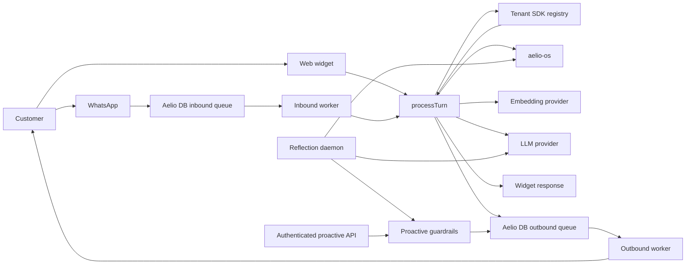
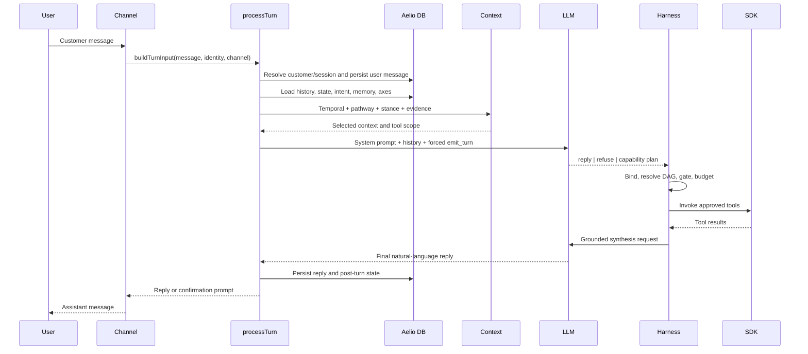
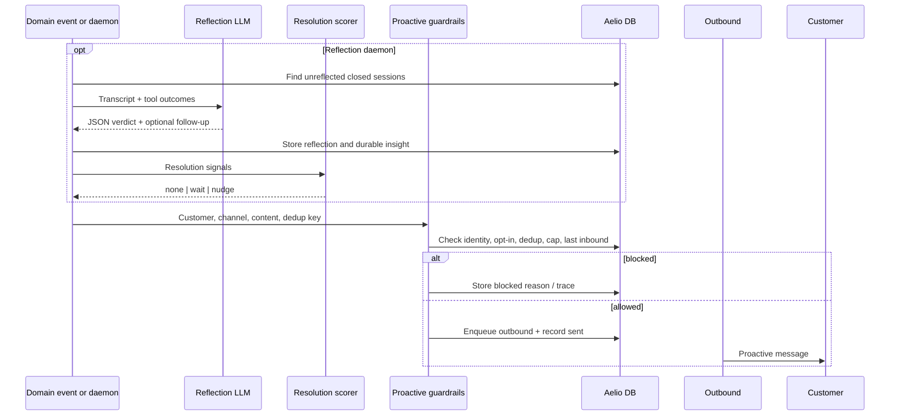

# AelioConvox Harness + Aelio DB: End-to-End Runtime Architecture

This document explains how AelioConvox receives a message, identifies the customer and
conversation, stores data, recalls temporal and semantic context, tracks intents and
conversational changes, constructs the system prompt, asks the LLM for a constrained
decision, executes tools safely, produces a reply, and keeps the conversation alive.

It also explains the two communication directions:

- **Reactive communication** — the customer sends a message first and AelioConvox replies.
- **Proactive communication** — AelioConvox initiates a message because an external domain
  event or the optional reflection daemon identifies a valid reason to contact the customer.

The description follows the current implementation. Older project documents that describe
SQLite/Drizzle as the source of truth or Aelio DB as optional are outdated. The current runtime
is aelio-os-only.

---

## 1. Architectural responsibilities

AelioConvox separates reasoning, control, business capability, persistence, and delivery.

| Component | Responsibility |
|---|---|
| Channel routes and workers | Receive widget, WhatsApp, or SDK-originated messages and deliver replies |
| Turn runtime | Own the complete lifecycle of one reactive customer turn |
| Semantic pathway | Retrieve relevant tools, policies, flows, memories, and response strategy |
| Archetype engine | Detect conversational stance such as sentiment, urgency, certainty, and engagement |
| Intent stack | Keep the current goal and previous conversational topics alive across turns |
| Harness | Plan, bind, resolve dependencies, gate, execute, suspend/resume, and synthesize |
| Tenant SDK | Register functions, states, policies, flows, persona, and delivery capability |
| aelio-os | Store operational records, vectors, graph edges, caches, ledgers, jobs, and audit data |
| LLM | Produce a constrained turn decision, final natural-language answer, summaries, reflections, and candidate aspects |
| Embedding provider | Convert text into vectors used by semantic retrieval |
| Proactive daemon | Reflect on completed sessions and propose follow-ups; deterministic code decides whether sending is allowed |

The key authority boundary is:

> The LLM may propose what to do and how to phrase it. It does not directly authorize a
> side effect, choose execution concurrency, bypass lifecycle restrictions, or decide whether
> proactive contact is permitted.

Those decisions remain in deterministic TypeScript code.

---

## 2. High-level runtime topology



The Node server communicates with Aelio DB engine through:

```text
Aelio TypeScript
  → @aelio/db-client
  → HTTP/JSON
  → ll-server
  → ll_query::Database
  → WAL + memtable + .vss segments and indexes
```

There is no direct Node FFI, N-API, WASM, or Rust-library binding to `ll-query`.

At startup, `server/src/app.ts`:

1. Creates the LLM provider chain.
2. Configures the embedding provider, or keeps the built-in hash embedder.
3. Forces Aelio DB to be enabled.
4. Health-checks Aelio DB and ensures every table.
5. Creates all Aelio DB-backed stores.
6. Creates the SDK bridge and Lighthouse registry mirror.
7. Creates the harness tracer and suspension store.
8. Creates the immediate-context, semantic-pathway, archetype, and axis engines.
9. Registers HTTP and WebSocket routes.
10. Starts inbound, outbound, backup, and optional reflection/proactive workers.

Aelio DB startup failure is fatal. There is no storage fallback.

---

## 3. Reactive communication: the user sends first

Reactive processing is the normal customer-support path.

### 3.1 Widget ingress

The widget uses a WebSocket route.

1. The client initializes its identity.
2. The server validates the session token when authentication is enabled.
3. The client sends a chat message.
4. The widget route emits a `typing` event.
5. It calls `processTurn(buildTurnInput(...))` directly.
6. It returns either:
   - a normal assistant `message`, or
   - a `confirmation` prompt for a pending write.

Widget replies are delivered inline on the same socket. They do not need the outbound job
queue.

### 3.2 WhatsApp ingress

WhatsApp uses durable queues.

1. The webhook verifies Meta's signature against the raw request body.
2. The inbound Meta message ID is deduplicated in Aelio DB.
3. The webhook enqueues an `inbound` job.
4. The inbound worker claims the job.
5. It resolves the WhatsApp identity.
6. It calls the same `processTurn` runtime used by the widget.
7. It enqueues the resulting reply as an `outbound` job.
8. The outbound worker sends the reply through:
   - the built-in Meta sender,
   - a mock sender, or
   - the tenant SDK's channel-send callback.

The channel changes the ingress and delivery mechanism, but not the core turn intelligence.

### 3.3 Reactive flow diagram



---

## 4. The outer turn lifecycle

The main orchestration lives in `packages/core/src/runtime/turn.ts`.

### 4.1 Validate mandatory dependencies

The turn requires Aelio DB-backed:

- message store;
- session store;
- customer store;
- function-call audit store;
- memory store when memory is enabled;
- response-cache store when cache is enabled;
- harness ledger configuration when the harness is enabled.

### 4.2 Resolve identity and serialize turns

The channel identity is normalized into an external customer ID. The runtime then locks on:

```text
channel + external customer ID
```

This prevents two simultaneous messages from the same customer/channel from racing while
they mutate session state, intent, lifecycle metadata, confirmation state, or a parked plan.

### 4.3 Ensure customer and session

The runtime:

1. Finds or creates the customer.
2. associates the channel address with the customer;
3. enforces customer rate limits using stored user-message counts;
4. finds an active session or creates a new session after the idle timeout;
5. generates a unique `turnId`;
6. loads the pre-turn intent, lifecycle state, and available profile fields.

### 4.4 Persist before reasoning

The incoming user message is persisted before the main reasoning path. This gives the system
a durable record even if later retrieval, an LLM call, or a business tool fails.

The message is written to:

- the raw messages table; and
- the enriched conversation archive.

The enriched record can include customer/channel identity, lifecycle state, intent stack,
active flow, active policies, tools executed, and pending-confirmation state.

The immediate-context engine is also notified so its cached customer snapshot is invalidated.

### 4.5 Per-turn telemetry

The turn executes inside `runWithTurnContext`. LLM and embedding activity can then be recorded
with the current:

- turn ID;
- session ID;
- customer ID;
- call sequence;
- purpose;
- model;
- token usage;
- duration;
- selected tool names;
- redacted prompt/input summaries.

---

## 5. Fast paths before the main LLM request

The runtime tries cheaper and safer paths before semantic planning.

### 5.1 Pending confirmation

There are two confirmation mechanisms:

- legacy tool-loop confirmation in session metadata;
- harness suspension in the dedicated Aelio DB suspension table.

For harness turns, the full plan is parked. On the next message:

- an explicit `yes` resumes the exact plan;
- an explicit denial clears it;
- an ambiguous message repeats the confirmation question.

The write is never inferred as approved from vague text.

### 5.2 Generic gate

Short whole-message greetings, thanks, and farewells can receive deterministic template
responses without embeddings or an LLM call.

This gate is skipped when:

- a harness plan is parked, because the message may answer the pending question; or
- a recoil intent is active.

### 5.3 Semantic response cache

When enabled, the response cache searches previous customer-specific no-tool replies by
semantic similarity.

A cache entry is eligible only when:

- it belongs to the same customer;
- it has not expired;
- recomputed cosine similarity passes the configured threshold;
- the original turn executed no tool;
- it has no pending confirmation.

The cache is also bypassed when a plan is parked. An answer to a pending question must not be
mistaken for a new cached query.

---

## 6. How conversation data is stored

Aelio DB is used as both operational storage and semantic retrieval infrastructure.

### 6.1 Raw conversation records

`messages` stores:

- message ID;
- session ID;
- customer ID;
- role;
- content;
- channel;
- tier;
- timestamp;
- optional embedding.

`conversations` stores a denormalized event view with the conversational state that existed
when the event was written.

This gives two useful views:

- a simple chronological transcript; and
- an enriched audit/event stream that explains the state surrounding each message.

### 6.2 Customer and channel identity

Customer records contain:

- internal customer ID;
- external ID;
- display name;
- JSON metadata;
- creation and update timestamps.

Channel-address records map web, WhatsApp, or other addresses to the same customer. This lets
the immediate-context and long-term-memory systems operate across sessions and channels.

### 6.3 Sessions

Session records contain:

- customer and channel;
- open/closed status;
- start, activity, and close times;
- rolling summary;
- JSON metadata.

Session metadata carries runtime state such as:

- intent stack;
- legacy pending confirmation;
- semantic pathway decision;
- conversational stance;
- proactive resolution state.

Customer metadata carries lifecycle state, lifecycle reason, tenant profile fields, flow
progress, and proactive opt-in.

### 6.4 Function-call audit

Every relevant tool decision can record:

- function name;
- arguments;
- result;
- success, error, pending, or blocked status;
- safety level;
- whether confirmation was required;
- whether it was confirmed;
- duration;
- error details.

This is separate from the harness execution ledger. Audit records explain what happened to
operators; the ledger prevents repeated execution inside a plan.

---

## 7. Temporal storage: keeping recent conversation alive

AelioConvox uses several time horizons rather than one unbounded transcript.

### 7.1 Current session history

The runtime loads the latest configured number of session messages and passes them as normal
chat history.

### 7.2 Rolling session summary

After the configured message count is reached, the session can be summarized. The summary
preserves important facts while preventing unlimited history growth.

### 7.3 Immediate Context Engine

The immediate-context engine keeps customer-wide context across sessions and channels:

| Age | Representation |
|---|---|
| Less than 5 minutes | Verbatim hot messages |
| 5–15 minutes | Tier 1 compacted bucket |
| 15–30 minutes | Tier 2 compacted bucket |
| 30–60 minutes | Tier 3 compacted bucket |
| 1–24 hours | Tier 4 compacted bucket |
| Older than 24 hours | Removed from immediate context; long-term memory is used instead |

When multiple buckets occupy the same tier they are merged. If the merged content exceeds
the character limit, the LLM condenses it into factual bullets. If that call fails,
deterministic truncation is used.

The prompt snapshot is cached briefly and invalidated whenever a new message is persisted.

### 7.4 Explicit temporal scope

The temporal resolver recognizes language such as:

- earlier today;
- yesterday;
- last week;
- recently;
- a while ago.

When there is no explicit phrase, it derives a recency window from session activity. That
scope limits which historical axis occurrences are considered relevant.

### 7.5 Long-term semantic memory

Durable customer facts and preferences are stored separately with:

- content;
- customer ID;
- embedding;
- category;
- source session;
- confidence;
- timestamp;
- optional expiry.

Memory recall performs customer-filtered vector search, hydrates candidate rows, filters
expired records, recomputes cosine similarity, and returns the highest-scoring items.

Post-turn extraction can capture explicit profile facts and preferences. Session reflection
can also store a durable insight. Exact duplicate content is not inserted again.

---

## 8. Graphical storage: conversational axes

The axis graph tracks how a customer's conversational aspects evolve over time.

Built-in aspects currently include:

- sentiment;
- engagement;
- certainty;
- urgency.

Each customer/aspect pair has a root node:

```text
root(customer, aspect)
  └── head → newest occurrence
                  └── previous → older occurrence
                                      └── previous → ...
```

An occurrence stores:

- customer and aspect;
- turn, message, and session identifiers;
- matched message span;
- dominant positive, negative, or neutral valence;
- all three valence scores;
- strength;
- intent label;
- active flow;
- embedding;
- timestamp;
- `previous` edge.

Only stance categories that pass confidence and winner-margin thresholds are written.
Occurrence IDs are deterministically derived from tenant, turn, span index, and aspect, which
makes a repeated write retry-safe.

On a later turn:

1. the current message is assessed for active aspects;
2. each confidently active aspect selects the matching customer axis;
3. the store begins at the root's `head`;
4. it follows `previous` edges up to a bounded depth;
5. it stops outside the resolved temporal window;
6. it computes semantic similarity against the current query vector;
7. matching occurrences enter unified evidence scoring.

This allows the prompt to describe continuity such as:

> The customer remains frustrated about the same billing issue discussed earlier today.

The LLM does not invent that continuity. It receives selected evidence derived from stored
graph occurrences.

---

## 9. Capturing stance and learning new aspects

### 9.1 Archetype valence model

Each conversational aspect has positive, neutral, and negative exemplar buckets in Aelio DB.
Every bucket contains:

- keyword vocabulary;
- description;
- examples of usage;
- inference explanation;
- response guidance;
- embedding.

The incoming message is matched against these exemplars using hybrid vector and lexical
retrieval. The system recomputes cosine similarity because Aelio DB hybrid result scores are
ranking scores, not calibrated similarity probabilities.

For multi-clause messages, the message can be split into at most six spans. Whole-message and
span searches run so that:

```text
"The dashboard is useful, but I am angry about the charge."
```

does not average the positive and negative clauses into an uninformative neutral result.

An aspect reaches the prompt only when:

- the strongest valence exceeds the feed threshold; and
- the margin over the second strongest valence exceeds the ambiguity threshold.

Stance shapes tone and response posture. It never overrides safety or authorizes a tool.

### 9.2 Self-learning aspect taxonomy

After the turn, the system can discover reusable conversational dimensions not already
covered.

1. Match the message against known aspects.
2. Increment matching aspect hit counts.
3. Skip discovery when an existing aspect already explains the message.
4. Otherwise ask the LLM for a small structured set of candidate aspects and valence buckets.
5. Semantically deduplicate proposals.
6. Store new aspects as `candidate`.
7. Promote repeatedly observed candidates to `active`.

Candidate aspects do not shape prompts until promoted, preventing one unusual message from
immediately changing system behavior.

---

## 10. Capturing and maintaining intents

Intent is not a single permanent label. A session stores an intent stack.

```text
CURRENT: billing correction
background: plan comparison
background: account recovery
```

Each frame stores:

- unique ID;
- tenant-derived intent label;
- summary;
- start time;
- last-active time;
- expiry time;
- optional `user` or `recoil` kind.

Intent vocabulary comes primarily from tenant SDK tool definitions. Core does not hardcode
domain topics such as invoices, refunds, or subscriptions.

After a turn:

1. an executed tool's declared intent is the strongest signal;
2. otherwise a sufficiently confident semantic-tool match can supply the intent;
3. the same intent refreshes the current frame;
4. a new intent is pushed on top;
5. previous topics remain as background;
6. explicit conclusion language pops the current topic;
7. stale non-spine frames expire.

The first three frames form an always-alive spine and are not TTL-evicted. This protects a
root goal while the conversation temporarily detours into clarification.

The rendered prompt tells the LLM to focus on the top intent and use deeper frames only as
background.

---

## 11. One embedding fan-out and semantic pathway

After fast paths, the runtime creates a main embedding for the incoming message. That vector
is reused by:

- customer memory recall;
- tool routing;
- pathway decisions;
- archetype assessment;
- axis recall;
- post-turn axis write-back.

There are bounded exceptions:

- mixed messages may create additional span embeddings;
- tool, policy, and flow descriptors have their own memoized embeddings.

The semantic pathway runs independent retrieval tasks in parallel:

1. rank lifecycle-allowed tools;
2. recall customer memories from Aelio DB;
3. rank soft policies;
4. rank flows valid for the active lifecycle state.

Selection rules include:

- lifecycle filtering happens before semantic tool selection;
- hard policies are always retained in the prompt;
- active-flow tools are force-included;
- a progressed flow wins over an unstarted flow;
- otherwise the highest-scoring valid flow is selected;
- intent comes from the best relevant tool, then the intent stack, then `general`.

The pathway returns:

- semantic intent;
- strategy;
- relevant tools;
- selected functions;
- policies;
- selected flow and step;
- recalled memories;
- proactive hint;
- degraded retrieval sources;
- timing information;
- rendered prompt guidance.

The strategy is selected deterministically:

```text
explicit closure     → disengage
active recoil        → resume
selected flow        → guide
relevant capability  → execute
otherwise            → reply
```

This strategy is advisory to the planner. Concrete safety gates remain authoritative.

---

## 12. Unified evidence selection

Axis occurrences, long-term memories, and current stance are converted into a common evidence
shape.

Current evidence weighting is:

```text
0.35 × semantic relevance
0.20 × atom/aspect confidence
0.15 × temporal relevance
0.15 × same-axis continuity
0.10 × active-flow relevance
0.05 × lexical relevance
```

Temporal relevance decays with age. Low-scoring evidence is removed and the selected list is
bounded.

Hard policy inclusion does not depend on evidence score.

The selected evidence block explains both the fact and why it was selected, making prompt
construction and traces easier to audit.

---

## 13. Building the system prompt

All runtime context is assembled in one prompt factory. Prompt composition is deterministic.

### 13.1 Stable prefix

Stable sections are placed first:

1. **Persona** — SDK persona, configured persona, or default persona.
2. **Tool/write guidance** — the model should call write capabilities directly; the platform
   owns confirmation.
3. **Product capability brief** — Lighthouse summary of what the tenant can do.
4. **Lifecycle, policies, and flows** — current state and permitted progression.

The stable prefix improves provider prompt caching.

### 13.2 Volatile suffix

Per-turn sections follow:

1. semantic pathway;
2. conversational stance;
3. temporal scope;
4. selected evidence;
5. selected tool cards;
6. immediate context;
7. rolling session summary;
8. recalled memories;
9. intent stack.

### 13.3 Prompt budgeting

Each section has:

- stability classification;
- priority;
- optional per-section token cap.

The total approximate system-prompt budget is 6,000 tokens, estimated at four characters per
token.

Composition rules:

1. normalize and dedent text;
2. cap each section;
3. place stable sections first;
4. append volatile sections;
5. if over budget, remove complete volatile sections from lowest priority upward;
6. never silently remove stable contract sections.

The current conversation history and user message are passed as chat messages, not embedded
inside this system prompt.

### 13.4 Tool visibility

With the harness enabled, the planner sees compact cards:

```text
- update_invoice (billing_correction) [write]: Correct invoice information.
```

It does not receive every native tool schema in the first planning pass. The binder and
resolver use the live SDK schemas after the LLM produces capability-level instructions.

The legacy tool loop is different: it exposes full native function schemas to the LLM.

---

## 14. Talking to the LLM: the planner contract

The harness does not accept arbitrary planner prose. It forces the LLM to call one synthetic
tool named `emit_turn`.

The output must match one of three modes.

### 14.1 Direct reply

```json
{
  "mode": "reply",
  "text": "..."
}
```

This mode is allowed only when no tenant data, account state, or side effect is required.

### 14.2 Refusal

```json
{
  "mode": "refuse",
  "reason": "..."
}
```

This means the requested outcome is outside the product's available capabilities.

When Lighthouse indicates that the request may be feasible, the harness can challenge an
initial refusal with one additional planning call, subject to budgets.

### 14.3 Capability plan

```json
{
  "mode": "plan",
  "goal": "Correct the customer's invoice VAT number",
  "instructions": [
    {
      "id": "a",
      "capability": "update invoice VAT number",
      "tool": "update_invoice",
      "args_hint": {
        "vat_number": "DE811556677"
      },
      "produces": []
    }
  ]
}
```

The planner may propose:

- a goal;
- capability-level steps;
- a tool-name suggestion;
- argument hints visible in conversation;
- names of values produced for later steps.

The planner does **not** decide:

- whether a suggested tool actually exists;
- which argument values are trustworthy;
- the dependency graph;
- which operations run in parallel;
- whether a write is approved;
- whether a policy permits execution.

The output is validated with Zod. Invalid output receives one corrective retry. A second
failure degrades to safe free-text reply/refusal behavior instead of crashing the turn.

---

## 15. Dissecting the LLM plan

### 15.1 Binding capabilities to live tools

Each instruction is bound in this order:

1. exact planner tool suggestion found in the state-filtered registry;
2. normalized name match;
3. Aelio DB capability-to-tool binding cache;
4. Lighthouse semantic tool search.

Semantic binding requires:

- a minimum top score; and
- enough distance from the runner-up to avoid ambiguity.

An unbindable instruction ends safely with a user-facing unsupported-capability response.

### 15.2 Resolving argument sources

The resolver compares:

- planner argument hints;
- live tool parameter schemas;
- fields produced by earlier instructions.

Every required argument becomes one of:

```text
literal value
output from instruction.field
missing value
```

Dependencies are derived from these producer/consumer relationships.

### 15.3 Deriving the execution graph

The resolver creates a DAG and rejects:

- duplicate instruction IDs;
- dependency cycles;
- impossible structures.

An instruction becomes runnable only when all dependencies are complete.

The LLM therefore describes **what** should happen; deterministic code derives **how** the
steps depend on one another.

---

## 16. Safe execution

### 16.1 Wavefront scheduling

For each runnable wave:

- independent reads run concurrently;
- writes run sequentially in stable order;
- a failed producer blocks downstream consumers;
- unrelated failures may remain in the ledger while best-effort work continues.

### 16.2 Concrete-argument gates

Before invoking a tool:

1. assemble arguments;
2. coerce them using the live parameter schema;
3. check missing required values;
4. enforce lifecycle tool boundaries;
5. enforce required customer-profile fields;
6. apply safety policy;
7. return one of:
   - `allow`;
   - `deny_fatal`;
   - `needs_info`;
   - `needs_approval`.

### 16.3 Missing information

When information is missing, the full plan is suspended and the assistant asks only for the
missing value. The next message resumes the existing plan rather than starting from zero.

### 16.4 Write confirmation

When approval is required:

1. no side effect occurs;
2. a pending function-call audit record is written;
3. the full plan is suspended;
4. the exact function, arguments, description, and question are persisted;
5. an explicit `yes` grants approval only to that instruction;
6. execution resumes with the remaining plan tail intact.

### 16.5 Budgets

The harness tracks limits for:

- plan instruction count;
- replans;
- recoils/clarifications;
- tool calls;
- elapsed wall-clock time;
- total model tokens.

These prevent an open-ended autonomous loop.

### 16.6 SDK invocation

After gating, `ServerSdkBridge` selects the freshest connected SDK registration that owns the
tool and sends it an invocation containing:

- function name;
- concrete arguments;
- customer identity;
- session;
- channel.

The SDK returns success, data, duration, or an error.

---

## 17. Idempotency, suspension, and recovery

### 17.1 Execution ledger

Before invocation, arguments are recursively canonicalized so object key order does not
change identity. The canonical JSON is hashed.

The effective replay identity is:

```text
turn ID + instruction ID + canonical argument hash
```

If a matching successful ledger entry is already loaded, the tool is not invoked again.

The ledger stores:

- session;
- turn;
- instruction;
- argument hash;
- status;
- result;
- timestamp.

### 17.2 Suspended plan

The suspension record stores:

- plan goal;
- original user message;
- registry hash;
- every resolved instruction;
- serialized argument sources and dependencies;
- completed ledger entries;
- pending instruction;
- missing field or exact pending call;
- question shown to the user;
- recoil count;
- expiry.

When the user responds, tools are rebound against the live registry. A changed registry,
removed tool, invalid answer, denial, or expiry is handled explicitly.

This makes multi-turn action completion possible without asking the LLM to reconstruct prior
execution state.

---

## 18. Producing the final reply

When a plan finishes, the harness performs a separate synthesis call.

The synthesis request contains:

- the same composed system prompt;
- previous chat history;
- the current user message;
- an assistant tool-call turn representing executed instructions;
- a user tool-result turn containing ledger results;
- no available tools.

Each tool result is capped at 4,000 characters before entering the model context.

Because synthesis receives no tools, it can explain outcomes but cannot start another
side effect.

The LLM returns final unstructured text. Empty output falls back to a deterministic failure
message.

The runtime then traces:

- reply;
- executed tools;
- number of calls;
- pending confirmation;
- semantic strategy;
- intent;
- stance.

---

## 19. Returning the reply to the user

### Widget

The route sends:

```json
{
  "type": "message",
  "role": "assistant",
  "content": "...",
  "turnId": "..."
}
```

For confirmation it sends:

```json
{
  "type": "confirmation",
  "prompt": "...",
  "turnId": "..."
}
```

### Queued channels

The inbound worker enqueues:

```json
{
  "queue": "outbound",
  "channel": "whatsapp",
  "to": "...",
  "text": "..."
}
```

The outbound worker polls every 250 ms, claims a job, selects the delivery provider, sends
the message, and marks the job complete. Failures are recorded and retried according to the
job-store retry behavior. Stale inbound jobs are requeued.

---

## 20. Post-turn learning and continuity

After obtaining the reply, the runtime updates:

1. pending confirmation state when required;
2. intent stack;
3. semantic pathway metadata;
4. conversational stance metadata;
5. proactive resolution state;
6. axis occurrence graph;
7. assistant message and enriched conversation record.

It can then asynchronously:

- extract durable memories;
- discover candidate conversational aspects.

Finally, when safe, it stores a semantic response-cache entry for a no-tool response.

### Resolution state

Resolution state provides a deterministic summary for future proactive decisions:

- `active`;
- `awaiting_user`;
- `awaiting_system`;
- `resolved`;
- `satisfied`;
- `disengaged`;
- `do_not_contact`.

Signals include:

- pathway strategy;
- proactive hint;
- stance;
- pending confirmation;
- tool success;
- flow completion;
- reflection outcome;
- explicit stop;
- previous resolution state.

Explicit stop and disengagement dominate. A pending confirmation becomes `awaiting_user`.
Successful resolution suppresses future contact.

---

## 21. Proactive communication: the system sends first

A proactive message does not begin with a customer query. There are two active entry points.

### 21.1 Domain-event/API initiated

The tenant's backend can call:

- `POST /proactive/opt-in`;
- `POST /proactive`.

Both routes require the configured SDK secret.

The caller supplies:

- external customer ID;
- channel;
- content;
- optional WhatsApp template;
- optional deduplication key.

This path sends caller-provided content. It does not run the reactive turn harness or ask the
main planner to invent an action.

### 21.2 Reflection-daemon initiated

The optional daemon can review completed sessions and produce a follow-up candidate. It is
disabled unless `daemon.enabled` is configured.

The daemon:

1. wakes at `daemon.interval_minutes`;
2. prevents overlapping daemon cycles in the same process;
3. finds closed sessions without reflections;
4. requires the configured minimum message count;
5. processes at most `max_per_cycle`;
6. loads transcript and function-call outcomes;
7. asks the LLM for a bounded JSON reflection;
8. persists the reflection;
9. stores a durable reflection insight as semantic memory when present;
10. considers a follow-up only when:
    - daemon proactive follow-up is enabled;
    - proactive messaging is enabled;
    - reflection outcome is `unresolved`;
    - the LLM supplied follow-up text.

The reflection contract is:

```json
{
  "outcome": "resolved | unresolved | unclear",
  "score": 0.0,
  "summary": "1-2 sentences",
  "issues": ["..."],
  "insight": "durable customer fact or empty",
  "followup": "short customer-facing follow-up or empty"
}
```

The LLM proposes reflection content. It does not decide whether the message is sent.

---

## 22. Deterministic proactive activation

The daemon combines the reflection with existing pathway, stance, and resolution metadata.

Hard suppression states are:

- resolved;
- satisfied;
- disengaged;
- do not contact.

For other states, the activation score considers:

```text
+ unresolved goal
+ promised follow-up / awaiting user
+ active flow
+ negative or unresolved outcome
- age decay
- previous proactive attempts
```

The default decision threshold is `0.45`. An unresolved signal decays with a three-day
half-life.

The result is one of:

- `none` — hard suppressed;
- `wait` — legitimate unresolved state but below threshold;
- `nudge` — eligible to continue to delivery guardrails.

The pathway's existing proactive hint is checked again. A suppression hint blocks sending.

Every wait, suppression, send, or blocked outcome is written to the proactive trace stream.

---

## 23. Proactive delivery guardrails

`sendProactiveMessage` enforces guardrails in this order:

1. proactive feature enabled;
2. known customer;
3. known address for the selected channel;
4. customer opt-in when required;
5. deduplication key has not already been sent;
6. daily customer frequency cap has not been reached;
7. for WhatsApp free-form text, the last inbound user message is inside the configured
   service window;
8. outside the WhatsApp window, an approved template name is required.

Blocked opt-in, daily-cap, and channel-window decisions are persisted with their reason.

On success:

1. an `outbound` job is enqueued with `proactive: true`;
2. a proactive-message record is stored as sent;
3. the same outbound worker used for reactive queued replies delivers it;
4. daemon-triggered sends increment the session resolution attempt count.

### Proactive sequence



---

## 24. Reactive versus proactive

| Concern | Reactive | Proactive |
|---|---|---|
| Trigger | Incoming customer message | Authenticated domain event or reflection daemon |
| Main planner | Yes, unless a deterministic fast path answers | No for API sends; reflection LLM only for daemon candidate text |
| Customer message persisted first | Yes | No new inbound message exists |
| Context retrieval | Full pathway, memory, temporal, stance, axes | Daemon reads completed session and stored resolution/pathway metadata |
| Tool execution | Possible through harness | No business-tool plan in the send path |
| Consent model | Confirmation for guarded writes | Proactive opt-in plus channel rules |
| Delivery | Inline widget or outbound queue | Outbound queue |
| Suppression | Safety/lifecycle gates | Resolution hard suppression, opt-in, dedup, daily cap, WhatsApp window |
| Purpose | Answer or complete the current user request | Re-engage only when permitted and useful |

Both paths share:

- customer identity;
- channel addresses;
- Aelio DB job storage;
- outbound delivery worker;
- proactive/audit traces;
- tenant SDK channel delivery when configured.

---

## 25. Aelio DB datasets used by this architecture

### Conversation and identity

- messages;
- conversations;
- customers;
- channel addresses;
- sessions.

### Temporal and semantic intelligence

- memories;
- compactions;
- archetypes;
- aspects;
- axis nodes;
- response cache.

### Harness execution

- tool mirror;
- capability mirror;
- binding cache;
- suspensions;
- ledger;
- traces.

### Runtime and audit

- function calls;
- per-turn API calls;
- job queue;
- reflections;
- proactive messages;
- inbound deduplication;
- SDK connections;
- magic links.

Vector-bearing datasets can be searched semantically. Edge-bearing datasets model tool
requirements and customer aspect history. Scalar filters enforce customer, tenant, session,
time, status, and lifecycle boundaries.

---

## 26. Failure and degradation behavior

Not all failures have the same policy.

### Mandatory failures

These normally fail startup or the current operation:

- Aelio DB health at startup;
- primary customer/session/message persistence;
- required harness ledger configuration;
- required SDK invocation path;
- critical job-store operations.

### Graceful degradation

These can fail without ending the customer turn:

- remote embeddings fall back to local hash embeddings;
- message embedding may be omitted while the text row is still stored;
- memory retrieval can be omitted and marked degraded;
- archetype failure returns empty neutral stance;
- immediate-context failure returns an empty block;
- Lighthouse mirror failure can use in-process registry ranking;
- trace writes are fire-and-forget;
- binding-cache writes are best effort;
- post-turn memory/aspect learning is asynchronous.

This design preserves basic conversation while making optional intelligence layers
independently degradable.

---

## 27. Current implementation caveats

The following are important when interpreting the architecture.

1. **Current user-message duplication**
   The incoming message is persisted before history is loaded, and the planner appends the
   current `userMessage` again. It can therefore appear twice in LLM chat messages.

2. **Immediate-context duplication**
   Because the current message is persisted first, it can also appear in the immediate
   context block.

3. **Temporal recency is usually hot**
   Session activity is touched before temporal resolution reads it. Without an explicit time
   phrase, recency may describe the just-written message rather than the previous message.

4. **Memory can appear twice**
   Recalled memory is rendered in the memory section and may also qualify for the evidence
   section.

5. **Hard policies are not all execution gates**
   Lifecycle tool boundaries and safety confirmation are deterministic. Tenant policies
   marked hard are retained in the prompt, but they are not generally evaluated as executor
   gate code.

6. **Segment replanning is not implemented**
   A replan outcome exists in types and comments, but the executor does not currently return
   it. The active extra planner call only challenges an initial refusal.

7. **Ledger durability is not exactly-once execution**
   Ledger writes are fire-and-forget and Aelio DB does not enforce a unique key. A process
   failure after an external side effect but before durable ledger persistence can still
   duplicate the side effect on retry.

8. **Some multi-row operations are not transactional**
   Suspension replacement, axis head advancement, customer creation, queue claiming, and
   scan-then-insert deduplication have race windows in multi-process deployment.

9. **SDK registry durability is partial**
   Function catalogs are persisted in SDK connection records. States, policies, flows,
   persona, and product brief primarily remain in the live in-memory registry.

10. **The reflection/proactive daemon is optional**
    It does no work unless daemon and proactive settings enable it. Response caching and
    proactive delivery are also disabled by default in typical configuration.

11. **No automatic all-in-one compaction daemon**
    Fresh Aelio DB engine rows remain queryable and WAL-durable through memtable scans, but indexed
    `.vss` performance depends on flush/compaction operations. The optional Rust daemon is not
    started by the standard all-in-one server image.

These caveats do not change the core design, but they distinguish the current implementation
from stronger exactly-once or fully transactional guarantees.

---

## 28. End-to-end example

Customer:

> I am still frustrated. My invoice has the wrong VAT number again. Fix it today using
> DE811556677.

### Assessment

1. Identity and session are resolved.
2. The message is persisted.
3. It is not a generic greeting and has no safe cache match.
4. The message vector retrieves invoice-related tools and memories.
5. Archetype matching identifies negative sentiment and urgency.
6. Temporal scope identifies hot continuity or an explicit time phrase.
7. The sentiment/urgency axes can retrieve prior relevant occurrences.
8. Evidence scoring selects the strongest context.
9. Lifecycle filtering removes tools not permitted in the current state.

### Prompt and planning

The system prompt contains:

- tenant persona;
- write confirmation guidance;
- capability brief;
- lifecycle and policies;
- billing-correction pathway;
- negative/urgent stance guidance;
- temporal and prior-axis evidence;
- only relevant tool cards;
- immediate context, memory, and intent stack.

The forced planner returns a `plan` for invoice correction.

### Binding and execution

1. `update_invoice` is verified against the live registry.
2. `vat_number` is a literal argument from the message.
3. The resolver marks it as a write.
4. The safety gate returns `needs_approval`.
5. The complete plan is stored in Aelio DB.
6. The customer receives a confirmation prompt.

Customer:

> Yes.

### Resume and response

1. The parked plan intercepts `Yes` before generic/cache handling.
2. The exact pending instruction is approved.
3. The SDK tool is invoked once.
4. The result is recorded in the ledger and function-call audit.
5. The synthesis LLM receives the real result.
6. The final reply confirms only what the tool result proves.
7. Intent, resolution, stance, axes, memory candidates, and the assistant message are updated.

If the completed session is later reflected as unresolved, the daemon may propose a follow-up.
That proposal is still suppressed unless the activation score and all proactive guardrails
allow contact.

---

## 29. Source map

Primary implementation locations:

```text
server/src/app.ts                         Runtime construction
server/src/turn-options.ts                ProcessTurnInput wiring
server/src/routes/widget.ts               Reactive widget ingress/response
server/src/routes/whatsapp.ts             WhatsApp webhook ingress
server/src/routes/proactive.ts             Authenticated proactive API
server/src/workers/inbound.ts              Queued reactive processing
server/src/workers/outbound.ts             Shared outbound delivery
server/src/workers/daemon.ts               Reflection/proactive daemon
server/src/aelio-db.ts                       Aelio DB initialization and stores

packages/core/src/runtime/turn.ts           Outer reactive turn lifecycle
packages/core/src/runtime/prompt-factory.ts Prompt sections
packages/core/src/runtime/prompt-composer.ts Prompt budgets and ordering
packages/core/src/pathway/index.ts          Semantic pathway
packages/core/src/archetype/index.ts        Stance and valence
packages/core/src/context-engine/index.ts   Temporal context buckets
packages/core/src/intent/stack.ts           Intent stack
packages/core/src/evidence/index.ts         Unified evidence scoring
packages/core/src/resolution/index.ts       Proactive resolution/scoring
packages/core/src/runtime/proactive.ts      Proactive guardrails and enqueue

packages/core/src/harness/planner.ts        Forced emit_turn planning
packages/core/src/harness/binder.ts         Capability-to-tool binding
packages/core/src/harness/resolver.ts       Argument sources and DAG
packages/core/src/harness/executor.ts       Gates and wave execution
packages/core/src/harness/suspension.ts     Parked plans
packages/core/src/harness/ledger.ts         Execution idempotency ledger
packages/core/src/harness/synthesis.ts      Grounded final reply
packages/core/src/harness/traces.ts         Decision traces

packages/core/src/storage/bootstrap.ts      Aelio DB table schemas
packages/core/src/storage/messages.ts       Conversation storage
packages/core/src/storage/memories.ts       Long-term semantic memory
packages/core/src/storage/axis.ts           Customer aspect graph
packages/core/src/analyst/extract.ts        Post-turn memory extraction
packages/core/src/analyst/aspects.ts        Aspect discovery
packages/core/src/analyst/reflect.ts        Session reflection

packages/aelio-db-client/src/client.ts        HTTP Aelio DB client
aelio-os/crates/ll-server           HTTP server
aelio-os/crates/ll-query            Query planning/execution
aelio-os/crates/ll-engine           WAL, memtable, segments
```

---

## 30. Summary

AelioConvox keeps a conversation alive through several cooperating memory layers:

- raw chronological messages;
- rolling session history and summaries;
- customer-wide immediate temporal context;
- long-term semantic memories;
- an intent stack;
- customer-specific aspect graphs;
- lifecycle and flow state;
- suspended action plans;
- execution ledgers and audit records.

For reactive turns, these layers are converted into a bounded prompt and constrained planner
contract. The LLM proposes a reply, refusal, or capability plan. Deterministic code verifies
the plan, derives dependencies, enforces gates, executes business functions, and asks the LLM
only to verbalize grounded results.

For proactive turns, the system begins without a new customer message. An authenticated
domain event can provide content directly, or the optional daemon can reflect on an unresolved
session and propose a follow-up. Deterministic resolution scoring, consent, deduplication,
frequency, and channel-window rules decide whether the message can be delivered.

Aelio DB is the common operational memory beneath both paths. The harness is the control plane.
The tenant SDK is the business-capability plane. The LLM is a constrained reasoning and
language component—not the final authority over state or side effects.
