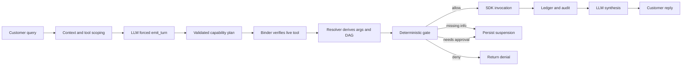

# Harness Tool Calling and Tool Execution: End-to-End

This document explains exactly how AelioConvox decides that a tool is needed, narrows the
available tool set, asks the LLM for a structured capability plan, binds that plan to live
tenant SDK functions, derives argument dependencies, enforces lifecycle and safety gates,
executes reads and writes, handles missing information and confirmation, records results,
resumes interrupted plans, and generates the final customer reply.

It focuses on the structured harness path:

```text
plan → bind → resolve → gate → execute → suspend/resume → synthesize
```

The legacy native tool loop is covered near the end for comparison.

---

## 1. The most important distinction

The harness uses two different kinds of “tool call.”

### 1.1 Planner control call

The first LLM request is forced to call a synthetic control tool:

```text
emit_turn
```

`emit_turn` does not perform a business operation. It only returns one structured decision:

- reply directly;
- refuse;
- produce a capability-level plan.

### 1.2 Business tool invocation

Actual tenant functions such as:

```text
get_order
refund_order
update_invoice
compare_plans
reset_login
```

are invoked later by deterministic harness code through `ServerSdkBridge`.

The LLM cannot directly jump from text generation to an SDK side effect.



---

## 2. Where tools come from

Tools are registered by the tenant SDK over its WebSocket connection.

Each function definition contains:

```ts
{
  name: string;
  description: string;
  params: Record<string, unknown>;
  safety: "read" | "write" | "destructive";
  intent?: string;
}
```

Example:

```ts
{
  name: "refund_order",
  description: "Start a refund for an eligible order.",
  intent: "order_refund",
  safety: "write",
  params: {
    order_id: {
      type: "string",
      description: "Customer order identifier"
    },
    reason: {
      type: "string",
      optional: true
    }
  }
}
```

### 2.1 What each field controls

| Field | Runtime use |
|---|---|
| `name` | Registry identity, planner suggestion, binding, invocation routing, audit |
| `description` | Semantic retrieval, planner grounding, confirmation wording |
| `params` | Required fields, coercion, dependency derivation, answer validation |
| `safety` | Read/write scheduling and safety policy |
| `intent` | Semantic routing and post-turn intent stack |

The live SDK registry is authoritative for liveness and schemas. Function catalogs are also
written to the SDK-connections store, but execution always routes to a currently registered
connection.

---

## 3. Supported parameter declarations

Function parameters support shorthand and structured forms.

### Required shorthand

```ts
{
  order_id: "string"
}
```

### Optional shorthand

```ts
{
  reason: "string?"
}
```

### Full declaration

```ts
{
  quantity: {
    type: "integer",
    description: "Number of units",
    optional: false
  },
  urgent: {
    type: "boolean",
    optional: true
  },
  tone: {
    type: "string",
    enum: ["short", "detailed"]
  },
  items: {
    type: "array",
    items: "string"
  }
}
```

A field is optional when:

- its shorthand type ends in `?`;
- `optional: true`; or
- `required: false`.

The schema layer provides:

- `buildInputSchema()` for native LLM tool definitions;
- `requiredParamNames()` for harness resolution;
- `findMissingRequiredArgs()` for gating;
- `coerceArgs()` for value conversion and validation.

---

## 4. Tool registry assembly

`ServerSdkBridge` can track multiple active SDK connections.

For reads of the registry:

1. registered connections are inspected;
2. functions are merged by function name;
3. later entries with the same name replace earlier entries in the merged map;
4. states, policies, and flows are similarly merged by ID;
5. persona and product brief come from the first registered connection that supplies them.

For invocation:

1. select registered connections that expose the chosen function;
2. sort by most recent heartbeat;
3. use the freshest matching connection.

This allows reconnection or multiple SDK instances while keeping execution routed to a live
handler.

---

## 5. Lighthouse: the harness tool read model

Lighthouse builds derived artifacts from the live registry:

- stable registry hash;
- product/capability brief;
- Sunjet tool mirror;
- Sunjet capability taxonomy;
- semantic search;
- prerequisite-expansion graph.

### 5.1 Registry hash

The hash covers:

- functions;
- states;
- policies;
- flows;
- persona;
- product brief.

When the registry changes:

1. the hash changes;
2. capability brief is rebuilt;
3. Sunjet mirror refreshes asynchronously;
4. binding-cache keys naturally change;
5. an old suspended plan can be rejected as stale.

### 5.2 Tool descriptor

Semantic tool search embeds:

```text
tool name — intent — description
```

Example:

```text
refund_order — order_refund — Start a refund for an eligible order.
```

### 5.3 Sunjet tool mirror

The mirror stores:

- tenant;
- registry hash;
- name;
- description;
- intent;
- safety;
- serialized parameters;
- embedding;
- `requires` edges.

### 5.4 Retrieval-expansion graph

The mirror derives heuristic prerequisite edges. For example, a tool that requires
`cart_id` can link to likely cart-producing tools.

These graph edges improve retrieval recall only.

> Lighthouse `requires` edges do not control execution order. The resolver derives the
> executable dependency graph later from the selected plan and live schemas.

### 5.5 Score calibration

Sunjet hybrid query results use reciprocal-rank fusion. Those scores are not cosine
probabilities. Lighthouse hydrates matched rows and recomputes cosine similarity against
stored embeddings before binder thresholds are applied.

If the Sunjet mirror is unavailable, Lighthouse falls back to in-process embedding and cosine
ranking over the live registry.

---

## 6. Pre-planner tool scoping

Before `runHarness` is called, the outer turn runtime reduces the registry.

### 6.1 Lifecycle filtering

The active lifecycle state can:

- allow only named tools;
- block named tools;
- require customer-profile fields;
- define transitions triggered by successful tools.

Lifecycle filtering happens before semantic retrieval. A semantically relevant tool cannot
be selected if it is outside the active state's allowed tool boundary.

### 6.2 Semantic pathway selection

The pathway engine ranks tools against the incoming message.

Rules include:

- if the state-allowed registry is small, include all tools;
- otherwise include the top semantic tools;
- force-include tools required by the current flow step;
- derive semantic intent from the strongest matching tool.

### 6.3 Planner tool cards

The harness planner does not receive full native tool schemas. It receives compact cards:

```text
- refund_order (order_refund) [write]: Start a refund for an eligible order.
- get_order (order_inquiry): Fetch current order details.
```

This gives the planner enough information to name capabilities without asking it to reason
over every schema detail. Full schemas remain in deterministic code.

---

## 7. The planner request

`runPlanner()` sends:

- composed system prompt;
- conversation history;
- current customer message;
- exactly one available tool: `emit_turn`;
- forced tool choice for `emit_turn`.

The model cannot choose free-form native tool execution in this pass.

### 7.1 `emit_turn` modes

#### Reply

```json
{
  "mode": "reply",
  "text": "The Pro plan includes..."
}
```

This is only for answers requiring no tenant data, account state, or side effect.

#### Refuse

```json
{
  "mode": "refuse",
  "reason": "This product cannot perform that operation."
}
```

#### Plan

```json
{
  "mode": "plan",
  "goal": "Refund the customer's damaged order",
  "instructions": [
    {
      "id": "a",
      "capability": "look up order details",
      "tool": "get_order",
      "args_hint": {
        "order_id": "8842"
      },
      "produces": ["order"]
    },
    {
      "id": "b",
      "capability": "refund the eligible order",
      "tool": "refund_order",
      "args_hint": {
        "order_id": "8842",
        "reason": "damaged"
      }
    }
  ]
}
```

### 7.2 Planner instruction semantics

Each instruction may contain:

| Field | Meaning |
|---|---|
| `id` | Short unique instruction identifier |
| `capability` | Human-readable outcome the instruction should achieve |
| `tool` | Optional suggestion from the visible tool cards |
| `args_hint` | Values the planner believes are already present in context |
| `produces` | Names of output values later instructions may consume |

`args_hint` is not execution authority. It is reinterpreted against the live tool schema.

### 7.3 Planner validation

The forced call arguments are parsed through `EmitTurnSchema`.

If invalid:

1. the invalid tool call is appended to conversation;
2. a synthetic tool-result error lists schema violations;
3. the model receives one corrective retry.

If the second attempt is still invalid:

- non-empty model text becomes a shallow reply;
- otherwise a safe refusal is returned.

The turn does not crash solely because structured planner output was malformed.

### 7.4 Refusal challenge

If the planner refuses and Lighthouse suggests the request may be servable:

1. feasibility score is compared with the binding threshold;
2. replan and clock budgets are checked;
3. one revised planning call receives a note that capability search found a possible match.

This is the only active harness replan path. Mid-plan “surprise” segment replanning is not
currently implemented.

---

## 8. Plan-size budget

Before any binding or execution, the plan instruction count is checked.

Default maximum:

```text
12 instructions
```

An oversized plan is rejected with a message asking the user to split the request.

This prevents a single LLM output from creating an unbounded execution graph.

---

## 9. Binding instructions to tools

The binder converts every capability instruction into:

```ts
{
  instruction: PlanInstruction;
  tool: FunctionDefinition;
}
```

Binding is attempted in this order.

### 9.1 Exact planner suggestion

The binder checks:

1. exact `instruction.tool`;
2. case/punctuation-insensitive `instruction.tool`;
3. normalized `instruction.capability` as a possible tool name.

A suggestion is accepted only if it exists in the already scoped live registry.

### 9.2 Sunjet binding cache

Cache identity is derived from:

```text
tenant + registry hash + normalized capability text
```

The cache stores:

- capability instruction;
- tool name;
- embedding;
- creation time;
- expiry.

Lookup is exact by the hashed binding key. The stored embedding is not used for lookup.

If the cache points to a tool no longer present in the current registry, it is ignored.

### 9.3 Lighthouse semantic binding

On a cache miss, Lighthouse returns the top candidates.

The winner must pass both:

```text
top score ≥ scoreMin
top score - runner-up score ≥ ambiguityGap
```

Defaults:

```text
scoreMin = 0.55
ambiguityGap = 0.08
```

This prevents binding a vague capability when two tools are similarly plausible.

Successful semantic bindings are written asynchronously to the cache.

### 9.4 Unbound instruction

If any instruction cannot be bound:

- the plan is not partially executed;
- the internal capability name is humanized;
- the customer receives an unsupported-capability response.

---

## 10. Resolving arguments and dependencies

The resolver is the authority for the executable graph.

### 10.1 Produced-field index

The resolver creates:

```text
normalized produced field → earliest producer instruction
```

Normalization removes case and punctuation:

```text
cart_id
cartId
Cart-ID
```

all become the same comparison key.

### 10.2 Required parameter resolution

For every required parameter in the bound tool schema:

1. if a non-null planner hint exists, use a literal source;
2. otherwise, if an earlier instruction declares a matching produced field, use an output
   source and add a dependency edge;
3. otherwise mark the source as missing.

Optional hinted parameters are retained as literals.

The result is:

```ts
type ArgSource =
  | { kind: "literal"; value: unknown }
  | { kind: "output"; instructionId: string; field: string }
  | { kind: "missing" };
```

### 10.3 Forward dependencies are not created

Only an earlier instruction can supply a later instruction.

If a matching producer appears after the consumer, the consumer parameter remains missing.

This preserves planner instruction order as the only source of producer precedence while
still deriving actual dependency edges deterministically.

### 10.4 Effect classification

Execution effect is derived from tool safety:

```text
safety = read                    → effect = read
safety = write or destructive    → effect = write
```

The model does not label reads and writes.

### 10.5 Structural validation

The resolver rejects:

- duplicate instruction IDs;
- derived dependency cycles.

Resolve failure currently returns a static “steps tangled” response. It does not invoke a
repair planner.

---

## 11. Resolved plan shape

After binding and resolution:

```ts
{
  goal: string;
  nudge?: string;
  instructions: [
    {
      id: string;
      capability: string;
      tool: FunctionDefinition;
      argSources: Record<string, ArgSource>;
      needs: string[];
      effect: "read" | "write";
      produces: string[];
    }
  ];
}
```

Example:

```text
a: get_customer
   effect: read
   args: email = literal("sanjith@example.com")
   needs: []
   produces: [customer_id]

b: get_orders
   effect: read
   args: customer_id = output(a.customer_id)
   needs: [a]
   produces: [order_id]

c: refund_order
   effect: write
   args:
     order_id = output(b.order_id)
     reason = literal("damaged")
   needs: [b]
```

---

## 12. Executor state and ledger hydration

Executor state contains:

```ts
{
  ledger: LedgerEntry[];
  completed: Set<string>;
  outputs: Map<string, unknown>;
  executedToolNames: string[];
  toolCallsExecuted: number;
}
```

Before executing a new plan with a `turnId`, the harness loads existing ledger rows from
Sunjet for:

```text
session ID + turn ID
```

Successful entries seed:

- completed instruction IDs;
- output values available to dependent instructions.

This is the retry/replay guard for work already recorded in the current turn.

---

## 13. Topological wave execution

`nextWave()` returns every unfinished instruction whose `needs` are all complete.

Example:

```text
Wave 1:
  get_customer       read
  get_catalog        read

Wave 2:
  get_orders         read; depends on get_customer
  compare_products   read; depends on get_catalog

Wave 3:
  refund_order       write; depends on get_orders
```

Within each wave:

1. all reads run concurrently with `Promise.all`;
2. writes run sequentially in instruction order;
3. after the wave, failures are checked for pending dependents;
4. successful instructions are reported to tracing/hooks;
5. execution proceeds to the next ready wave.

### 13.1 Why reads run together

Independent reads have no side effects and can reduce latency.

### 13.2 Why writes are serialized

Writes may change shared account state. Running them one at a time avoids racing side effects
inside one plan.

### 13.3 Stalled graph

If no instruction is runnable but the plan is incomplete, execution stops as a structural
stall.

### 13.4 Failed producer

If a tool fails and an unfinished instruction needs its output:

- downstream execution stops;
- the customer receives a dependency failure explanation;
- undefined output is never passed to the consumer.

A failed instruction with no unfinished dependents can remain in the ledger while unrelated
work continues.

---

## 14. Assembling concrete arguments

Immediately before a tool runs, the executor evaluates each `ArgSource`.

### Literal source

```text
vat_number = "DE811556677"
```

### Output source

The executor loads the producing instruction's result and tries:

1. exact property name;
2. normalized property-name comparison;
3. if the producer result is scalar, use the scalar directly.

Example result:

```json
{
  "orderId": "8842"
}
```

can satisfy a consumer parameter named:

```text
order_id
```

### Missing source

Missing sources are not silently converted to empty strings. They remain absent so the gate
can suspend and request information.

---

## 15. Argument coercion

Before the gate, arguments are coerced against the live tool schema.

Examples:

```text
"5"      → 5       for number/integer
"true"   → true    for boolean
123      → "123"   for string
```

Validation can detect:

- non-numeric number/integer;
- fractional value for integer;
- invalid boolean;
- non-array for array;
- non-object for object;
- value outside an enum.

Undeclared keys pass through.

### Current harness caveat

The harness executor computes `coercion.errors`, but the current implementation does not stop
or suspend when those errors are non-empty. It continues with `coercion.args`.

The legacy tool loop does inspect those errors and sends them back to the model for repair.

Therefore tenant SDK handlers should still validate received arguments defensively, and the
harness should be hardened to convert coercion errors into a deterministic rejection or
recoil.

---

## 16. Deterministic gate order

Every business invocation passes through `evaluateGate()` using concrete arguments.

Order matters.

### Gate 1: required arguments

If required values are absent:

```ts
{
  verdict: "needs_info",
  missing: ["order_id"],
  reason: "Missing required argument(s): order_id"
}
```

### Gate 2: lifecycle tool boundary

The active state can deny the tool when:

- it appears in `blockedTools`; or
- `allowedTools` exists and does not include it.

This is a fatal denial.

### Gate 3: lifecycle profile guards

If the state requires customer fields that are not present:

```ts
{
  verdict: "needs_info",
  missing: ["verified_email"],
  reason: "The identity_verification stage still needs: verified_email."
}
```

### Gate 4: safety policy

Safety returns:

- fatal deny;
- needs approval;
- allow.

The LLM cannot reorder or bypass these checks.

---

## 17. Safety policy

Effective safety starts with the function's SDK-declared safety and can be overridden by
server configuration.

### Read

Normally executes without confirmation.

### Write

In `read_only` mode, a write is denied unless explicitly configured as allowed.

In full mode, or when explicitly allowed, write confirmation depends on:

- per-tool `require_confirmation` override; or
- global `requireConfirmationFor` settings.

### Destructive

Destructive tools are denied:

```text
This action is not available via chat.
```

### Blocked override

A server override can mark any function as blocked.

### Important policy distinction

Lifecycle boundaries and the safety configuration are executable gates.

Tenant policies included in the system prompt—even policies marked hard—are not generally
compiled into `evaluateGate()`. Prompt policy compliance still depends on model behavior
unless separately represented by lifecycle or safety configuration.

---

## 18. Missing information: recoil and suspension

When the gate returns `needs_info`, execution stops before invocation.

The executor returns:

```ts
{
  kind: "suspend",
  reason: "awaiting_info",
  instruction,
  verdict,
  question: "To continue I still need: order_id. Could you provide it?"
}
```

### 18.1 Persisted state

The harness stores:

- complete resolved plan;
- completed ledger;
- pending instruction;
- missing field;
- tool name;
- exact question;
- original user message;
- registry hash;
- recoil count;
- expiry.

### 18.2 Next user message

The next message is intercepted before fresh planning.

If it is an explicit cancellation:

- suspension is cleared;
- no tool runs.

Otherwise:

1. rehydrate the serialized plan;
2. verify the registry hash;
3. rebind every live tool;
4. coerce the answer using the pending field schema;
5. ensure the field is now present;
6. pin the answer as a literal source;
7. seed completed work and outputs from the ledger;
8. resume execution.

If answer validation fails, the same question is asked again.

The recoil budget prevents asking forever.

---

## 19. Write confirmation

When the safety gate returns `needs_approval`, the tool has not run.

### 19.1 Pending audit

A function-call audit row is written with:

- function name;
- concrete arguments;
- status `pending`;
- safety level;
- `requiredConfirmation = true`.

### 19.2 Customer prompt

The harness builds a confirmation message from:

- tool name;
- description;
- concrete arguments.

### 19.3 Persist full plan

The same suspension mechanism stores:

- full plan;
- prior ledger;
- exact pending call;
- pending instruction;
- question;
- registry hash.

This preserves steps after the write. Confirmation does not drop the rest of a multi-step
plan.

### 19.4 Resume rules

- explicit denial clears the plan;
- ambiguous response repeats the question;
- explicit confirmation continues.

On confirmation:

1. suspension is rehydrated;
2. the pending instruction ID is added to `approvedInstructions`;
3. the safety gate still evaluates;
4. `needs_approval` is bypassed only for that exact instruction;
5. the write executes;
6. the remaining plan continues.

Approval is not a global “all writes allowed” flag.

---

## 20. Idempotency before invocation

Arguments are canonicalized recursively:

- plain-object keys are sorted;
- nested objects are canonicalized;
- arrays preserve order;
- dates become ISO strings;
- buffers become base64.

The canonical JSON is SHA-256 hashed and truncated to a 16-character identity.

Before invoking:

```text
find ledger entry where:
  instruction ID matches
  argument hash matches
  status is success
```

If found:

- mark instruction complete;
- restore its result as output;
- do not call the SDK again.

This protects recorded retries from duplicate execution.

---

## 21. Tool-call budgets and loop protection

Immediately before SDK invocation, `BudgetMeter.noteToolCall()`:

1. increments the tool-call count;
2. enforces the maximum tool calls;
3. tracks `tool name + argument hash`;
4. rejects the third identical attempted call as no progress;
5. checks wall-clock budget.

Default harness budgets:

```text
max instructions       12
max replans             2
max recoils per intent  3
max tool calls         15
wall clock         60,000 ms
max turn tokens     30,000
```

Budget exhaustion blocks further tool invocation.

### Current budget caveat

Token usage is recorded through `noteUsage()`, but callers do not consistently act on a
failed token-budget result. Wall-clock checks also do not abort an LLM request already in
flight. These are accounting and boundary checks, not hard cancellation of provider calls.

---

## 22. SDK invocation wire path

After all checks pass:

```ts
sdk.invoke(toolName, args, context)
```

Invocation context contains:

- external customer ID;
- session ID;
- channel;
- channel address.

`ServerSdkBridge`:

1. finds active connections exposing the function;
2. chooses the freshest heartbeat;
3. creates a random invocation ID;
4. stores a pending promise keyed by that ID;
5. sends a WebSocket message;
6. waits for the matching result;
7. enforces the protocol invocation timeout;
8. converts success or error into `SdkInvokeResult`.

Wire request:

```json
{
  "type": "invoke",
  "id": "invocation-uuid",
  "function": "refund_order",
  "args": {
    "order_id": "8842",
    "reason": "damaged"
  },
  "context": {
    "customerId": "customer-external-id",
    "sessionId": "session-uuid",
    "channel": "whatsapp",
    "channelAddress": "+..."
  }
}
```

Wire response:

```json
{
  "type": "result",
  "id": "invocation-uuid",
  "ok": true,
  "data": {
    "refund_id": "rf_123",
    "status": "submitted"
  },
  "durationMs": 83
}
```

If there is no matching SDK connection, the result is an error without sending.

If the SDK does not respond before timeout, the pending promise rejects and the harness
records an invocation error.

---

## 23. Recording the result

After the SDK responds, executor state is updated:

- increment `toolCallsExecuted`;
- append tool name;
- mark instruction completed;
- append a ledger entry;
- store successful result in the output map.

Ledger entry:

```ts
{
  instructionId: string;
  argsHash: string;
  status: "success" | "error";
  result: unknown;
  toolName: string;
  durationMs: number;
}
```

The row is persisted to Sunjet asynchronously.

The function-call audit is written with:

- session and customer;
- function name;
- concrete arguments;
- result;
- success or error;
- safety level;
- duration;
- error message.

### Ledger versus audit

| Ledger | Function-call audit |
|---|---|
| Execution replay guard | Operator/audit history |
| Keyed by turn/instruction/args | New call record per decision/outcome |
| Supplies dependent outputs | Shows safety, confirmation, duration, errors |
| Used by suspension resume | Used by reflection and telemetry |

---

## 24. Lifecycle transition after success

If the active lifecycle state declares:

```ts
{
  transitions: [
    {
      on_tool_success: "create_order",
      to: "awaiting_payment",
      guard: {
        requires_fields: ["verified_email"]
      }
    }
  ]
}
```

then a successful matching tool can update customer lifecycle state.

Rules:

1. tool must succeed;
2. transition name must match the tool;
3. transition profile guards must pass;
4. state is updated in the customer store;
5. transition reason names the successful tool.

Transition errors are caught because the business tool has already completed. They do not
retroactively turn a successful external side effect into a failed invocation.

The tenant SDK can later push authoritative lifecycle state.

---

## 25. Wave completion and downstream outputs

After a wave:

1. executor checks failed producers;
2. successful producer results remain in `outputs`;
3. newly ready instructions are selected;
4. output-sourced arguments are assembled;
5. the next wave executes.

Example:

```text
get_customer → { "customer_id": "cus_1" }
                       │
                       ▼
get_open_invoice(customer_id = "cus_1")
        → { "invoice_id": "inv_9" }
                       │
                       ▼
update_invoice(invoice_id = "inv_9", vat_number = "DE...")
```

The model does not manually copy these intermediate results. The executor connects them.

---

## 26. Execution outcomes

The executor returns one of:

### Complete

Every instruction reached a terminal state. Run final synthesis.

### Suspend

The current instruction needs:

- information; or
- approval.

Persist the plan and ask the customer.

### Blocked

Possible causes:

- lifecycle or safety denial;
- dependency failure;
- structural stall;
- budget exhaustion.

Fatal denials and dependency/stall explanations are returned directly.

If budget exhaustion occurs after partial successful work, the harness may synthesize a
graceful response over the partial ledger.

### Replan

The type exists for surprising results, but current executor code does not produce it.

---

## 27. Final synthesis after tools

The harness uses a second LLM call to explain the result.

It constructs native-looking conversation turns:

### Assistant tool-call turn

```json
{
  "role": "assistant",
  "content": "Working on: Refund the damaged order",
  "toolCalls": [
    {
      "id": "a",
      "name": "get_order",
      "args": {}
    },
    {
      "id": "b",
      "name": "refund_order",
      "args": {}
    }
  ]
}
```

### User tool-result turn

```json
{
  "role": "user",
  "content": "",
  "toolResults": [
    {
      "toolUseId": "a",
      "content": "{\"order_id\":\"8842\",\"eligible\":true}"
    },
    {
      "toolUseId": "b",
      "content": "{\"refund_id\":\"rf_123\",\"status\":\"submitted\"}"
    }
  ]
}
```

Successful results are JSON serialized. Errors are represented as:

```json
{
  "error": "..."
}
```

Each result is capped at 4,000 characters.

The synthesis request exposes no tools. The model can only produce the final text.

This final response is persisted and returned to the original channel.

---

## 28. Complete read-tool example

Customer:

> Where is order 8842?

### Step 1: pre-scope

- lifecycle allows `get_order`;
- semantic retrieval ranks it highly;
- planner sees its compact tool card.

### Step 2: planner

```json
{
  "mode": "plan",
  "goal": "Find the current status of order 8842",
  "instructions": [
    {
      "id": "a",
      "capability": "get order status",
      "tool": "get_order",
      "args_hint": {
        "order_id": "8842"
      }
    }
  ]
}
```

### Step 3: bind

`get_order` exists in the scoped live registry. No semantic binding is needed.

### Step 4: resolve

```text
order_id = literal("8842")
effect = read
needs = []
```

### Step 5: gate

- required argument present;
- state permits tool;
- read is allowed;
- no confirmation.

### Step 6: invoke

```json
{
  "function": "get_order",
  "args": {
    "order_id": "8842"
  }
}
```

### Step 7: result

```json
{
  "order_id": "8842",
  "status": "out_for_delivery",
  "eta": "2026-07-20"
}
```

### Step 8: synthesis

> Order 8842 is out for delivery and is expected on July 20.

---

## 29. Complete write-tool confirmation example

Customer:

> Refund damaged order 8842.

### First turn

1. planner emits a refund plan;
2. binder verifies `refund_order`;
3. resolver creates literal `order_id` and `reason`;
4. write gate requires approval;
5. pending audit row is written;
6. full plan is stored;
7. confirmation prompt is returned;
8. SDK has not been invoked.

Customer:

> Yes.

### Resume turn

1. suspension intercepts the message;
2. exact affirmation is recognized;
3. registry hash is checked;
4. tool definition is rebound;
5. previous ledger is restored;
6. only the pending refund instruction is approved;
7. SDK invokes `refund_order`;
8. result enters ledger and audit;
9. lifecycle transition may apply;
10. synthesis confirms the actual result.

If the customer says `no`, the suspension is cleared and nothing executes.

---

## 30. Multi-tool dependency example

Customer:

> Find my open cart, apply coupon SAVE20, and show the new total.

Possible planner output:

```json
{
  "mode": "plan",
  "goal": "Apply SAVE20 to the customer's open cart and report the total",
  "instructions": [
    {
      "id": "a",
      "capability": "find open cart",
      "tool": "get_open_cart",
      "produces": ["cart_id"]
    },
    {
      "id": "b",
      "capability": "apply coupon to cart",
      "tool": "apply_coupon",
      "args_hint": {
        "coupon": "SAVE20"
      },
      "produces": ["total"]
    },
    {
      "id": "c",
      "capability": "read updated cart total",
      "tool": "get_cart",
      "produces": []
    }
  ]
}
```

Resolver:

```text
a get_open_cart
  needs: []
  effect: read

b apply_coupon
  cart_id: output(a.cart_id)
  coupon: literal("SAVE20")
  needs: [a]
  effect: write

c get_cart
  cart_id: output(a.cart_id)
  needs: [a]
  effect: read
```

Execution:

```text
Wave 1: a
Wave 2: c read and b write are both ready
        reads execute first, then writes
```

This exposes an important modeling detail: if `c` must observe the result of `b`, the planner
must declare a produced field from `b` that matches a required input of `c`, or the tool
schemas/plan must otherwise create that dependency. Merely placing `c` after `b` does not
automatically create an edge.

The resolver derives dependencies from data flow, not narrative sequence.

---

## 31. Tracing and observability

Harness traces can record:

- `plan` — validated `emit_turn` decision;
- `bind` — bound and unbound instructions;
- `wave` — instructions run and remaining count;
- `gate` — verdicts and failed dependencies;
- `repair` — refusal challenge or lifecycle transition;
- `suspend` — pending information/approval;
- `resume` — confirmation, answer, or discarded stale plan;
- `synthesis` — final reply preview;
- `budget` — limit or block reason.

Traces are:

- written asynchronously;
- intentionally lossy;
- not execution authority;
- not fed back into prompts;
- embedded only for plan trace rows.

Per-turn API telemetry separately records LLM/embedding calls, purposes, duration, tokens,
tool names, and redacted prompt summaries.

---

## 32. Failure behavior

### No SDK connection

Invocation returns:

```text
No connected SDK exposes function "..."
```

The ledger records an error and synthesis can explain it.

### SDK timeout

The pending invocation is removed and an error result is returned.

### Tool returns error

- instruction is marked complete with error status;
- dependent instructions are blocked;
- unrelated plan branches may continue.

### Audit write fails

Audit logging is awaited after SDK invocation. A storage failure can reject the turn after the
external side effect already happened.

### Ledger write fails

Ledger persistence is fire-and-forget. Execution continues, but replay protection is weaker.

### Registry changes while suspended

Registry hash mismatch discards the suspended plan and falls through to fresh planning.

### Tool removed while suspended

The plan is discarded because it can no longer be rebound safely.

---

## 33. Durability and exactly-once limitations

The ledger prevents many duplicate calls, but it does not provide strict exactly-once
external execution.

Important limitations:

1. ledger writes are asynchronous;
2. Sunjet has no unique constraint for ledger identity;
3. a process can fail after SDK success but before ledger persistence;
4. a new inbound turn normally receives a new `turnId`;
5. external SDK handlers may not be idempotent;
6. audit and ledger are separate writes;
7. suspension replace is delete-then-insert rather than transactional.

For high-risk side effects, tenant handlers should accept a durable idempotency key or derive
one from stable invocation context.

---

## 34. Harness versus legacy tool loop

| Concern | Structured harness | Legacy tool loop |
|---|---|---|
| First LLM tool | Forced `emit_turn` only | Full native business tools |
| Planning | Capability plan | Model chooses direct tool calls |
| Binding | Exact/cache/Lighthouse | Direct name lookup |
| Dependencies | Derived DAG | Iterative conversation |
| Read parallelism | Yes, per wave | Tool calls processed sequentially |
| Write sequencing | Deterministic | Sequential loop |
| Missing values | Persist full plan and recoil | Error handed back to model |
| Confirmation | Persist full plan and resume tail | Pending call in session metadata |
| Idempotency ledger | Yes | No harness ledger |
| Max loop | Budget meter | Five LLM iterations |
| Final answer | Separate no-tools synthesis | Model continues after tool results |
| Lifecycle transition hook | Implemented after successful harness tool | Not equivalent in legacy loop |

The outer turn runtime can select the legacy path when `harness.enabled` is false, but current
default configuration enables the harness.

---

## 35. Current implementation caveats

1. **No active segment replan**  
   `ExecOutcome` contains a `replan` variant, but execution does not produce it.

2. **Resolve failure is not repaired**  
   Duplicate IDs/cycles lead to a static response, despite comments mentioning replanning.

3. **Harness coercion errors are ignored**  
   Coercion runs, but its error list is not acted upon before gating/invocation.

4. **Dependency inference depends on `produces`**  
   The planner must name produced fields that match later required parameters. Narrative order
   alone does not create dependencies.

5. **Scalar producer fallback is permissive**  
   A scalar producer output can satisfy any requested output field. This is convenient but can
   hide an incorrect field contract.

6. **Write classification uses safety**  
   Both `write` and `destructive` become executor write effects; destructive denial occurs
   later in the safety gate.

7. **Hard prompt policies are not executor gates**  
   Only lifecycle boundaries and configured safety policy are deterministic invocation gates.

8. **Pending and completed audits are separate rows**  
   A resumed success record is not linked to the original pending row by a shared audit ID.

9. **Hydrated ledger loses audit detail**  
   Sunjet ledger rows do not store tool name or duration; hydrated entries use empty/zero
   placeholders. Idempotency survives, but later synthesis/audit fidelity can be weaker.

10. **Ledger persistence is not atomic with the side effect**  
    This leaves a crash window for duplicate external execution.

---

## 36. Recommended tenant tool design

To work reliably with the harness, tenant functions should:

1. use globally unique, descriptive names;
2. provide specific descriptions and intent labels;
3. declare every required input accurately;
4. use consistent field names between producer outputs and consumer parameters;
5. return structured objects rather than prose;
6. include stable IDs in outputs;
7. mark reads, writes, and destructive operations correctly;
8. independently validate arguments;
9. implement handler-level authorization;
10. support idempotency for writes;
11. keep tool results bounded;
12. return explicit error messages without secrets;
13. update authoritative backend state before returning success;
14. use lifecycle transitions only as conversational projection, not the sole business truth.

Good producer result:

```json
{
  "customer_id": "cus_123",
  "verified": true
}
```

Good consumer schema:

```ts
{
  customer_id: "string",
  plan_id: "string"
}
```

The shared `customer_id` name lets the resolver derive the dependency.

---

## 37. Source map

```text
packages/protocol/src/index.ts               Function and wire contracts
server/src/sdk-bridge.ts                     Live registry and SDK invocation
server/src/turn-options.ts                   Harness configuration wiring

packages/core/src/lighthouse/index.ts        Registry hash, brief, search
packages/core/src/lighthouse/mirror.ts       Sunjet mirror and graph expansion
packages/core/src/pathway/index.ts           Pre-planner tool scoping
packages/core/src/runtime/tool-retrieval.ts  Fallback semantic selection
packages/core/src/runtime/tool-schema.ts     Parameter schemas and coercion

packages/core/src/harness/schema.ts          Planner and resolved-plan types
packages/core/src/harness/planner.ts         Forced emit_turn call
packages/core/src/harness/binder.ts          Capability-to-tool binding
packages/core/src/harness/resolver.ts        Arg sources and execution DAG
packages/core/src/harness/gates.ts           Deterministic invocation gates
packages/core/src/harness/executor.ts        Wave execution and SDK calls
packages/core/src/harness/budgets.ts         Loop and call limits
packages/core/src/harness/ledger.ts          Replay ledger
packages/core/src/harness/suspension.ts      Persisted parked plans
packages/core/src/harness/resume.ts          Rehydration and answer validation
packages/core/src/harness/transitions.ts     Lifecycle transitions
packages/core/src/harness/synthesis.ts       Final grounded reply
packages/core/src/harness/traces.ts          Harness decision tracing
packages/core/src/harness/index.ts           Complete harness orchestration

packages/core/src/safety/policy.ts            Safety evaluation
packages/core/src/safety/confirmations.ts     Confirmation text and parsing
packages/core/src/audit/function-calls.ts     Audit API
packages/core/src/storage/audit.ts            Sunjet function-call records
packages/core/src/runtime/tool-loop.ts         Legacy comparison path
```

---

## 38. Final summary

Tool execution in AelioConvox is intentionally separated into stages:

1. the outer turn selects a lifecycle-valid semantic tool subset;
2. the LLM is forced to emit a reply, refusal, or capability plan;
3. the binder verifies every capability against the live SDK registry;
4. the resolver converts schemas, hints, and produced fields into argument sources and a DAG;
5. the executor runs ready reads concurrently and writes sequentially;
6. every concrete call passes missing-data, lifecycle, profile, and safety gates;
7. missing data or approval suspends the complete plan for a later turn;
8. approved calls cross the SDK WebSocket with concrete arguments and invocation context;
9. ledger and audit records capture results;
10. successful outputs feed dependent instructions and lifecycle transitions;
11. a separate no-tools LLM call converts verified results into the final customer response.

The LLM proposes and explains. The harness verifies and controls. The tenant SDK performs the
business operation. Sunjet preserves execution state, recovery data, and audit history.
