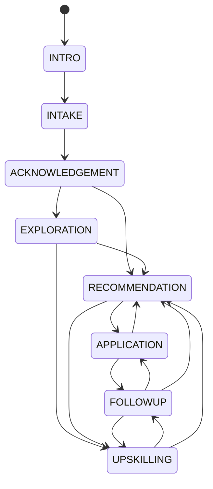
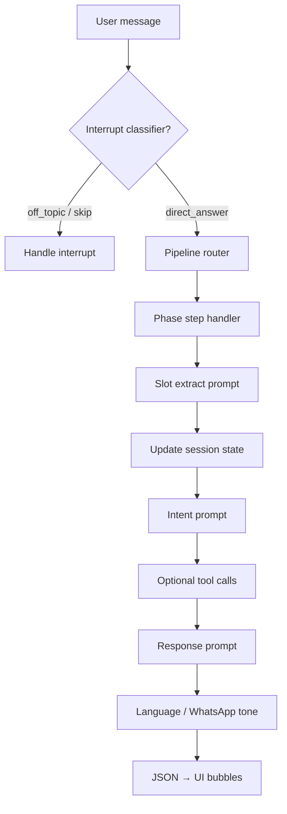

# DevelUp Career Copilot — Complete System Architecture

> **Scope of this document:** A full descriptive account of how the DevelUp Career Copilot + Vector Search Engine is designed and implemented today — the two channels (Web and WhatsApp), the conversational FSM (Finite State Machine) and its phases, how each phase is executed end‑to‑end, the vector search / retrieval layer, the data model, and the supporting infrastructure. This consolidates and supersedes the scattered notes in `FSM.md`, `develup_workflow_v1.md`, `README.md` and `docs/*.md` into one authoritative reference.
>
> **Audience:** Engineering team, new contributors, and anyone who needs to understand "how the system actually works" without reading every file.

---

## Table of Contents

1. [System at a Glance](#1-system-at-a-glance)
2. [High-Level Architecture](#2-high-level-architecture)
3. [Repository Structure](#3-repository-structure)
4. [The Two Channels — Web & WhatsApp](#4-the-two-channels--web--whatsapp)
5. [Copilot Version Lineage (v1 → v5)](#5-copilot-version-lineage-v1--v5)
6. [The Conversation FSM — Phases in Detail](#6-the-conversation-fsm--phases-in-detail)
7. [The Two Pipelines: State Pipeline vs Legacy Pipeline](#7-the-two-pipelines-state-pipeline-vs-legacy-pipeline)
8. [Exploration Phase 2 — Behavioral Deepening Layer](#8-exploration-phase-2--behavioral-deepening-layer)
9. [State-Derived Embedding System](#9-state-derived-embedding-system)
10. [Vector Search Engine (Jobs & Courses)](#10-vector-search-engine-jobs--courses)
11. [LLM Integration & Prompt Architecture](#11-llm-integration--prompt-architecture)
12. [Data Model & Persistence](#12-data-model--persistence)
13. [Cross-Channel Identity](#13-cross-channel-identity)
14. [Proactive / Background Systems](#14-proactive--background-systems)
15. [Security & Guardrails](#15-security--guardrails)
16. [Deployment & Configuration](#16-deployment--configuration)
17. [Known Gaps / Open Issues](#17-known-gaps--open-issues)

---

## 1. System at a Glance

DevelUp is a **single Python (FastAPI) backend service** — not a monorepo of micro-apps — that provides two things:

1. **A vector search engine** for jobs, courses, and candidate profiles (Qdrant-backed).
2. **"Dev" — the Career Copilot**: a conversational AI career guide, built as a phase-driven FSM combined with LLM reasoning, delivered over **two channels**:
   - **Web** — a chat widget on the DevelUp web app, talking to this backend over REST + Server-Sent Events (SSE).
   - **WhatsApp** — the primary, mobile-first channel for Tier 2/3 India users, via the **AiSensy** WhatsApp Business Solution Provider (BSP).

Both channels are powered by the **same core conversation engine** (`copilot_v4`). WhatsApp is served through a channel adapter (`copilot_v5`) that also handles Web chat *whenever a phone number is attached to the session* — meaning Web and WhatsApp share one brain and one FSM once the user is "known."

```
                     ┌────────────────────────────┐
                     │        Dev (the bot)       │
                     │   copilot_v4 FSM + LLM core │
                     └─────────────┬──────────────┘
                                    │
              ┌─────────────────────┴─────────────────────┐
              │                                            │
     ┌────────▼─────────┐                        ┌─────────▼─────────┐
     │   copilot_v5      │                        │   copilot_v2       │
     │  (channel adapter) │                        │ (legacy web modes) │
     └────────┬──────────┘                        └─────────┬─────────┘
              │                                              │
   ┌──────────┴───────────┐                                  │
   │                      │                                  │
┌──▼───────┐        ┌─────▼──────┐                    ┌──────▼───────┐
│ WhatsApp │        │  Web chat   │                    │  Web chat    │
│ (AiSensy)│        │(with phone) │                    │ (no phone /  │
│          │        │             │                    │ mode-based)  │
└──────────┘        └─────────────┘                    └──────────────┘
```

---

## 2. High-Level Architecture

The service follows a classic **Routes → Controllers → Services** layering, with a dedicated `copilot_v4` sub-system implementing the actual conversation brain.

```
Client (Web app / AiSensy webhook)
        │
        ▼
FastAPI app (app/main.py)
  - lifespan hook: provisions Qdrant collections, starts background workers
  - CORS, health check, mounts /api/v1 router
        │
        ▼
Routes (app/routes/v1/*)
  - jobs, courses, candidates, resume_builder, copilot, webhooks/aisensy
        │
        ▼
Controllers (app/controllers/*)
  - validate request → decide which orchestrator/pipeline to call → shape response
        │
        ▼
Services (app/services/*)
  ├── jobs/ courses/ candidate/         → vector search domains
  ├── job_ingestion/                    → scrape → normalize → embed → Qdrant
  ├── job_alerts/                       → proactive WhatsApp job cards
  ├── embeddings/                       → two-tower field vectors
  ├── resume_builder/                   → AI resume assistant
  ├── copilot/  copilot_v2/  copilot_v3/ → legacy conversation engines
  ├── copilot_v4/  ★                    → active FSM + LLM conversation core
  └── copilot_v5/  ★                    → WhatsApp channel adapter (+ web-with-phone)
        │
        ▼
External systems: Qdrant · Neon Postgres · Redis · MongoDB · OpenAI/Gemini ·
                   AiSensy / Meta WhatsApp Cloud API · Node "main-server" ·
                   Azure (OCR/Blob/Service Bus) · Apify · job boards
```

Key architectural facts:

- **No LangChain / LlamaIndex** — the LLM orchestration is fully custom (`app/helpers/LLMHelpers.py` + `copilot_v4/llm/runtime.py`).
- **No Twilio, no Pinecone** — WhatsApp runs on **AiSensy**, vectors live in **Qdrant**.
- **No frontend code in this repo.** The web UI lives in a separate app; this backend only exposes REST/SSE APIs.
- **Single deployable container** (`dockerfile`, `uvicorn app.main:app` on port 8000). Background workers (re-engagement, job alerts, schedulers) run **in-process** via the FastAPI lifespan, not as separate services — though a worker-only replica can disable the scraper via env flags.

---

## 3. Repository Structure

```
vector-search-engine/
├── app/
│   ├── main.py                  # FastAPI app, lifespan workers, CORS, /api/v1 mount
│   ├── core/                    # config.py (env), conn.py (Qdrant/Neon), mongo.py
│   ├── routes/v1/               # jobs, courses, copilot, candidate, webhooks/aisensy
│   ├── controllers/             # request orchestration per domain
│   ├── models/                  # Pydantic request/response schemas
│   ├── services/
│   │   ├── jobs/ courses/ candidate/     # vector search domains
│   │   ├── job_ingestion/                # scraping + normalization pipeline
│   │   ├── job_alerts/                   # proactive WhatsApp job-card system
│   │   ├── embeddings/                   # two-tower embedding generation
│   │   ├── resume_builder/               # AI resume orchestrator
│   │   ├── copilot/                      # v1 — legacy
│   │   ├── copilot_v2/                   # v2 — mode-based web orchestrator
│   │   ├── copilot_v3/                   # v3 — Career OS tools + early FSM
│   │   ├── copilot_v4/         ★         # active FSM / phases / LLM pipeline
│   │   └── copilot_v5/         ★         # WhatsApp (+ web-with-phone) adapter
│   ├── helpers/                 # LLMHelpers, Qdrant setup, chat identity, PDF/OCR
│   ├── repositories/ daos/      # Qdrant data access layer
│   └── embeddings/              # older embedding helpers
├── docs/                        # architecture + prompt specs (design docs)
├── tests/                       # ~45 pytest modules covering FSM, identity, reco
├── scripts/                     # LlamaFirewall install, SQL helpers
├── requirements.txt             # Python dependencies
├── dockerfile                   # python:3.12-slim, uvicorn on :8000
├── runserver.sh                 # local dev startup (uvicorn --reload)
├── README.md                    # setup guide (stale re: active copilot version)
├── FSM.md                       # authoritative FSM / phase reference
└── develup_workflow_v1.md       # product-level conversation workflow spec
```

**Entry points**

| Purpose | Path |
|---|---|
| App boot | `uvicorn app.main:app` |
| Health check | `GET /api/v1/health` |
| WhatsApp inbound webhook | `POST /api/v1/webhooks/aisensy/incoming` |
| Web chat (sync) | `POST /api/v1/copilot/chat` |
| Web chat (streaming) | `POST /api/v1/copilot/chat/stream` |

---

## 4. The Two Channels — Web & WhatsApp

### 4.1 Web Channel

Web chat has **two distinct execution paths**, chosen by the controller based on whether a phone number is present on the request/session:

**Path A — Web with phone (the primary Career OS path)**

Once a user is identified by phone number (e.g. after login/signup on the web app), Web chat is routed into **the same `copilot_v5` pipeline as WhatsApp**, just with outbound WhatsApp sending disabled:

```46:55:app/helpers/chat/wa_pipeline.py
async def run_copilot_v5_web_turn(
    wa_phone_digits: str,
    user_message: str,
) -> Dict[str, Any]:
    """Run one copilot_v5 turn for web (no outbound WhatsApp send)."""
    return await career_copilot_v5(
        wa_phone_digits,
        user_message,
        auto_send=False,
    )
```

This means: **same FSM, same phases, same prompts, same session state** — the only difference is that the reply is returned as an HTTP/SSE response instead of being pushed via AiSensy. This is the mechanism that keeps Web and WhatsApp conversations in sync for the same user (see [§13 Cross-Channel Identity](#13-cross-channel-identity)).

**Path B — Web without phone (legacy v2 mode-based chat)**

If no phone number is attached, the request falls back to the older `copilot_v2` orchestrator, which routes into one of five hand-built "modes" selected by `focus_mode_data.copilot_mode`:

| Mode | What it does |
|---|---|
| `career_guidance` | General career advice / Q&A |
| `job_search` | Finds and recommends jobs, injects results into LLM context |
| `course_search` | Suggests learning paths and courses |
| `resume_builder` | Guides resume creation/edit/optimization |
| `web_search` | Live web search via LinkUp, surfaces results |

Every mode shares one conversation-history pipeline: messages persist to Neon/Postgres (or CSV in local/dev mode), and a rolling summary is regenerated every 6 messages to keep LLM context compact.

**Web request schema**

```41:48:app/models/copilot_schemas.py
class CareerQueryRequest(BaseModel):
    query: str
    conversation_id: str
    candidate_id: Optional[str] = None
    temp_candidate_id: Optional[str] = None
    phone_number: Optional[str] = None
    focus_mode_data: FocusModeData = Field(default_factory=FocusModeData)
```

**Other Web capabilities:**
- `POST /copilot/chat/begin`, `/chat/fetch`, `/conversations/fetch` — conversation lifecycle
- `POST /resume/attach` — resume PDF upload + text extraction
- `POST /chat/rate`, `/chat/share` — feedback and shareable transcript links
- `GET /copilot/events` (SSE) + Web Push (VAPID) — server-push channel used for re-engagement/job-alert nudges while the browser tab is open, mirroring what WhatsApp does via message push

### 4.2 WhatsApp Channel

**Inbound flow** (`app/routes/v1/webhooks/aisensy.py`):

1. Optional shared-secret authentication on the webhook.
2. Filters for `topic=message.sender.user` events only (ignores delivery receipts, etc.).
3. Parses phone number, message text, button replies, and any document/image attachment.
4. **Deduplicates** the inbound event via a Redis `claim_message_id` (idempotency — AiSensy can redeliver webhooks).
5. Dispatches to `career_copilot_v5(...)` as a FastAPI **background task**, and immediately returns `200 { received, dispatched }` to AiSensy — the actual reply is sent asynchronously.

```561:580:app/routes/v1/webhooks/aisensy.py
async def _run_copilot_v5_turn(...):
    from app.services.copilot_v5 import career_copilot_v5
    result = await career_copilot_v5(
        wa_phone=wa_phone,
        user_message=user_message,
        wa_name=wa_name,
        message_id=message_id,
        attachment=attachment,
    )
```

**Outbound flow:**

- Primary sender: `app/services/copilot_v5/sender/aisensy.py` → AiSensy Project API (`POST https://apis.aisensy.com/project-apis/v1/project/{id}/messages`).
- Fallback: **Meta WhatsApp Cloud API** (`WHATSAPP_CLOUD_API_TOKEN`) for typing indicators, message reactions, and media — used when AiSensy doesn't support a particular UX primitive.
- WhatsApp doesn't render rich UI, so v5 formats every LLM/pipeline response into **WhatsApp-native constructs**: multi-bubble text, quick-reply buttons, promoted URLs turned into CTA buttons, and emoji tone shaping (`copilot_v5/whatsapp/emoji_tone.py`).

**Full WhatsApp turn (end to end):**

```
User sends WhatsApp message
  → AiSensy relays webhook
  → POST /api/v1/webhooks/aisensy/incoming
       parse event → claim message_id (dedupe) → BackgroundTasks.add(career_copilot_v5)
  ← immediate 200 ack to AiSensy
  (async, inside the background task) career_copilot_v5(...)
       → ensure_whatsapp_conversation_async   (get/create the phone's conversation row)
       → load_session_v5                      (Redis first, fallback Neon snapshot)
       → send typing indicator / reaction      (AiSensy / Meta Graph API)
       → if attachment: OCR + classify (resume / educational doc / job posting / other)
       → security guard (input safety check)
       → run the v4 pipeline (state pipeline OR legacy pipeline, see §7)
             slot extraction → FSM transition → tool calls (job/course search) → LLM response
       → format_pipeline_response_for_whatsapp (bubbles, CTA buttons, emoji tone)
       → send via AiSensy (if COPILOT_V5_AUTO_SEND enabled)
       → persist updated session + CandidateMessages
       → sync relevant profile/application data to the Node "main-server" if ready
```

**Proactive WhatsApp workers** (started in `main.py`'s lifespan, running continuously in-process):

- Re-engagement scheduler (stalled-conversation nudges, phase-aware)
- Job-alert dispatcher (daily WhatsApp job cards from a two-tower recommendation pool)
- Swipe-timer / roadmap follow-up / subscription reminder / expiry-reminder jobs

Ops/debug routes for these live under `/api/v1/copilot/v5/...`.

---

## 5. Copilot Version Lineage (v1 → v5)

The repo contains five generations of the copilot, kept side by side behind feature flags rather than deleted — this explains why "copilot" appears to be several things at once in the codebase.

| Version | Role | Status |
|---|---|---|
| `copilot` (v1) | Original single-shot intent+answer engine | Legacy — still referenced by v2's general-answer tool |
| `copilot_v2` | Mode-based orchestrator (5 modes, see §4.1) | Active fallback — used for **Web without phone** |
| `copilot_v3` | Introduced tool REST APIs + an early FSM prototype | Superseded by v4, some tool code reused |
| **`copilot_v4`** | **The product.** 8-phase FSM + LLM-first turn engine, slot extraction, job/course tools, application & upskilling logic | **Active — core conversation brain** |
| **`copilot_v5`** | WhatsApp channel adapter built *on top of* v4 | **Active — WhatsApp always, Web whenever a phone number is present** |

```1:18:app/services/copilot_v5/__init__.py
"""
copilot_v5 — WhatsApp-native career copilot.

This package is the WhatsApp counterpart of copilot_v4 (frontend/web).
It reuses the same LLM pipeline, exploration graph, and FSM transitions
from copilot_v4 but adds:
  * Phone-keyed session management (Redis + Neon, namespace: copilot_v5:wa_*)
  * AiSensy API integration for outbound WhatsApp messages
  ...
Entry point:  ``career_copilot_v5(wa_phone, user_message, ...)``
Webhook:      ``POST /api/v1/webhooks/aisensy/incoming``
"""
```

The public entry point for the core engine is `career_copilot_v4()` in `app/services/copilot_v4/orchestrator/turn.py`: it loads the session, runs either the state pipeline or the legacy pipeline depending on phase, and persists the resulting messages. `career_copilot_v5()` wraps this with phone-keyed session loading, AiSensy formatting/sending, document intake, and re-engagement bookkeeping.

---

## 6. The Conversation FSM — Phases in Detail

The chat is modeled as an explicit **Finite State Machine with 8 top-level phases**. Both Web (with phone) and WhatsApp run through *exactly* this FSM — `CopilotV5SessionState` simply extends `CopilotV4SessionState` with phone/WhatsApp-specific fields.

### 6.1 Top-level phases (`CareerPhase`)

```8:17:app/services/copilot_v4/schemas/session.py
```

| Phase | Purpose |
|---|---|
| **INTRO** | First-touch greeting, "Dev" persona handshake, detect FINDER vs SEEKER intent |
| **INTAKE** | Collect profile slots: name, current role, years of experience, location, LinkedIn/resume |
| **ACKNOWLEDGEMENT** | Summarize the profile back to the user, resolve their path choice (jobs / skills / both / unsure) |
| **EXPLORATION** | Structured discovery questions — goals, interests, values, strengths, constraints, timeline |
| **RECOMMENDATION** | Present job cards, course pathway, or a mixed presentation |
| **APPLICATION** | The apply flow: resume tailoring, outreach, interview prep, offer negotiation, tracker |
| **UPSKILLING** | The learning journey: discovery → outline → roadmap → coaching |
| **FOLLOWUP** | Post-application follow-ups and re-engagement while still inside an "apply" context |

### 6.2 Allowed transitions

```43:54:app/services/copilot_v4/fsm/transitions.py
    allowed = {
        "INTRO": {"INTAKE"},
        "INTAKE": {"ACKNOWLEDGEMENT"},
        "ACKNOWLEDGEMENT": {"EXPLORATION", "RECOMMENDATION"},
        "EXPLORATION": {"RECOMMENDATION", "UPSKILLING"},
        "RECOMMENDATION": {"APPLICATION", "UPSKILLING"},
        "APPLICATION": {"FOLLOWUP", "RECOMMENDATION"},
        "UPSKILLING": {"FOLLOWUP", "RECOMMENDATION"},
        "FOLLOWUP": {"APPLICATION", "UPSKILLING", "RECOMMENDATION"},
    }
```



Two **entry modes** determine how much of the FSM a user walks through:

- **CAREER FINDER MODE** ("I don't know what career to choose") → `Intro → Intake → Exploration → Recommendation → Application/Upskilling → Follow-up` (full path)
- **JOB SEEKER MODE** ("I know what I want, help me get there") → `Intro → Intake (light) → Recommendation → Application/Upskilling → Follow-up` (skips Exploration)

### 6.3 Phase-by-phase execution detail

#### Phase 1 — INTRO
- **Goal:** psychological safety before collecting any personal data. Never opens with "What are your career goals?"
- **Execution:** a single deterministic step, `intro_greeting`. On the very first WhatsApp/web turn, `generate_intro_payload()` produces a 3-bubble JSON payload (greeting bubbles + `slots_filled` + `detected_language` + `mode_signal`) — this bypasses the main response builder.
- **Exit condition:** max 3 turns before mode detection is forced; transitions to INTAKE.

#### Phase 2 — INTAKE
- **Goal:** collect the minimum profile needed to personalize everything downstream.
- **Slots (ordered):** `intake_name → intake_role → intake_exp → intake_location → intake_linkedin`. Each slot is its own file under `copilot_v4/phases/intake/*.py`, following a two-prompt pattern: an `_EXTRACT_PROMPT` (silently pulls the slot value out of the user's free-text reply) and a response builder that asks for the next missing slot in Dev's voice.
- **Deterministic gates:** `intake/slot_gates.py` decides whether to advance, independent of the LLM — this is intentional: early phases avoid letting the LLM freely decide FSM transitions, for safety and predictability.
- **Rule:** LinkedIn URL is **stored only, never scraped**. Max 7 turns; if the limit is hit, the FSM advances anyway with whatever partial profile exists.

#### Phase 3 — ACKNOWLEDGEMENT
- **Goal:** confirm the profile back to the user, then resolve which path they want.
- **Two states:** `ack_summary` (path not chosen yet — profile summary + path question) and `ack_done` (path chosen — short transition line into the next phase).
- **Path choice (`chosen_path`)**: `jobs` | `skills` | `unsure` | `both`. This choice decides whether EXPLORATION runs the job-track question graph, the course-track graph, or both sequentially.

#### Phase 4 — EXPLORATION (Phase 1 — structured intake-style discovery)
- **Goal:** FINDER-mode only. Minimum bar to exit: 2+ interests, 1+ strength, top constraint, and a timeline in months. Max 10 turns, **one question per turn**.
- **Question graphs:**
  - Job path: `Q-J1, Q-J1-FB, Q-J1b, Q-J2, Q-J2b, Q-J3, Q-J3-CITY, Q-J4`
  - Course path: `Q-C1, Q-C2, Q-C2-FT, Q-C3, Q-C4, Q-C5, Q-C6`
  - Dual-track (`chosen_path=both`): job graph first, then course graph.
- **Execution pattern:** each turn runs a Q-ID-specific analyzer (`EXP_P1_ANALYZER_SYSTEM` / `EXP_COURSE_P1_ANALYZER_SYSTEM`) to extract signal, a silent `_VALIDATOR_PROMPT` checks whether the user actually answered the expected dimension (can force a re-ask if confidence < 0.7), and a response template asks the next question in the graph.
- **Family-pressure branch:** if family pressure is detected, the bot collects `family_acceptable_paths` and looks for overlap with the user's own interests rather than pushing back on the family constraint.
- **Exit:** advances to RECOMMENDATION (job/mixed path) or UPSKILLING (pure skills path).
- There is also an **Exploration Phase 2** — see [§8](#8-exploration-phase-2--behavioral-deepening-layer) — which is *not* a 9th top-level phase, but a behavioral overlay that runs during later phases.

#### Phase 5 — RECOMMENDATION
- **Goal:** deliver 2–3 career-path suggestions max (hard cap — more causes decision paralysis for this audience), then immediately activate the **Job Aggregator** and **Course Aggregator**.
- **Filters applied to every recommendation:** `chosen_path + location + relocation_open`; if `urgency=immediate`, only paths with income achievable in < 60 days are shown; if `family_pressure=true`, at least one suggested path must carry a salary/stability signal.
- **Response modes (runtime sub-states):** `mixed_presentation`, `job_search_response`, `course_search_response`, `pathway_presentation`, `pathway_adjust`, `pathway_confirm`. These live in `metadata.recommendation_runtime.response_mode` and determine which prompt template/tool is invoked for that turn.
- **Course Aggregator** (see [§6.4](#64-the-course-aggregator-tool-detail)) activates automatically here and stays available through UPSKILLING.
- **Job cards** are sourced from the vector search engine (see [§10](#10-vector-search-engine-jobs--courses)) — never LLM-generated URLs (hallucination risk).
- **Exit triggers:** `application_selected` → APPLICATION; `upskilling_selected` → UPSKILLING; "none of these fit" → back to EXPLORATION.

##### 6.4 The Course Aggregator tool (detail)

A recommendation engine sitting on top of a curated pool of learning artefacts (documents, videos, courses) tagged and indexed from NPTEL, Coursera, Udemy, YouTube, Google Career Certs, Simplilearn, Internshala Learning, LinkedIn Learning, PMKVY, government skill portals, and curated blogs.

- **Tagging schema per artefact:** `career_paths[]`, `skill_tags[]`, `level`, `cost`, `duration_hours`, `language`, `format`, `quality_score`, `last_verified_date`.
- **Recommendation steps:** (1) Intent resolution → query vector `{career_path, skill_gap, level, urgency, cost_constraint}` → (2) Hard filter on cost/language/level → (3) Score & rank (`relevance 40% + quality 30% + recency 15% + cost efficiency 15%`) → (4) Diversify (≥1 free artefact in top 3, mixed formats, no duplicate source) → (5) Surface top 3–5 with title/source/duration/cost/why-it-fits/verified link, cached into `course_aggregator_cache`.
- **Hard rule:** the LLM must **never generate URLs** for learning resources — all links come exclusively from the verified item-pool database, and any artefact older than 90 days must be re-verified before being surfaced.
- **Trigger points across phases:** RECOMMENDATION (path selected → top 3 starter artefacts), UPSKILLING journey curation (weekly artefacts), UPSKILLING course picker / concept explainer / application examples, and FOLLOWUP (milestone completed → next artefact).

#### Phase 6 — APPLICATION
Activates when a user expresses intent to apply for a specific job. Contains **five sequenced tools** mirroring the real-world job-application journey — they are not all triggered at once; each gates on the previous step completing.

| Step | Tool | Trigger | What happens |
|---|---|---|---|
| 1 | **Resume Builder** | Immediately on job entry | Build/tailor resume to the JD, ATS-optimize, output PDF/Word |
| 2 | **Networker** | Resume confirmed ready | Find hiring manager / decision maker at the company |
| 3 | **Application Sender** | Contact found, or Networker skipped | Generate personalized email / LinkedIn message / cover letter |
| 4 | **Interview Prep** | 2–3 days after application sent (bot-initiated) | Company research, mock Q&A, positioning feedback |
| 5 | **Negotiator** | Offer or interview confirmation received | Market pay research, negotiation script, offer evaluation |

- **Response modes:** `app_initiator`, `resume_editor`/`resume_help`, `outreach_menu`/`referral_finder`/`message_drafter`, `kanban_summary`, `interview_prep_entry`/`positioning_guide`/`interview_questions`, `followup_*` variants.
- **Application tracker (kanban):** `interested → resume_ready → outreach_sent → applied → interview_scheduled → offer_received`, plus terminal states `rejected` / `withdrawn`.
- **Background follow-up scheduler** (independent of the reactive FSM, runs on a timer):

```
Day 0  — application logged, "I'll check in in 2 days"
Day 2  — check-in; if no response, proactively offer Interview Prep
Day 5  — check-in; offer a follow-up email; follow_up_count++
Day 10 — check-in: keep waiting vs explore other options; if offer received → trigger Negotiator immediately
Day 21 — final check-in; archive prompt if still no response
```
Multiple applications are tracked in parallel, each with its own `follow_up_count`, `status`, and timeline.
- **Engineering notes worth preserving:** never send outreach on the user's behalf without explicit confirmation (always show the draft first); avoid Western idioms ("circling back") in generated copy; contacts sourced from LinkedIn public search, Hunter.io, Apollo.io — never scraping in violation of ToS; resumes are versioned per `job_id`, not stored as plain text long-term.

#### Phase 7 — UPSKILLING
A **persistent, adaptive learning companion** that runs in the background of a user's entire journey (unlike APPLICATION, which is linear and time-bound). Orchestrated by one central tool with five satellites.

| Tool | Trigger | Invoked by |
|---|---|---|
| **T1 — Learning Journey Curator** (orchestrator) | Phase entry + path confirmed | Auto-invoked |
| **T2 — Course Picker** | "which course should I take?" | User ad-hoc or Curator |
| **T3 — Quiz** | Artefact completed / weekly milestone | Curator (scheduled) or user ad-hoc |
| **T4 — Concept Explainer** | "what is X?" | User ad-hoc |
| **T5 — Application Examples Finder** | "how is X used?" | User ad-hoc, or auto-offered after Concept Explainer |
| **T6 — Tools Finder** | New skill area entry, or "what tools do I need?" | Curator or user ad-hoc |

- **Response modes:** `upskilling_discovery`, `upskilling_outline`/`_outline_review`/`_outline_adjust`, `upskilling_roadmap`/`_roadmap_review`/`_adjust`, `upskilling_coaching`.
- **Plan generation:** week-by-week plan keyed on `chosen_path`, skill level, `timeline_months`, hours/week, cost constraint. **Week 1 rule:** always free, always completable in under 2 hours (momentum over depth). Plan compresses to 4 weeks max if `urgency=immediate`.
- **Adaptive pacing:** 2+ weeks behind → reduce scope, extend timeline; consistently >80% quiz scores → offer to skip ahead.
- **Concept Explainer style rule:** plain-language first sentence (no jargon), then a relatable Indian analogy (Zomato/Swiggy/BigBasket/OYO/Ola-Uber/IRCTC first), then optional deeper layer only if the user asks.
- **Note:** Exploration Phase 2 overlay questions are **hard-disabled** during UPSKILLING (`upskilling_skip_phase2_overlay` always returns `True`) — deliberately avoiding overlapping question loops.

#### Phase 8 — FOLLOWUP
- Handles post-application check-ins and re-engagement while the user is still logically "inside" an apply/upskilling context.
- Feeds back into APPLICATION, UPSKILLING, or RECOMMENDATION depending on what the user does next.
- Also the terminal landing state for the unified background scheduler (application day-N check-ins, weekly upskilling check-ins, 24h re-engagement nudge, networking day-5 follow-up, course-completion nudges) — all run on a shared ~30-minute cron loop.

### 6.5 Sub-phases and parallel state

Several pieces of state track progress **orthogonally** to the top-level phase:

- **`sub_phase`** — e.g. `phase_1` during EXPLORATION; `JOBS` / `COURSES` / `""` during RECOMMENDATION/UPSKILLING to indicate which track is dominant.
- **`decision_state.decision_stage`** — `exploring` (ACK/EXPLORATION) → `comparing` (RECOMMENDATION) → `acting` (APPLICATION/UPSKILLING).
- **`course_rec.inner_phase`** — `course_search`, `pathway_presentation`, `pathway_adjustment`, `pathway_confirmation`, `course_rec_presentation`.
- **`checklist` stage status** — mirrors top-level phases with `pending | in_progress | completed | revisit`.

---

## 7. The Two Pipelines: State Pipeline vs Legacy Pipeline

A key implementation detail: **not every phase is executed by the same code path.**

| Pipeline | Handles | Character |
|---|---|---|
| **State pipeline** (`state_pipeline.py`) | `INTRO → INTAKE → ACKNOWLEDGEMENT → EXPLORATION` (Phase 1 only) | Deterministic, step-driven, 12-step turn loop |
| **Legacy pipeline** (`legacy_pipeline.py`) | `RECOMMENDATION` onward (RECOMMENDATION, APPLICATION, UPSKILLING, FOLLOWUP) | LLM-orchestrated with `response_mode` sub-states |

Dispatch happens per-turn based on current phase:

```932:942:app/services/copilot_v5/orchestrator/turn.py
    if not skip_pipeline:
        try:
            if use_state_pipeline() and state.phase in _state_pipeline_phases:
                pipeline_result = await run_state_pipeline_turn(**pipeline_kwargs)
            else:
                pipeline_result = await run_legacy_pipeline_turn(**pipeline_kwargs)
```

**The 12-step state-pipeline turn** (as documented in `state_pipeline.py`):
1. Resolve current step
2. Interrupt detection (is this an off-topic message, a correction, or a direct answer?)
3. Extract slots from the message
4. Apply slot updates to session state
5. Run FSM transition check
6. LinkedIn enrichment (if applicable)
7. Tool invocation (job/course search) if triggered
8. Generate the user-facing response
9. Persist session + messages
(steps continue through localization/formatting before delivery)

This split matters for one big practical reason: **Exploration Phase 2 (the behavioral overlay) only exists in the legacy pipeline** — see next section.

---

## 8. Exploration Phase 2 — Behavioral Deepening Layer

Exploration Phase 2 is **not a 9th FSM phase**. It's a second exploration *layer*, tagged `phase="phase_2"` in the question catalog, that overlays on top of whatever phase the user is already in (RECOMMENDATION, APPLICATION, UPSKILLING, FOLLOWUP) once they've left EXPLORATION.

| | Phase 1 | Phase 2 |
|---|---|---|
| **Runs during** | `EXPLORATION` only | `RECOMMENDATION / APPLICATION / UPSKILLING / FOLLOWUP` |
| **Purpose** | Structured intake (goals, interests, location, timeline) | Deepen intent from **behavior** (card taps, skips, return visits) |
| **Question IDs** | `Q-J1…Q-J4`, `Q-C1…Q-C6` | `Q-P2-G1`, `Q-P2-G2`, `Q-P2-V1`, `Q-P2-V2`, `Q-P2-I1`, `Q-P2-S1` |
| **Changes top-level phase?** | Yes | No — pure overlay |

**Trigger events** (`detect_phase2_events`):

| Event | Meaning |
|---|---|
| `recommendation_positive` | User tapped/saved a job card |
| `recommendation_skipped` | User skipped/rejected a job card |
| `return_visit` | New session after a prior one |
| `saved_two_plus` | 2+ jobs saved |
| `ctr_drop` | 2+ consecutive sessions with no card tap |
| `third_session_low_conf` | 3rd+ session with low slot confidence |

**Selection priority:** skip → `Q-P2-G2`; positive tap + low goal confidence → `Q-P2-G1`; return visit + low values confidence → `Q-P2-V1`; 2+ saves + no strengths → `Q-P2-S1`; 3rd session + low interest confidence → `Q-P2-I1`; CTR drop → `Q-P2-V2`.

**Guardrails / stop conditions:** skipped entirely whenever job/course tools are running this turn or a learning journey is being shown; hard-disabled in UPSKILLING; capped at 2 Phase 2 questions per session; stops once confidence targets are met (goals ≥0.80, interests ≥0.70, values ≥0.65, strengths ≥0.60); deflections ("idk"/"skip") suppress that QID for the rest of the session.

**Delivery:** the selected Phase 2 question is either rendered from a deterministic template or injected into the main LLM response call as an extra instruction block — so a user might receive a job card **and** a deepening question in the same turn.

> **Known limitation** (documented for engineering awareness): in practice, Phase 2 rarely fires. The `skip_phase2_for_job_card` guard is true on almost every RECOMMENDATION turn (since job/course tools run on most of those turns); WhatsApp's native Interested/Save/Skip button taps bypass the LLM intent-extraction path entirely, so they never populate `options_considered`; and two of the session counters that other triggers depend on (`copilot_session_index`, `consecutive_sessions_no_card_tap`) are never incremented anywhere in the code. This is a backlog item, not an intended behavior — see [§17](#17-known-gaps--open-issues).

---

## 9. State-Derived Embedding System

Rather than embedding raw chat transcripts, the system extracts **structured signals every turn** and embeds *those* — this is the deliberate design principle behind personalization and recommendation quality.

### 9.1 Four embedding layers

| Layer | Represents | Update frequency |
|---|---|---|
| **Profile Embedding** | Who the user is (`role`, `experience`, `location`, `skills`, taxonomy-normalized) | Low — only on slot change (INTAKE, and Resume Builder in APPLICATION) |
| **Intent Embedding** | What the user wants *right now* (`goals`, `interests`, `values`, `strengths`, `constraints`, `timeline`) | Every turn |
| **Engagement State** | How the user behaves/feels (`language`, `tone`, `sentiment`, `engagement_level`, `responsiveness`) | Every turn |
| **Decision State** | Readiness to act (`options_considered`, `current_preference`, `confidence_level`, `commitment_signals`, `friction_points`) | Every turn from RECOMMENDATION onward |

### 9.2 The rule that governs everything here

> **Never embed raw conversation text.** Extract a structured object each turn → serialize it to a canonical text string → embed that string. Confidence scores are **adjusted, never overwritten** on contradiction — recent signals weight higher, but nothing is deleted.

Example — canonical intent string that actually gets embedded:

```
"Wants to transition to Product Manager role with high salary.
Enjoys working with data and problem solving.
Values stability and career growth.
Has strengths in communication and analytical thinking.
Cannot relocate and prefers low-cost learning options.
Wants to achieve this within 3 months."
```

Multiple sub-vectors are derived from this: `goal_vector` (job matching), `interest_vector` (course recommendations), `constraint_vector` (hard pre-ranking filter), `full_intent_vector` (holistic ranking).

### 9.3 Engagement scoring (0–100)

Five dimensions, 20 points max each: response speed, response depth, sentiment, consistency, commitment signals. Score bands drive live prompt conditioning:

| Score | Level | Behavior |
|---|---|---|
| 80–100 | HIGH | Push actions, ask commitment questions |
| 50–79 | MEDIUM | Clarify, reduce friction, show options |
| 20–49 | LOW | Simplify, quick replies, shorten text |
| 0–19 | CRITICAL | Re-engage or defer follow-up |

### 9.4 Per-turn update loop (runs on every message, across all 4 layers)

```
1. Receive message
2. Detect language/tone/sentiment/response-time/depth      → update EngagementState
3. Run slot extractors for the current FSM phase            → update ProfileEmbedding if slots changed
4. Extract intent signals                                    → update IntentState (confidence-adjusted)
5. If phase ≥ RECOMMENDATION: extract commitment/friction    → update DecisionState
6. Serialize IntentState to canonical text                   → recompute the 4 intent vectors
7. Compute EngagementScore (0–100), detect trend
8. Select prompt-conditioning rules from engagement + clarity level
9. Return the next response, conditioned on all of the above
```

Decision preferences are always represented **probabilistically**, never as a binary flag — e.g. `{option: "PM", confidence: 0.6}` alongside a secondary `{option: "DA", confidence: 0.4}`, rather than `decided: true`. Explicit commitment language ("I will start this weekend") always outweighs exploratory interest ("PM sounds interesting").

---

## 10. Vector Search Engine (Jobs & Courses)

### 10.1 Stack

| Piece | Technology |
|---|---|
| Vector database | **Qdrant** (accessed over gRPC) |
| Embeddings | **FastEmbed** (local, 1024-d) for indexing; **OpenAI embeddings** for internal query-time search |
| Two-tower vectors | Named vectors per job: `title_vector`, `skills_vector`, `desc_vector`, etc. |
| Optional rerank | External `RERANK_SERVICE_URL` microservice |

### 10.2 Indexing (job ingestion pipeline)

```
normalize → location resolve → dedup → embed → upsert (Qdrant)
```

- **Sources:** LinkedIn, Indeed, Apna, Glassdoor scrapers (via `python-jobspy` + custom scrapers), plus Apify for LinkedIn profile enrichment.
- **Location normalization:** an LLM batch resolver (`job_ingestion/location/llm_batch_resolver.py`) normalizes raw location strings to canonical Indian city names before storage.
- Controlled at runtime by `JOB_SCRAPER_ENABLED` / `SCRAPER_AUTO_RUN` — typically off on the main API replica and on for a dedicated worker/ingestion replica.

### 10.3 Search / retrieval

- `app/services/jobs/search.py`: embeds the query, performs a Qdrant `query_points` call (multi-vector / fusion across the named vectors), then merges internal (Qdrant) results with external scraper results and live scraper calls (via `asyncio.gather` for concurrency), optionally reranks, and returns a unified ranked list.
- Endpoints: `/jobs/search`, `/jobs/search/internal`, `/jobs/search/external`, `/jobs/search/recommendations`, `/jobs/search/job-pool`; mirrored for `/courses/*`.
- Source selection per-request via `focus_mode_data.modes` (`internal`, `external`, `indeed`, `linkedin`, `apna`, `glassdoor`).

### 10.4 How the copilot uses retrieval (its "RAG")

This is **not classic document RAG**. The pattern is:

1. Structured session state (profile + intent, from §9) determines *what to search for*.
2. A tool call triggers a job/course vector search against Qdrant.
3. Results are injected into the LLM's response-generation prompt as grounding context — the LLM is explicitly instructed never to fabricate a job/course URL; all links must come from retrieved, verified records.

State-derived embeddings (profile/intent, §9) additionally feed a **two-tower recommendation pool** used for proactive job alerts — this is a separate, precomputed matching system from the reactive in-chat search.

---

## 11. LLM Integration & Prompt Architecture

| Aspect | Detail |
|---|---|
| Providers | **OpenAI** (primary; `gpt-4.1`-class models), **Google Gemini** (alternate) |
| Wrapper | Custom `app/helpers/LLMHelpers.py` — no agent framework |
| Copilot v4 model config | `COPILOT_V4_MODEL_INTENT`, `COPILOT_V4_MODEL_RESPONSE` env vars |
| Guardrails | Optional LlamaFirewall alignment check; input safety guard on both channels |
| Web search augmentation | LinkUp SDK, Google Custom Search |

Every v4 turn generally makes **two kinds of LLM calls**:

1. **Intent extraction** (`v4.intent.main` / `.exploration` / `.phase1` / `.phase2`) — never user-facing, produces structured JSON: mode, transition signal, slot updates, tool-invocation flags.
2. **Response generation** (`v4.response.main`) — user-facing, produces JSON: `message_body`, `closing_text`, `quick_replies`, `sentiment`, following a strict phase-specific instruction block.

**Prompt flow (primary v4/v5 path):**



**Shared system-prompt building blocks** (composed by `copilot_v3/prompts/builder.py::build_system_prompt`, reused across v3/v4): `VOICE_BLOCK` (Gen-Z friend tone, India-real voice), `CHARACTER_BLOCK` (Dev persona consistency), `DEV_PHRASE_BANK_BLOCK` (approved/banned phrases), `ANTI_HALLUCINATION_BLOCK` (no fabricated jobs/courses/URLs), `CONVERSATION_DRIVE_BLOCK`, `JSON_SCHEMA_INSTRUCTION`, `TOOL_ANALYZER_BLOCK`.

### 11.1 Conversation Drive Architecture (three-layer enforcement)

Every bot response must end with **exactly one** forward driver — a question, an action, or a quick-reply set. This is enforced redundantly at three layers so it can never silently fail:

1. **Prompt instruction** — system prompt explicitly forbids ending on a bare statement or asking two questions.
2. **Response validator** — a post-LLM, pre-delivery function checks the last sentence for a question mark or CTA; if missing, it patches from a `PHASE_DRIVERS` registry and logs `patched: true` for monitoring.
3. **Structured JSON output** — the LLM's response schema requires a `closing_type` field (`question | action | quick_replies`) as a required field, not optional.

**Response anatomy** (four parts, always in order): Acknowledgement (1 sentence, validates what the user said) → Core Content (max 3 sentences) → Bridge (optional, 1 sentence) → Closing Driver (always exactly one).

---

## 12. Data Model & Persistence

| Store | Used for |
|---|---|
| **Neon Postgres** (or local CSV in dev) | `CandidateConversations`, `CandidateMessages`, `ConversationStateSnapshots` (full FSM state as JSON), `UserKnowledgeV4`, job-alert pools, engagement scores, `CopilotJobTouchRecords` |
| **Redis** | Live session cache (fast path before Neon), inbound message dedupe, delayed/scheduled worker queues (ZSETs for re-engagement) |
| **MongoDB** (via Motor async driver) | Candidate profile documents |
| **Qdrant** | Job / course / candidate vector collections |
| **Azure Blob** | Resume/document uploads |
| **Node "main-server"** (separate service) | Account/auth, JWT issuance, job tracker & drafts — this Python service calls it for intake sync and the tracker |

**Session state schema (conceptual, `CopilotV4SessionState`):** phase, sub_phase, profile fields, intent embedding fields, engagement state, decision state, checklist stage, job/course recommendation runtime state, `active_job_applications[]`, upskilling plan, subscription/metadata fields.

`CopilotV5SessionState` extends this with: `wa_phone`, `wa_name`, `wa_opt_in`, `last_wa_message_id`, `wa_last_served_job`, plus a re-engagement mixin (`focus_phase`, send logs, native trigger tracking) — the re-engagement state is explicitly **separate from** the reactive turn FSM.

WhatsApp conversations use **one conversation UUID per phone number** (`whatsapp_v5_conversation_uuid`).

---

## 13. Cross-Channel Identity

Because Web (with phone) and WhatsApp run the *same* `copilot_v5` pipeline, a user's conversation state is naturally shared once their phone number is known on both sides.

- Candidate identity is resolved via `app/helpers/copilot/identity.py`, which reconciles `wa:{digits}` phone-based identity with the web `candidate_id`.
- A normalized E.164-digits phone number is the join key between the two channels' session state, conversation history, and application/upskilling progress.
- This is validated by dedicated tests: `test_web_wa_conversation_sync.py` and `test_cross_channel_identity.py`.

---

## 14. Proactive / Background Systems

All of the following run as **in-process background workers**, started from the FastAPI `lifespan` context in `app/main.py`, and are coordinated by a shared scheduler pattern (cron-like loop, roughly every 30 minutes for the follow-up/re-engagement sweep):

| System | What it does |
|---|---|
| **Re-engagement scheduler** | Sends phase-aware nudges to stalled conversations (Redis ZSET priority queue: APPLICATION → UPSKILLING → RECOMMENDATION → EXPLORATION_P2 → EXPLORATION_P1 → INTAKE) |
| **Job alert dispatcher** | Sends daily WhatsApp job cards sourced from a precomputed two-tower recommendation pool |
| **Application follow-up scheduler** | Day 0/2/5/10/21 check-ins per active job application |
| **Upskilling milestone checker** | Weekly "how did Week X go?" check-ins |
| **Networking follow-up** | Day-5 "did they respond?" nudge after outreach is sent |
| **Subscription reminders** | Expiry/renewal nudges |

On any user reply to a proactive nudge, the system identifies which context triggered the message and **resumes from that tool/sub-phase** — it does not restart the session, and it resets the "re-engagement sent" flag so the cycle can fire again later if needed.

---

## 15. Security & Guardrails

- **Input safety guard** runs on both Web and WhatsApp turns before the pipeline executes.
- **LlamaFirewall** (optional, `LLAMAFIREWALL_*` env vars) — an alignment/safety check that can be enabled per environment; installed via `scripts/`.
- **Anti-hallucination rule** baked into the system prompt: the LLM must never fabricate a job/course URL, a contact, or a fact not present in retrieved data.
- **Distress handling:** a documented "ANY state + distress signal → hold current state, respond with empathy, flag" transition exists at the FSM level, independent of the normal phase-advance logic.
- **Resume/document handling:** documents are not persisted as plain text long-term; secure document storage with TTL is used, and multiple resume versions are indexed by `job_id`.
- **Outreach confirmation:** the system never sends an email/LinkedIn message on the user's behalf without the user explicitly approving the draft first.

---

## 16. Deployment & Configuration

| Aspect | Detail |
|---|---|
| Runtime | Python 3.12, FastAPI + Uvicorn |
| Container | Single `dockerfile` (`python:3.12-slim`), uvicorn on port 8000 |
| Orchestration | None in-repo (no docker-compose/k8s/CI workflows) — single container, workers in-process |
| Typical topology | One API replica (scraper disabled) + optionally one worker replica (scraper enabled) |
| Production WhatsApp webhook host | `https://vector-server.develup.in` (referenced in code) |

**Key configuration domains** (`.env.example` / `app/core/config.py`):

| Domain | Variables (representative) |
|---|---|
| Vector DB | `QDRANT_URL`, `QDRANT_PORT`, `QDRANT_API_KEY`, collection names |
| LLM | `OPENAI_API_KEY`, `GEMINI_API_KEY` |
| Relational / doc stores | `NEON_DATABASE_URL`, `USE_LOCAL_CSV_STORE`, `MONGODB_URL` |
| Cache/queues | `REDIS_URL` |
| WhatsApp | `AISENSY_*`, `WHATSAPP_CLOUD_API_TOKEN` |
| Node backend link | `MAIN_SERVER_BASE_URL`, `COPILOT_BACKEND_SECRET`, `DEVELUP_WEB_APP_URL` |
| Cloud storage/OCR | Azure OCR endpoint/key, Blob connection string, Service Bus connection |
| Scraping | `JOB_SCRAPER_ENABLED`, `SCRAPER_AUTO_RUN`, `APIFY_*` |
| Schedulers | `REENGAGEMENT_*`, `JOB_ALERT_*`, roadmap/subscription timers |
| Security | `LLAMAFIREWALL_*`, VAPID keys (web push) |

> Note: Supabase has been **removed** from the stack — the `helpers/supabase/` module now targets Neon Postgres or a local CSV store, kept only for interface compatibility with older code paths.

---

## 17. Known Gaps / Open Issues

Documented transparently so the team can prioritize fixes:

1. **Exploration Phase 2 rarely fires in production** (see §8). Root causes: the `skip_phase2_for_job_card` guard is true on nearly every RECOMMENDATION turn; WhatsApp's native job-card button taps (Interested/Save/Skip) bypass the LLM intent path entirely and never populate the events Phase 2 listens for; `copilot_session_index` and `consecutive_sessions_no_card_tap` are defined in the session schema but never incremented anywhere; and a referenced helper (`_any_slot_low_conf`) is not implemented, which would throw if that code path were ever reached.
2. **`README.md` is stale** relative to the active copilot — it still centers on `copilot_v2` and Supabase, both superseded by `copilot_v4`/`v5` and Neon.
3. **No CI/CD or orchestration manifests in-repo** — deployment topology (replica count, worker/API split) is managed outside this repository.

---

*This document reflects the implementation as of the current codebase and supersedes prior scattered notes. When phases, prompts, or FSM transitions change, update this file alongside `FSM.md` (phase/state reference) and `docs/PROMPTS_CATALOG.md` (prompt inventory) to keep them consistent.*
