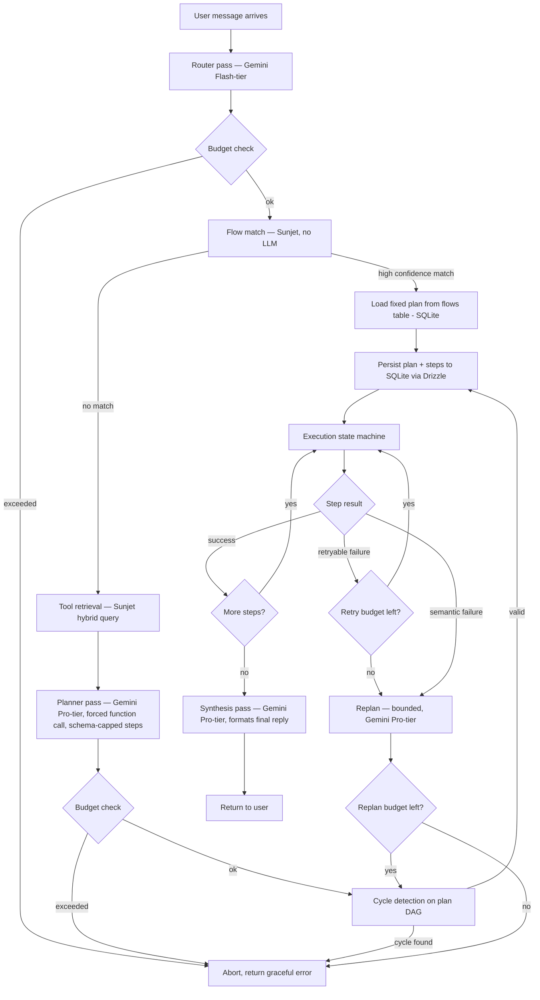

# Conversational Harness Architecture

**System name:** The Harness (a.k.a. "the brain")
**Purpose:** Tenant-configurable AI agent that understands user intent, selects the right tools/flows out of a large per-tenant tool registry, plans a multi-step action sequence, executes it safely, and returns a result — without runaway loops, without bloated prompts, and without double-executing side effects like orders or payments.

**Stack (aligned to Aelio-Convox):**
- Orchestration: `@aelio/core` turn loop (Fastify server, Node.js) — the harness extends this directly, it is not a separate package
- Vector + hybrid search: Sunjet (custom Rust engine, codename LL), with `sqlite-vec` as the fallback path when `sunjet.enabled: false`
- Transactional source of truth: SQLite + Drizzle ORM (`@aelio/db`, `better-sqlite3`) — not Postgres/Neon
- Planning/synthesis: Gemini via `@aelio/llm`'s Gemini provider (Pro-tier model for planning/synthesis, Flash-tier model for routing) — confirm exact model strings against your `config.yaml` / `config.gemini.yaml`, since these get renamed/versioned over time

**Integration approach:** this harness is built as an extension of `@aelio/core`'s existing turn/tool loop, not a standalone package. Multi-step planning (flows, plan DAGs) is a new stage inserted into that loop; single-tool-call turns should continue to work exactly as they do today. Before implementing, the actual turn-loop code and existing `function_calls` / `turn_api_calls` tables need to be reviewed — some of the tables below may already be partially covered by existing schema and shouldn't be duplicated.

---

## 1. Design Principles (the non-negotiables)

1. **SQLite (via Drizzle, `@aelio/db`) is the only source of truth for anything that moves money or state.** Sunjet is a search index, not a ledger. If Sunjet is down, slow, or wrong, no order should ever be double-placed or lost.
2. **The LLM proposes, the state machine disposes.** Planning is an LLM's job. Executing, retrying, and enforcing limits is deterministic code — never re-delegated to the model mid-execution.
3. **Every side-effecting call is idempotent by construction**, not by convention. A key exists before the call is attempted, not after.
4. **Every loop has a ceiling that is enforced by schema or DB constraint, not by prompt instruction.** "Don't do more than 10 steps" in a system prompt is a suggestion. A `maxItems: 10` in a tool schema, or a `CHECK`/`UNIQUE` constraint in SQLite, is a guarantee.
5. **Nothing unbounded touches the LLM twice without a budget check in between.** Router call → check budget → planner call → check budget → (only if needed) replan call → check budget.

Everything below exists in service of these five rules.

---

## 2. High-Level Flow



The shape to notice: **the LLM is called at most 4 times per turn** in the worst case (router, planner, one replan, synthesis), and every arrow leading back into the loop passes through a budget check first.

---

## 3. Component Breakdown

### 3.1 Router — cheap classification, not planning

A small, fast model call that does exactly one thing: turn the raw user message into a clean intent string + category. This is *not* where tool selection or planning happens — keeping it separate means this call stays small and cheap no matter how big your tool registry grows.

```javascript
// Via @aelio/llm's provider abstraction, configured to Gemini (see config.gemini.yaml)
async function routeIntent(userMessage) {
  const resp = await llm.complete({
    model: process.env.GEMINI_FLASH_MODEL, // e.g. a Gemini Flash-tier model — confirm against your config
    maxTokens: 300,
    systemInstruction: `Extract a clean intent string and category from the user's message.
Respond ONLY with JSON: {"intent": string, "category": string|null}`,
    messages: [{ role: "user", content: userMessage }],
    responseFormat: "json" // maps to Gemini's generationConfig.responseMimeType: "application/json"
  });
  return JSON.parse(extractText(resp));
}
```

Gemini's native `generateContent` API takes `system_instruction` as a top-level field (not a `system` message) and supports `generationConfig.responseMimeType: "application/json"` for structured-JSON-only output — worth using directly here instead of parsing free text, since it removes a failure mode the same way forced tool calls do for the planner below.

### 3.2 Flow matching — skip planning entirely when possible

Tenants pre-register known multi-step flows ("buy on COD" → add_to_cart → checkout → confirm_order). If the user's intent matches a registered flow with high confidence, you skip the planner LLM call altogether — this is your single biggest cost and latency win, and it's worth tuning the threshold carefully.

```javascript
const FLOW_CONFIDENCE_THRESHOLD = 0.82;

async function matchFlow(intent, tenantId) {
  const result = await sunjetClient.query("flows", {
    k: 1,
    semantic: { col: "embedding", text: intent },
    filters: [{ col: "tenant_id", op: "eq", value: { type: "utf8", value: tenantId } }]
  });
  if (result.results.length && result.results[0].score >= FLOW_CONFIDENCE_THRESHOLD) {
    return result.results[0];
  }
  return null;
}
```

Tune this threshold empirically — log every flow-match score alongside whether the resulting plan actually succeeded, and adjust. Too low and you'll force-fit user requests into the wrong flow; too high and you'll rarely benefit from the shortcut.

### 3.3 Tool retrieval — hybrid query, tenant-isolated

When there's no flow match, retrieve candidate tools via Sunjet's fused vector + text + filter query in a single call:

```javascript
async function retrieveTools(intent, tenantId, k = 12) {
  const result = await sunjetClient.query("tools", {
    k,
    semantic: { col: "embedding", text: intent },
    text: { col: "when_to_call", query: extractKeywords(intent) },
    filters: [{ col: "tenant_id", op: "eq", value: { type: "utf8", value: tenantId } }]
  });
  return result.results;
}
```

The `text` clause on `when_to_call` matters as much as the semantic clause — embeddings blur exact operational phrases ("cash on delivery," "COD," a specific SKU code) that keyword match catches cleanly. The RRF fusion combines both without you writing merge logic by hand.

Tenant isolation lives in the `filters` clause, not in separate per-tenant indexes — Sunjet's cost-based optimizer pre-filters on low-selectivity scalar predicates like `tenant_id`, so this stays exact-recall rather than degrading the way naive ANN-then-filter setups do.

### 3.4 Planner — one call, schema-capped, forced tool use

The planner is a single LLM call that receives the retrieved tools, tenant policies, and (if matched) the flow hint, and must respond via a forced tool call with a schema-enforced step cap:

```javascript
const PLAN_STEP_CAP = 10;

async function generatePlan(userMessage, toolDefs, policies, tenantId) {
  const resp = await llm.complete({
    model: process.env.GEMINI_PRO_MODEL, // e.g. a Gemini Pro-tier model — confirm against your config
    maxTokens: 1000,
    systemInstruction: buildSystemPrompt(toolDefs, policies),
    messages: [{ role: "user", content: userMessage }],
    tools: [{
      functionDeclarations: [{
        name: "submit_plan",
        description: "Submit the ordered list of tool calls needed to fulfill the user's request",
        parameters: {
          type: "OBJECT",
          properties: {
            steps: {
              type: "ARRAY",
              // Gemini's function schema (OpenAPI-subset) has no native maxItems enforcement —
              // this differs from Claude's JSON Schema tool_choice behavior, see note below
              items: {
                type: "OBJECT",
                properties: {
                  tool_name: { type: "STRING" },
                  input: { type: "OBJECT" },
                  depends_on_step_index: { type: "ARRAY", items: { type: "INTEGER" } }
                },
                required: ["tool_name", "input"]
              }
            }
          },
          required: ["steps"]
        }
      }]
    }],
    toolConfig: {
      functionCallingConfig: { mode: "ANY", allowedFunctionNames: ["submit_plan"] }
    }
  });
  const plan = extractFunctionCallArgs(resp, "submit_plan");
  if (plan.steps.length > PLAN_STEP_CAP) {
    throw new PlanValidationError(`Plan exceeded step cap: ${plan.steps.length} > ${PLAN_STEP_CAP}`);
  }
  return plan;
}
```

**Important behavioral difference from the Claude version of this doc:** Gemini's `functionCallingConfig.mode: "ANY"` (with `allowedFunctionNames` restricted to `submit_plan`) forces a function call the same way Claude's `tool_choice: { type: "tool", name: ... }` does — that failure class (free text instead of a plan) is still closed off. But Gemini's function-parameter schema (an OpenAPI subset) does **not** support `maxItems` as an enforced constraint the way Claude's JSON Schema tool input does. That means the step cap is *not* guaranteed by the API here — it has to be checked in application code immediately after the call, as shown above (`if (plan.steps.length > PLAN_STEP_CAP) throw ...`). This is a real weakening of principle #4 from section 1 ("every loop has a ceiling enforced by schema or DB constraint, not by prompt instruction") — the cap is now an app-code check rather than a hard schema guarantee, so it's worth treating this validation function as first-class, tested code rather than an afterthought, since it's now your only backstop against an oversized plan.

> **Note on the code below:** sections 3.5–3.7 use `pg.query(...)` as placeholder pseudocode for "a database call." The actual implementation should use Drizzle's query builder against the schema in section 6 (e.g. `db.update(planSteps).set({...}).where(eq(planSteps.stepId, id))`), not raw SQL strings. The exact shape depends on what `@aelio/core`'s existing turn loop already exposes for DB access — worth confirming that before writing this for real.

### 3.5 Execution state machine — the part that must never be "clever"

This is deliberately the most boring code in the system. No LLM involvement. A loop over steps, respecting dependencies, resolving output references, checking idempotency, and persisting state after every single step (not just at the end).

```javascript
async function executePlan(planId) {
  const steps = await pg.query(
    `SELECT * FROM plan_steps WHERE plan_id = $1 ORDER BY step_order`, [planId]
  );

  for (const step of topologicalOrder(steps)) {
    const budgetOk = await checkBudget(planId);
    if (!budgetOk) {
      await abortPlan(planId, "budget_exceeded");
      return;
    }

    const resolvedInput = resolveReferences(step.input_template, steps);
    await pg.query(
      `UPDATE plan_steps SET resolved_input=$1, status='running', started_at=now() WHERE step_id=$2`,
      [resolvedInput, step.step_id]
    );

    try {
      const result = await invokeTool(step.tool_id, resolvedInput, step.idempotency_key);
      await pg.query(
        `UPDATE plan_steps SET output=$1, status='success', finished_at=now() WHERE step_id=$2`,
        [result, step.step_id]
      );
    } catch (err) {
      await handleStepFailure(planId, step, err);
      return; // handleStepFailure decides: retry loop, replan, or abort
    }
  }

  await pg.query(`UPDATE plans SET status='done', updated_at=now() WHERE plan_id=$1`, [planId]);
  await synthesizeReply(planId);
}
```

Reference resolution (`$step_1.output.cart_id` → actual value) happens here in code, immediately before the call — never by asking the LLM to "fill in" a value it hasn't actually seen yet.

```javascript
function resolveReferences(template, allSteps) {
  const json = JSON.stringify(template);
  const resolved = json.replace(/"\$step_(\w+)\.output\.(\w+)"/g, (_, stepId, field) => {
    const sourceStep = allSteps.find(s => s.step_id === stepId);
    if (!sourceStep || sourceStep.status !== 'success') {
      throw new Error(`Unresolved dependency: step ${stepId} not yet successful`);
    }
    return JSON.stringify(sourceStep.output[field]);
  });
  return JSON.parse(resolved);
}
```

### 3.6 Failure handling — split retryable from semantic

Not every failure needs the LLM back in the loop. A timeout should just retry. An "invalid payment method" needs actual replanning.

```javascript
async function handleStepFailure(planId, step, err) {
  const attemptCount = step.attempt_count + 1;
  await pg.query(`UPDATE plan_steps SET attempt_count=$1 WHERE step_id=$2`, [attemptCount, step.step_id]);

  if (isRetryable(err) && attemptCount < 3) {
    await sleep(backoffMs(attemptCount));
    return executePlan(planId); // resumes from first non-success step
  }

  const replanCount = await incrementReplanCount(planId);
  if (replanCount > 3) {
    await abortPlan(planId, "replan_limit_exceeded");
    return;
  }

  await pg.query(`UPDATE plan_steps SET status='failed', finished_at=now() WHERE step_id=$1`, [step.step_id]);
  await replanFromFailure(planId, step, err); // bounded LLM call, then loops back to executePlan
}

function isRetryable(err) {
  return ['ETIMEDOUT', 'RATE_LIMITED', 'ECONNRESET'].includes(err.code);
}
```

### 3.7 Idempotency — enforced at the database, not just in application logic

```sql
UNIQUE (plan_id, idempotency_key)
```

on `plan_steps` means that even if `executePlan` somehow gets triggered twice for the same step (a retry racing a replan, a webhook firing twice), the second `invokeTool` call for a side-effecting tool checks for an existing successful record with that key before calling out, and short-circuits if found:

```javascript
async function invokeTool(toolId, input, idempotencyKey) {
  const existing = await pg.query(
    `SELECT output, status FROM plan_steps WHERE idempotency_key=$1 AND status='success'`,
    [idempotencyKey]
  );
  if (existing.rows.length) return existing.rows[0].output; // already done, don't re-fire

  return await callTenantTool(toolId, input);
}
```

### 3.8 Cycle detection — cheap because plans are small

Because the step cap keeps plans at ≤10 steps, a full DFS cycle check on the in-memory `depends_on` graph is trivial — no need to push this into Sunjet's graph engine for something this size:

```javascript
function detectCycle(steps) {
  const visited = new Set(), inStack = new Set();
  function dfs(stepId) {
    if (inStack.has(stepId)) return true;
    if (visited.has(stepId)) return false;
    visited.add(stepId); inStack.add(stepId);
    const step = steps.find(s => s.step_id === stepId);
    for (const dep of step.depends_on) {
      if (dfs(dep)) return true;
    }
    inStack.delete(stepId);
    return false;
  }
  return steps.some(s => dfs(s.step_id));
}
```

Run this immediately after the planner returns, before a single row is persisted or a single tool is called.

---

## 4. Budget Enforcement — the thing that actually prevents the "token bloat / infinite loop" failure mode

Track three independent limits, all backed by durable SQLite columns on `plans` (not just in-memory counters that vanish on crash):

| Limit | Column | Default | Checked before |
|---|---|---|---|
| Step count | schema `maxItems` on planner tool | 10 | Plan generation (enforced by API itself) |
| Replan attempts | `plans.replan_count` | 3 | Every replan trigger |
| Token spend | `plans.token_spend` | tenant-configurable, e.g. 50,000 | Every LLM call |
| Wall-clock | `plans.created_at` vs `now()` | e.g. 60s | Every loop iteration |

```javascript
async function checkBudget(planId) {
  const plan = await pg.query(`SELECT * FROM plans WHERE plan_id=$1`, [planId]);
  const p = plan.rows[0];
  const elapsedMs = Date.now() - new Date(p.created_at).getTime();

  if (p.token_spend > TOKEN_BUDGET) return false;
  if (p.replan_count > REPLAN_CAP) return false;
  if (elapsedMs > WALL_CLOCK_LIMIT_MS) return false;
  return true;
}
```

Every LLM call site increments `token_spend` with the actual usage returned by the API response — not an estimate — immediately after the call returns, in the same transaction as any other state update for that step.

---

## 5. Data Layer Split

| Concern | System | Why |
|---|---|---|
| Tool/flow embeddings, semantic search | Sunjet | Native hybrid vector+text+filter query, single round trip |
| Message/memory semantic recall | Sunjet | Same — replaces the SQLite brute-force path |
| Conversation threading (`parent_ids`) | Sunjet | Graph traversal for reply-chain context |
| `plans` / `plan_steps` (the ledger) | SQLite (Drizzle, `@aelio/db`) | Transactional guarantees, foreign keys, `UNIQUE` idempotency constraint — this is money-adjacent state and Sunjet is pre-alpha |
| `tools` / `flows` canonical definitions | SQLite, mirrored into Sunjet | SQLite is source of truth; Sunjet holds the embedding copy for search only |
| Ephemeral loop counters | SQLite columns on `plans` (durable) + optionally Sunjet `runtime_state` (fast, TTL-swept) | Durable for crash recovery, fast copy for the hot loop check if needed |

This mirrors the "operational split" already in your Sunjet integration notes — SQLite for transactional state, Sunjet for archival and semantic layers. The one addition specific to this harness: **`plan_steps` is transactional, not archival**, so it belongs in SQLite even though it's conceptually close to `convox_messages`. The moment you write a checkout call, you want ACID guarantees, not eventual consistency, and `better-sqlite3` gives you that on a single node.

---

## 6. SQLite Schema (Drizzle ORM, `@aelio/db`)

SQLite has no native array or UUID-default type, and no `ENUM` — this differs from a Postgres design in three structural ways: `depends_on` and `step_tool_ids` become JSON-encoded TEXT columns (parsed in app code), IDs are generated app-side via `crypto.randomUUID()` through Drizzle's `$defaultFn`, and status fields are `TEXT` constrained with an inline `enum` on the Drizzle column (compiles to a `CHECK` constraint).

**Before adding these tables**, check whether `function_calls` and `turn_api_calls` (already in `@aelio/db`) cover part of this — `plan_steps` may be able to extend `function_calls` rather than duplicate it, and `plans.token_spend` may belong on `turn_api_calls` instead of a new column.

```typescript
import { sqliteTable, text, integer } from 'drizzle-orm/sqlite-core';
import { sql } from 'drizzle-orm';

export const tools = sqliteTable('tools', {
  toolId: text('tool_id').primaryKey().$defaultFn(() => crypto.randomUUID()),
  tenantId: text('tenant_id').notNull(),
  toolName: text('tool_name').notNull(),
  description: text('description').notNull(),
  whenToCall: text('when_to_call').notNull(),
  inputSchema: text('input_schema', { mode: 'json' }).notNull(),
  category: text('category'),
  createdAt: integer('created_at', { mode: 'timestamp' }).default(sql`(unixepoch())`),
});
// Add a unique index on (tenant_id, tool_name) via Drizzle Kit migration:
// CREATE UNIQUE INDEX tools_tenant_name_unique ON tools(tenant_id, tool_name);

export const flows = sqliteTable('flows', {
  flowId: text('flow_id').primaryKey().$defaultFn(() => crypto.randomUUID()),
  tenantId: text('tenant_id').notNull(),
  flowName: text('flow_name').notNull(),
  triggerDesc: text('trigger_desc').notNull(),
  stepToolIds: text('step_tool_ids', { mode: 'json' }).notNull().$type<string[]>(), // ordered tool_id array, JSON-encoded
  createdAt: integer('created_at', { mode: 'timestamp' }).default(sql`(unixepoch())`),
});

export const tenantPolicies = sqliteTable('tenant_policies', {
  tenantId: text('tenant_id').primaryKey(),
  policyText: text('policy_text').notNull(),
  updatedAt: integer('updated_at', { mode: 'timestamp' }).default(sql`(unixepoch())`),
});

export const plans = sqliteTable('plans', {
  planId: text('plan_id').primaryKey().$defaultFn(() => crypto.randomUUID()),
  sessionId: text('session_id').notNull(),
  tenantId: text('tenant_id').notNull(),
  status: text('status', { enum: ['pending', 'running', 'done', 'failed', 'aborted'] })
    .notNull().default('pending'),
  matchedFlowId: text('matched_flow_id').references(() => flows.flowId),
  tokenSpend: integer('token_spend').notNull().default(0),
  replanCount: integer('replan_count').notNull().default(0),
  abortReason: text('abort_reason'),
  createdAt: integer('created_at', { mode: 'timestamp' }).default(sql`(unixepoch())`),
  updatedAt: integer('updated_at', { mode: 'timestamp' }).default(sql`(unixepoch())`),
});
// Enforce the replan cap at the application layer (checkBudget, section 4) rather than
// a table CHECK — simpler to adjust per-tenant without a migration.

export const planSteps = sqliteTable('plan_steps', {
  stepId: text('step_id').primaryKey().$defaultFn(() => crypto.randomUUID()),
  planId: text('plan_id').notNull().references(() => plans.planId, { onDelete: 'cascade' }),
  stepOrder: integer('step_order').notNull(),
  toolId: text('tool_id').notNull().references(() => tools.toolId),
  dependsOn: text('depends_on', { mode: 'json' }).notNull().$type<string[]>().default(sql`'[]'`), // step_id array, JSON-encoded
  inputTemplate: text('input_template', { mode: 'json' }).notNull(),
  resolvedInput: text('resolved_input', { mode: 'json' }),
  output: text('output', { mode: 'json' }),
  status: text('status', { enum: ['pending', 'running', 'success', 'failed', 'skipped'] })
    .notNull().default('pending'),
  idempotencyKey: text('idempotency_key').notNull(),
  attemptCount: integer('attempt_count').notNull().default(0),
  startedAt: integer('started_at', { mode: 'timestamp' }),
  finishedAt: integer('finished_at', { mode: 'timestamp' }),
});
// Add via Drizzle Kit migration:
// CREATE UNIQUE INDEX plan_steps_idempotency_unique ON plan_steps(plan_id, idempotency_key);
// CREATE INDEX idx_plan_steps_plan_id ON plan_steps(plan_id);
// CREATE INDEX idx_plans_session_id ON plans(session_id);
// CREATE INDEX idx_plans_status ON plans(status) WHERE status IN ('pending','running');
```

The last partial index matters operationally — it's what a background sweeper job uses to cheaply find stuck plans (status stuck at `running` past the wall-clock limit) without scanning the whole table. `better-sqlite3` supports partial indexes fine; this isn't Postgres-only syntax.

**The idempotency `UNIQUE` constraint above is the one piece of this schema that must not be skipped or weakened** — it's what makes double-firing a `checkout` call structurally impossible rather than just unlikely, and it works identically in SQLite and Postgres.

**JSON array caveat:** because `depends_on` and `step_tool_ids` are JSON-encoded TEXT rather than real array columns, you can't filter *by* a value inside them in a `WHERE` clause the way `ANY($1)` would in Postgres. Given plans are capped at 10 steps, fetching the full step set for a plan and filtering in app code (as `detectCycle` and `resolveReferences` already do in section 3) is simpler and just as correct as reaching for SQLite's `json_each()` table-valued function.

---

## 7. What Still Needs a Human Decision

A CTO-honest list of things this document deliberately does not resolve, because they're product/business calls, not architecture:

1. **What happens when a plan aborts mid-purchase?** If step 1 (add_to_cart) succeeded and step 2 (checkout) hit the budget cap — do you leave the cart populated and tell the user, or auto-rollback? This needs a per-tool "compensating action" concept (e.g. `remove_from_cart` as the rollback for `add_to_cart`) if you want clean rollback, which isn't in scope above.
2. **Cross-tenant tool schema validation** — right now a malformed `input_schema` from a tenant's backend team would only surface at planning time. Consider validating tool registration payloads at write time.
3. **What the user sees during a multi-step plan** — this doc covers backend execution; you'll want a progress-streaming layer (your SSE/webhook re-engagement work is the natural fit) so a 3-step checkout doesn't look like a silent hang.
4. **Sunjet's pre-alpha status** — re-flagging this from before: don't put anything transactional there until it's hardened. The split above already isolates that risk, but worth a standing item to revisit as Sunjet matures.

---

## 8. Summary — why this doesn't crash

- **Bounded by construction, not convention**: step caps, replan caps, token budgets, and wall-clock limits are all schema constraints or DB-checked values, never prompt-only instructions.
- **The LLM never re-enters a live tool call.** Planning and execution are separate phases; execution is a deterministic loop that only calls back to the LLM at well-defined recovery points (replan), each gated by a budget check.
- **Every side effect has a key before it has a call.** Idempotency is structural, enforced by a `UNIQUE` constraint, not application discipline.
- **State is persisted after every step, not at the end.** A crash mid-plan leaves a resumable, inspectable row trail in SQLite — not a lost conversation.
- **Sunjet does what it's good at (search), SQLite does what it's good at (transactions).** Neither system is asked to be something it isn't.